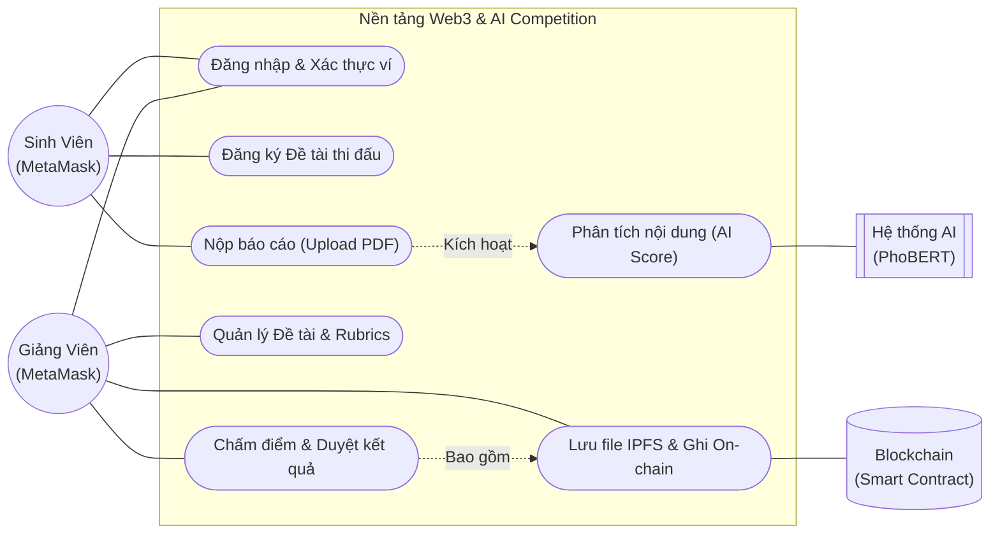
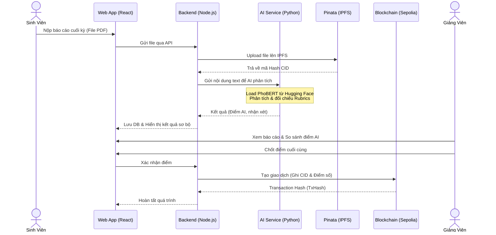
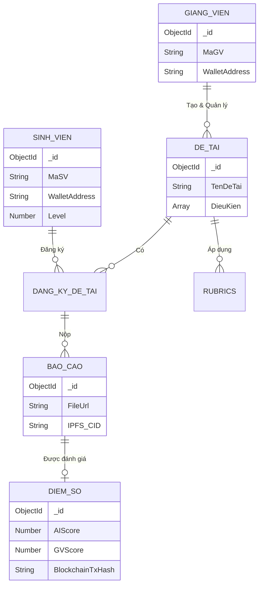

# PHÂN TÍCH VÀ THIẾT KẾ HỆ THỐNG WEB3 & AI COMPETITION PLATFORM

## 1. Tổng Quan Đề Tài

### 1.1. Lý do chọn đề tài (Nỗi đau thực tế)
Trong môi trường giáo dục đại học hiện nay, việc quản lý các đồ án, khóa luận hay các cuộc thi học thuật thường gặp phải nhiều vấn đề cốt lõi:
- **Dữ liệu phân tán & Lưu trữ kém an toàn:** Báo cáo, source code của sinh viên thường nộp qua email, Google Drive hoặc các hệ thống LMS cũ, dễ bị thất lạc hoặc chỉnh sửa sau thời hạn. Điểm số cuối cùng đôi khi thiếu tính minh bạch.
- **Tải trọng công việc của giảng viên quá lớn:** Việc phải đọc, kiểm tra đạo văn và đánh giá hàng chục báo cáo chi tiết mất rất nhiều thời gian. Giảng viên gặp khó khăn trong việc đánh giá nhanh chất lượng tổng thể của một bài làm.
- **Việc ghép nhóm và chọn đề tài thiếu khoa học:** Sinh viên thường chọn đề tài theo cảm tính, không biết mình có đủ kỹ năng để hoàn thành hay không.

### 1.2. Giải pháp và Lợi ích
Đề tài **Web3 & AI Competition Platform** được sinh ra để giải quyết triệt để các vấn đề trên thông qua sự giao thoa của 2 công nghệ tiên tiến nhất:
- **Áp dụng AI:** Tự động hóa quá trình phân tích văn bản tiếng Việt. AI đóng vai trò như một "trợ giảng", đọc trước báo cáo, trích xuất từ khóa, nhận diện ngữ nghĩa và đưa ra mức điểm sơ bộ (AI Score) kèm nhận xét. Điều này giúp giảng viên tiết kiệm đến 70% thời gian đọc lướt, chỉ tập trung vào việc đối chiếu và chấm điểm chuyên sâu. Ngoài ra, AI còn giúp "matching" (gợi ý) đề tài phù hợp với kỹ năng của sinh viên.
- **Áp dụng Web3/Blockchain:** Toàn bộ quá trình định danh người dùng được thực hiện ẩn danh và an toàn qua ví MetaMask. Các file báo cáo quan trọng được lưu trữ phi tập trung, và kết quả điểm số cuối cùng được ghi bất biến (immutable) lên Blockchain. Không một ai – kể cả quản trị viên hệ thống – có thể gian lận hoặc sửa đổi điểm số sau khi đã chốt.

## 2. Công Nghệ Sử Dụng

Hệ thống được thiết kế theo kiến trúc Microservices và Decentralized.

### 2.1. Công nghệ Blockchain / Web3
- **Mạng lưới (Network):** Hệ thống chạy trên mạng thử nghiệm **Ethereum Sepolia Testnet**. Đây là môi trường chuẩn để chạy các Smart Contract mà không tốn phí Gas thực tế nhưng vẫn mô phỏng chính xác môi trường Mainnet.
- **Hardhat:** Được sử dụng làm framework phát triển Blockchain. Hardhat giúp biên dịch (compile) mã nguồn Solidity, chạy test tự động và triển khai (deploy) Smart Contract lên mạng Sepolia một cách dễ dàng.
- **IPFS & Pinata:** Lưu trữ phi tập trung. Blockchain rất đắt đỏ nếu dùng để lưu file dung lượng lớn. Do đó, hệ thống sử dụng **IPFS (InterPlanetary File System)** thông qua cổng dịch vụ **Pinata**. Báo cáo PDF của sinh viên sẽ được tải lên Pinata, hệ thống nhận lại một mã băm duy nhất (CID - Content Identifier). Chỉ mã CID này mới được lưu lên Smart Contract để làm bằng chứng lưu trữ vĩnh viễn.

### 2.2. Công nghệ Trí Tuệ Nhân Tạo (AI / ML)
Hệ thống xây dựng một ML Service độc lập bằng **Python (FastAPI)**, tích hợp các mô hình ngôn ngữ lớn (LLMs) chuyên biệt cho Tiếng Việt được lấy từ **Hugging Face**:
- **PhoBERT (`vinai/phobert-base`):** Được sử dụng để phân tích ngữ nghĩa sâu của văn bản. Quá trình hoạt động: 
  1. Tải tokenizer và pre-trained weights từ Hugging Face.
  2. Báo cáo của sinh viên được extract thành text và tokenize (tách từ).
  3. Đưa qua mô hình PhoBERT để đánh giá độ phức tạp, nhận diện các chủ đề chính và đối chiếu với tiêu chí (rubrics). Từ đó nội suy ra một mức điểm gợi ý.
- **SBERT (Sentence-BERT):** Được dùng để so sánh sự tương đồng (Semantic Similarity). SBERT chuyển đổi kỹ năng của sinh viên (ví dụ: React, Nodejs) và yêu cầu của đề tài thành các vector đa chiều. Sau đó dùng thuật toán Cosine Similarity để tính điểm phần trăm (%) mức độ phù hợp, từ đó gợi ý đề tài thi đấu cho sinh viên.

## 3. Phân Tích & Thiết Kế Hệ Thống (Theo hướng dẫn của Thầy)

Theo góp ý, dưới đây là các sơ đồ UML thể hiện hành vi và cấu trúc cơ sở dữ liệu của hệ thống.

### 3.1. Sơ đồ Use Case (Biểu diễn hành vi)

### 3.2. Sơ đồ Tuần tự (Sequence Diagram) - Luồng Nộp bài & Đánh giá

### 3.3. Sơ đồ Cơ Sở Dữ Liệu (MongoDB Node Graph)
Đối với CSDL MongoDB (NoSQL), mỗi Node đại diện cho một Collection và các đường nối đại diện cho mối liên hệ Reference (`ObjectId`).

## 4. Cài Đặt Hệ Thống

### Sơ đồ Phân Cấp Chức Năng (Functional Hierarchy)
Được chuẩn hóa theo cấu trúc quản lý đồ án/cuộc thi thi đấu giữa Giảng viên và Sinh viên.

```mermaid
flowchart TD
    ROOT["HỆ THỐNG WEB3 & AI COMPETITION PLATFORM"]
    
    ROOT --- M1["1. Quản lý Đề tài & Cuộc thi"]
    ROOT --- M2["2. Quản lý Tham gia & Nộp bài"]
    ROOT --- M3["3. Đánh giá & Chấm điểm"]
    ROOT --- M4["4. Lưu trữ Web3 & Xác thực"]
    
    M1 --- M11["1.1. Khởi tạo & Đăng đề tài"]
    M1 --- M12["1.2. Thiết lập tiêu chí (Rubrics)"]
    M1 --- M13["1.3. Cấu hình điều kiện môn học"]
    
    M2 --- M21["2.1. Đăng nhập MetaMask (Xác thực ví)"]
    M2 --- M22["2.2. AI Gợi ý đề tài (Matching)"]
    M2 --- M23["2.3. Đăng ký & Ghép nhóm thi đấu"]
    M2 --- M24["2.4. Tải lên Báo cáo (PDF)"]
    
    M3 --- M31["3.1. Phân tích tự động (AI PhoBERT)"]
    M3 --- M32["3.2. Chấm điểm thủ công của Giảng viên"]
    M3 --- M33["3.3. So sánh độ lệch điểm (AI vs GV)"]
    M3 --- M34["3.4. Quản lý tiến độ báo cáo"]
    
    M4 --- M41["4.1. Mã hóa & Upload file lên IPFS (Pinata)"]
    M4 --- M42["4.2. Ghi điểm & CID lên Smart Contract"]
    M4 --- M43["4.3. Truy xuất & Kiểm tra Transaction Hash"]
    M4 --- M44["4.4. Hiển thị Bảng xếp hạng (Leaderboard)"]
```

