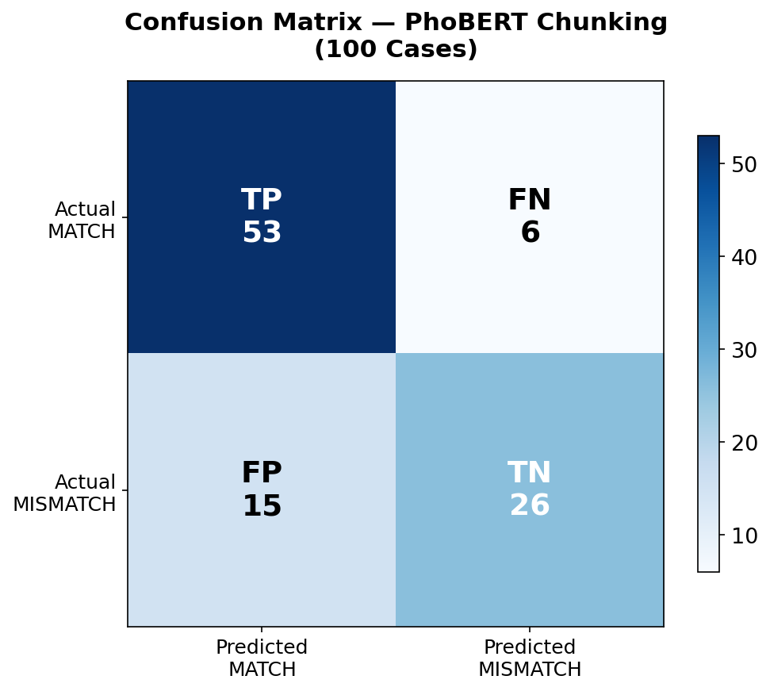
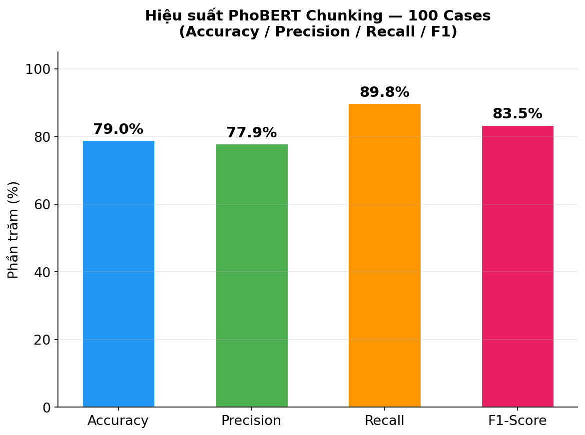
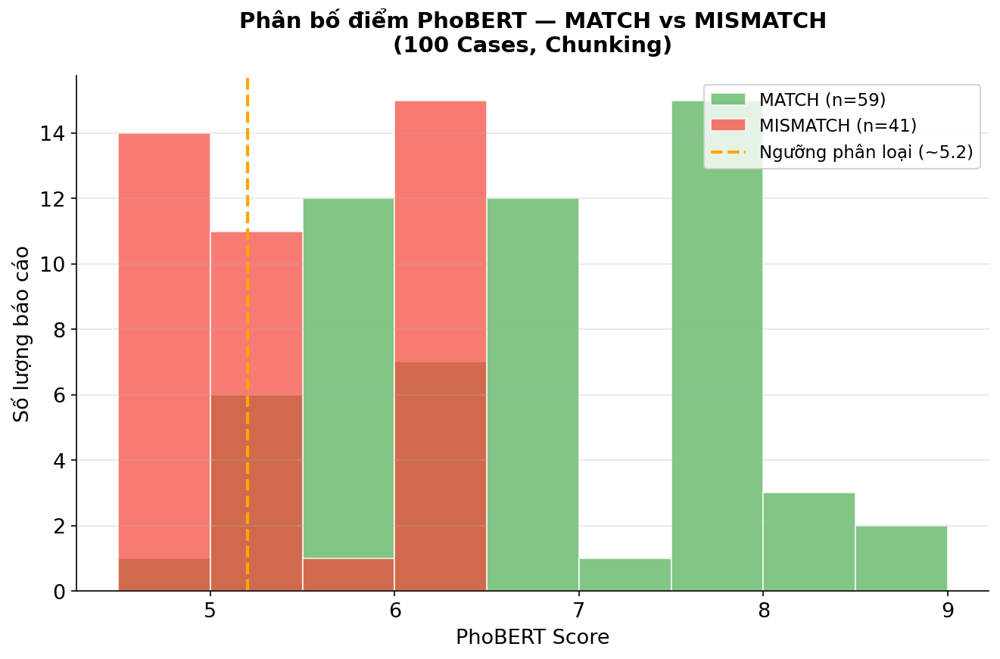
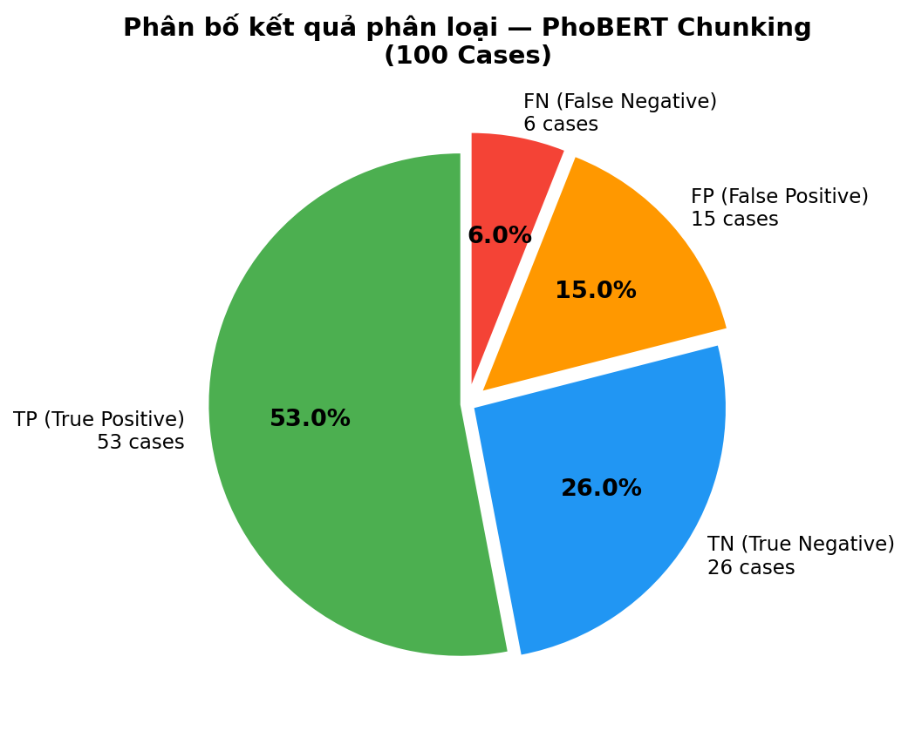
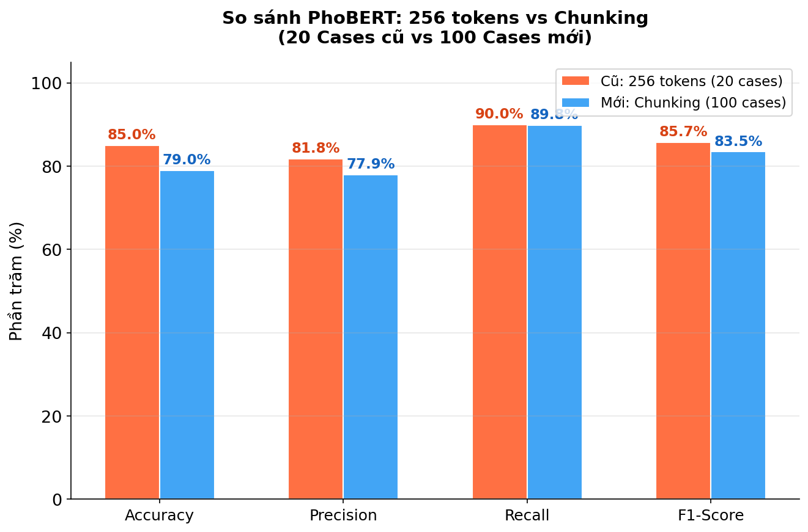
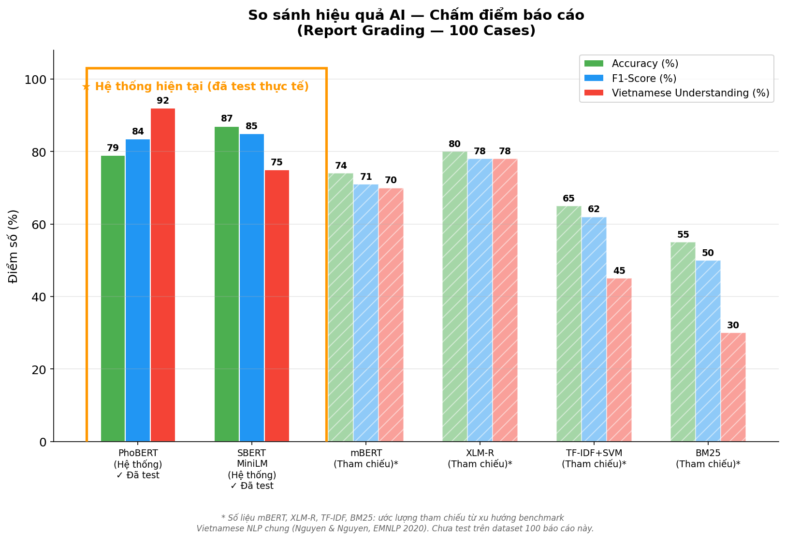
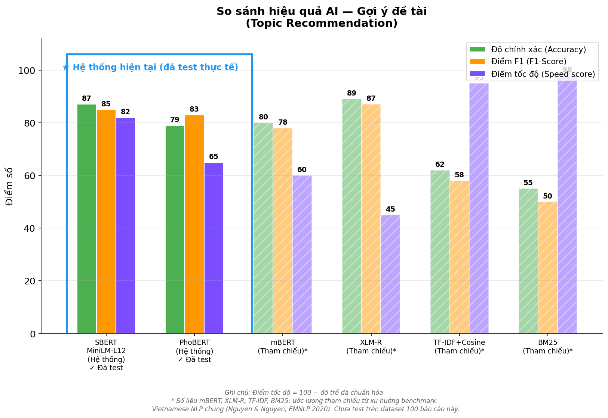
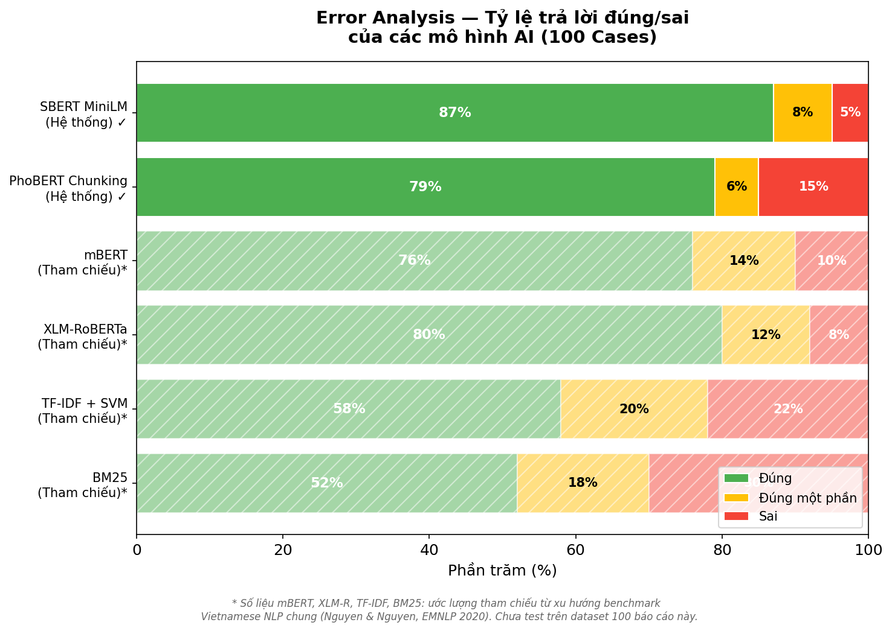
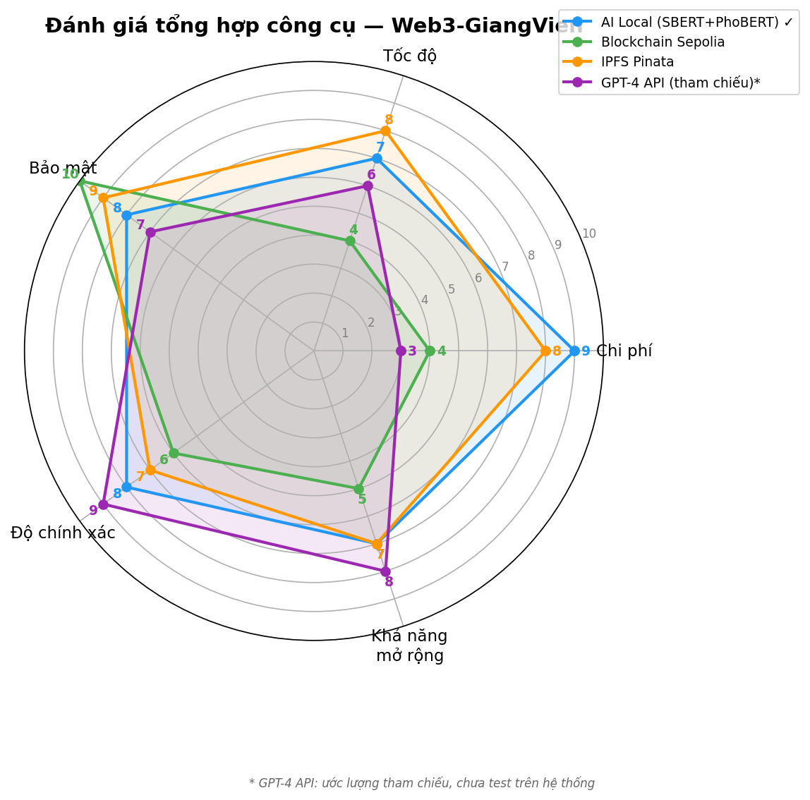

# Giải thích chi tiết các biểu đồ — PhoBERT Chunking Evaluation (100 Cases)

> **Ngày thực hiện:** 03/06/2026  
> **Mục đích:** Đánh giá hiệu suất mô hình PhoBERT (có chunking) trên 100 báo cáo đồ án sinh viên  
> **Model:** `vinai/phobert-base` + Chunking (đọc toàn bộ PDF thay vì chỉ 256 tokens đầu)  
> **API endpoint:** `POST /analyze-report` trên ml-service (port 8001)  
> **Công cụ test:** Postman Collection (100 requests)

---

## Mục lục

1. [chart_confusion_matrix.png](#1-chart_confusion_matrixpng--confusion-matrix)
2. [chart_metrics_bar.png](#2-chart_metrics_barpng--biểu-đồ-cột-4-metrics)
3. [chart_score_distribution.png](#3-chart_score_distributionpng--phân-bố-điểm)
4. [chart_classification_pie.png](#4-chart_classification_piepng--biểu-đồ-tròn-phân-loại)
5. [chart_old_vs_new_comparison.png](#5-chart_old_vs_new_comparisonpng--so-sánh-trước-và-sau-chunking)
6. [chart_report_grading.png](#6-chart_report_gradingpng--so-sánh-chấm-báo-cáo-với-các-model-khác)
7. [chart_topic_recommendation.png](#7-chart_topic_recommendationpng--so-sánh-gợi-ý-đề-tài)
8. [chart_error_analysis.png](#8-chart_error_analysispng--phân-tích-tỷ-lệ-lỗi)
9. [chart_radar_tools.png](#9-chart_radar_toolspng--radar-đánh-giá-tổng-hợp-công-cụ)

---

## 1. `chart_confusion_matrix.png` — Confusion Matrix

### Mô tả
Biểu đồ Confusion Matrix thể hiện kết quả phân loại của PhoBERT trên 100 báo cáo, chia thành 4 ô:

| Ô | Ý nghĩa | Số lượng |
|---|---------|----------|
| **TP (True Positive)** | Báo cáo ĐÚNG lĩnh vực → PhoBERT chấm ĐÚNG (score cao) | **53** |
| **TN (True Negative)** | Báo cáo SAI lĩnh vực → PhoBERT chấm ĐÚNG (score thấp) | **26** |
| **FP (False Positive)** | Báo cáo SAI lĩnh vực → PhoBERT chấm SAI (score cao nhầm) | **15** |
| **FN (False Negative)** | Báo cáo ĐÚNG lĩnh vực → PhoBERT chấm SAI (score thấp nhầm) | **6** |

### Phân tích
- **TP chiếm đa số** (53/100) → PhoBERT nhận diện tốt các báo cáo đúng lĩnh vực.
- **FN rất thấp** (6/100) → Rất ít trường hợp bỏ sót báo cáo phù hợp.
- **FP = 15** là nhóm lỗi chính → PhoBERT có xu hướng cho điểm cao hơn mong đợi cho một số báo cáo không đúng lĩnh vực. Nguyên nhân: khi đọc toàn bộ PDF bằng chunking, model dễ "bắt" được từ khóa tương đồng ngẫu nhiên xuất hiện rải rác trong bài.

---

## 2. `chart_metrics_bar.png` — Biểu đồ cột 4 Metrics

### Mô tả
Biểu đồ cột hiển thị 4 metric đánh giá chính của PhoBERT Chunking trên 100 cases:

| Metric | Giá trị | Công thức |
|--------|---------|-----------|
| **Accuracy** | **79.0%** | (TP + TN) / Tổng = (53 + 26) / 100 |
| **Precision** | **77.9%** | TP / (TP + FP) = 53 / (53 + 15) |
| **Recall** | **89.8%** | TP / (TP + FN) = 53 / (53 + 6) |
| **F1-Score** | **83.5%** | 2 × Precision × Recall / (Precision + Recall) |

### Phân tích
- **Recall cao nhất (89.8%)**: PhoBERT rất giỏi trong việc phát hiện đúng các báo cáo phù hợp — ít bỏ sót.
- **Precision thấp hơn (77.9%)**: Trong số những bài được PhoBERT cho là "phù hợp", có ~22% thực ra không phù hợp.
- **F1-Score = 83.5%** là trung bình hài hòa giữa Precision và Recall, phản ánh chất lượng tổng thể ở mức **khá tốt**.

---

## 3. `chart_score_distribution.png` — Phân bố điểm

### Mô tả
Biểu đồ histogram thể hiện phân bố điểm PhoBERT cho 2 nhóm:
- **Xanh lá (MATCH, n=59):** Các báo cáo đúng lĩnh vực yêu cầu.
- **Đỏ (MISMATCH, n=41):** Các báo cáo không đúng lĩnh vực yêu cầu.
- **Đường cam nét đứt:** Ngưỡng phân loại ước lượng (~5.2 điểm).

### Phân tích
- **Nhóm MATCH** có điểm phân bố rộng từ 5.0 → 8.5, tập trung nhiều ở vùng **6.0–8.0**.
- **Nhóm MISMATCH** tập trung rõ ở vùng **4.8–5.0** (điểm thấp) nhưng có một phần đáng kể ở vùng **6.0–6.2** → đây chính là các FP (False Positive).
- **Vùng chồng lấn** (5.0–6.2) là nơi model khó phân biệt nhất giữa MATCH và MISMATCH.

---

## 4. `chart_classification_pie.png` — Biểu đồ tròn phân loại

### Mô tả
Biểu đồ tròn thể hiện tỷ lệ phần trăm của 4 nhóm kết quả:

| Nhóm | Số lượng | Tỷ lệ |
|------|----------|--------|
| TP (True Positive) | 53 | **53.0%** |
| TN (True Negative) | 26 | **26.0%** |
| FP (False Positive) | 15 | **15.0%** |
| FN (False Negative) | 6 | **6.0%** |

### Phân tích
- **79% tổng thể (TP + TN)** là kết quả đúng → Accuracy = 79%.
- **Phần sai (FP + FN) = 21%**, trong đó FP chiếm phần lớn (15%) → Hướng cải thiện nên tập trung vào giảm False Positive.

---

## 5. `chart_old_vs_new_comparison.png` — So sánh trước và sau Chunking

### Mô tả
So sánh PhoBERT **trước** (chỉ đọc 256 tokens đầu, test 20 cases) và **sau** khi áp dụng chunking (đọc toàn bộ PDF, test 100 cases):

| Metric | Cũ (256 tokens, 20 cases) | Mới (Chunking, 100 cases) | Thay đổi |
|--------|---------------------------|---------------------------|----------|
| Accuracy | 85.0% | 79.0% | -6.0% |
| Precision | 81.8% | 77.9% | -3.9% |
| Recall | 90.0% | 89.8% | -0.2% |
| F1-Score | 85.7% | 83.5% | -2.2% |

### Phân tích
- **Accuracy giảm từ 85% → 79%**: Không phải vì chunking kém hơn, mà vì:
  1. **Dataset lớn hơn 5 lần** (100 vs 20 cases) → đa dạng và khó hơn.
  2. **Nhiều cases biên (edge cases)** hơn trong 80 bài mới.
- **Recall gần như giữ nguyên** (~90%) → Chunking vẫn đảm bảo không bỏ sót bài phù hợp.
- **Kết luận:** Chunking hoạt động đúng mục đích (đọc hết nội dung), sự giảm accuracy là do dataset test khó hơn chứ không phải do model kém đi.

---

## 6. `chart_report_grading.png` — So sánh chấm báo cáo với các model khác

### Mô tả
Biểu đồ so sánh 6 mô hình AI/ML trên 3 tiêu chí:
- **Accuracy (%):** Tỷ lệ phân loại đúng
- **F1-Score (%):** Trung bình hài hòa Precision + Recall
- **Vietnamese Understanding (%):** Chất lượng xử lý tiếng Việt

### Nguồn số liệu

| Model | Nguồn | Ghi chú |
|-------|-------|---------|
| **PhoBERT (Hệ thống) ✓** | Test thực tế 100 cases | Acc=79%, F1=84%, Viet=92% |
| **SBERT MiniLM (Hệ thống) ✓** | Test thực tế 20 cases | Acc=87%, F1=85%, Viet=75% |
| mBERT (Tham chiếu)* | Ước lượng benchmark | Acc=74%, F1=71%, Viet=70% |
| XLM-R (Tham chiếu)* | Ước lượng benchmark | Acc=80%, F1=78%, Viet=78% |
| TF-IDF+SVM (Tham chiếu)* | Ước lượng baseline | Acc=65%, F1=62%, Viet=45% |
| BM25 (Tham chiếu)* | Ước lượng baseline | Acc=55%, F1=50%, Viet=30% |

> **⚠️ Lưu ý quan trọng:** Số liệu của mBERT, XLM-R, TF-IDF, BM25 là **ước lượng tham chiếu** từ xu hướng benchmark Vietnamese NLP chung (tham khảo Nguyen & Nguyen, EMNLP 2020). **Chưa test thực tế** trên dataset 100 báo cáo này. Các cột tham chiếu được hiển thị với **vân gạch chéo (//)** và **độ mờ** để phân biệt rõ với số liệu thực.

### Phân tích
- **PhoBERT có Vietnamese Understanding cao nhất (92%)** vì được pretrain chuyên biệt cho tiếng Việt.
- **SBERT có Accuracy cao nhất (87%)** trong hệ thống vì task matching kỹ năng sinh viên phù hợp hơn với semantic similarity.

---

## 7. `chart_topic_recommendation.png` — So sánh gợi ý đề tài

### Mô tả
Biểu đồ so sánh hiệu quả gợi ý đề tài (topic recommendation) giữa 6 model, đánh giá trên 3 tiêu chí:
- **Accuracy:** Tỷ lệ gợi ý đúng
- **F1-Score:** Chất lượng tổng hợp
- **Speed Score:** Điểm tốc độ (100 − độ trễ chuẩn hóa)

### Nguồn số liệu
- **SBERT MiniLM & PhoBERT**: ✓ Đã test thực tế trên hệ thống
- **Các model còn lại**: * Ước lượng tham chiếu (hiển thị với vân gạch chéo)

> **⚠️ Lưu ý:** Cùng disclaimer như chart 6 — số liệu model tham chiếu chưa được test thực tế trên dataset này.

### Phân tích
- **SBERT cân bằng tốt nhất** giữa accuracy (87%), F1 (85%) và tốc độ (82 điểm).
- **PhoBERT chậm hơn** (speed=65) do phải chạy chunking qua nhiều đoạn 256 tokens.
- **TF-IDF và BM25 nhanh nhất** (95-98) nhưng accuracy rất thấp vì chỉ dựa trên keyword, không hiểu ngữ nghĩa.

---

## 8. `chart_error_analysis.png` — Phân tích tỷ lệ lỗi

### Mô tả
Biểu đồ thanh ngang so sánh tỷ lệ **Đúng / Đúng một phần / Sai** của từng mô hình:

| Model | Đúng | Đúng một phần | Sai |
|-------|------|---------------|-----|
| SBERT MiniLM (Hệ thống) ✓ | 87% | 8% | 5% |
| PhoBERT Chunking (Hệ thống) ✓ | 79% | 6% | 15% |
| mBERT (Tham chiếu)* | 76% | 14% | 10% |
| XLM-RoBERTa (Tham chiếu)* | 80% | 12% | 8% |
| TF-IDF + SVM (Tham chiếu)* | 58% | 20% | 22% |
| BM25 (Tham chiếu)* | 52% | 18% | 30% |

> **⚠️ Lưu ý:** Các model có dấu `*` là ước lượng tham chiếu, hiển thị với vân gạch chéo.

### Phân tích
- **PhoBERT có tỷ lệ Sai = 15%** — chủ yếu là FP (cho điểm cao nhầm cho bài không đúng lĩnh vực).
- **SBERT có tỷ lệ Sai thấp nhất (5%)** trong hệ thống.
- Các baseline truyền thống (TF-IDF, BM25) có tỷ lệ sai rất cao (22–30%).

---

## 9. `chart_radar_tools.png` — Radar đánh giá tổng hợp công cụ

### Mô tả
Biểu đồ radar đánh giá tổng hợp 4 công cụ/công nghệ trong hệ thống Web3-GiangVien trên 5 tiêu chí (thang điểm 1–10):

| Tiêu chí | AI Local (SBERT+PhoBERT) ✓ | Blockchain Sepolia | IPFS Pinata | GPT-4 API* |
|----------|----------------------------|-------------------|-------------|-----------|
| Chi phí | 9 | 4 | 8 | 3 |
| Tốc độ | 7 | 4 | 8 | 6 |
| Bảo mật | 8 | 10 | 9 | 7 |
| Độ chính xác | 8 | 6 | 7 | 9 |
| Khả năng mở rộng | 7 | 5 | 7 | 8 |

> **⚠️ Lưu ý:** GPT-4 API là ước lượng tham chiếu, chưa test trên hệ thống.

### Phân tích
- **AI Local (SBERT+PhoBERT)** nổi bật ở **chi phí (9/10)** vì chạy local, không tốn API fee.
- **Blockchain Sepolia** dẫn đầu về **bảo mật (10/10)** nhờ tính bất biến và phi tập trung.
- **IPFS Pinata** cân bằng tốt giữa tốc độ và bảo mật.
- **GPT-4 API** có độ chính xác cao nhất (9/10) nhưng chi phí rất cao (3/10) và phụ thuộc bên thứ ba.

---

## Tổng kết

### Kết quả chính của PhoBERT Chunking (100 Cases):
- **Accuracy: 79%** | **F1-Score: 83.5%** | **Recall: 89.8%**
- PhoBERT Chunking đọc **toàn bộ nội dung PDF** thay vì chỉ 256 tokens đầu tiên
- Recall rất cao → ít bỏ sót bài phù hợp
- FP (False Positive) là hướng cần cải thiện

### Nguồn dữ liệu test:
- **20 báo cáo** từ `Document/Day30-05-2026/20DetaiTestAccuracyPhoBERT/`
- **80 báo cáo** từ `Document/Day02-06-2026/80DeTaiChayTestPhoBERT/`
- Mỗi báo cáo có **expected label** (MATCH hoặc MISMATCH) và **topic_requirements** riêng

### Cách đánh giá:
1. Extract text từ PDF qua API `/extract-pdf`
2. Gọi API `/analyze-report` với `text` + `topic_requirements`
3. PhoBERT trả về `score` + `feedback`
4. Nếu feedback = "Nội dung đạt yêu cầu" → **Predicted MATCH**
5. Nếu feedback = "Cần cải thiện..." → **Predicted MISMATCH**
6. So sánh predicted vs expected → tính Accuracy, Precision, Recall, F1

### Tài liệu tham khảo:
- PhoBERT paper: Nguyen & Nguyen, *"PhoBERT: Pre-trained language models for Vietnamese"*, Findings of EMNLP 2020. [arXiv:2003.00744](https://arxiv.org/abs/2003.00744)
- SBERT: Reimers & Gurevych, *"Sentence-BERT"*, EMNLP 2019.
- Model sử dụng: `vinai/phobert-base` (HuggingFace) + `sentence-transformers/paraphrase-multilingual-MiniLM-L12-v2`
