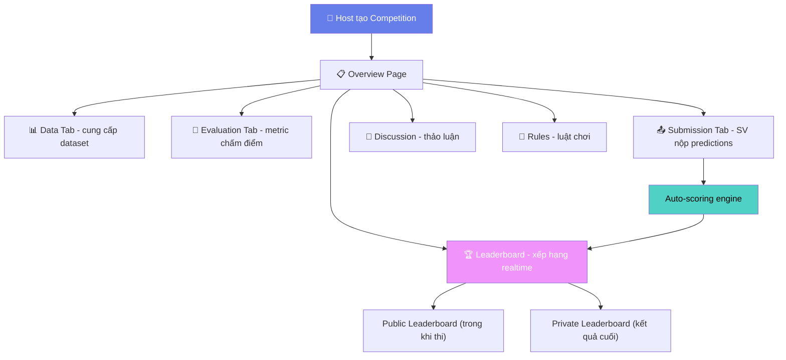
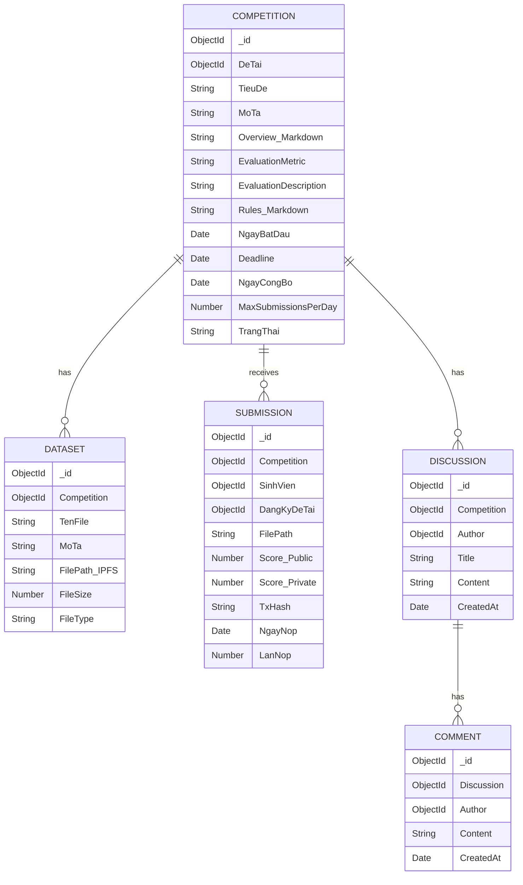

# 🔍 So Sánh: Competition Hiện Tại vs Kaggle Competition

## Ý thầy là gì?

Thầy nói **"competition là cốt lõi của web3"** và yêu cầu:
1. Tham khảo cách Kaggle tổ chức **Competition** 
2. Thay Kaggle platform → **MongoDB platform** (tức là dùng MongoDB để lưu trữ thay vì hạ tầng Kaggle)
3. Phần còn lại **thiết kế giống Kaggle**

Nói cách khác: **Xây một mini-Kaggle cho luận văn**, nơi SV "thi đấu" để giành đề tài, với data/scoring/leaderboard giống Kaggle.

---

## Kaggle Competition Hoạt Động Như Thế Nào?



### Các thành phần cốt lõi của Kaggle Competition:

| # | Thành phần | Mô tả |
|:--|:--|:--|
| 1 | **Overview** | Mô tả bài toán, timeline, giải thưởng, metric đánh giá |
| 2 | **Data** | Host cung cấp dataset (train/test), SV tải về phân tích |
| 3 | **Evaluation** | Định nghĩa rõ metric chấm điểm (accuracy, RMSE, F1...) |
| 4 | **Submission** | SV nộp file predictions (CSV) hoặc notebook code |
| 5 | **Leaderboard** | Bảng xếp hạng realtime, Public + Private |
| 6 | **Discussion** | Forum thảo luận cho mỗi competition |
| 7 | **Rules** | Giới hạn submission/ngày, team size, deadline |
| 8 | **Team** | Cho phép tạo nhóm, merge team |
| 9 | **Notebook/Code** | Môi trường code trực tiếp trên platform |
| 10 | **Timeline** | Ngày bắt đầu → deadline nộp → ngày công bố kết quả |

---

## Hệ Thống Hiện Tại Của Mình Có Gì?

Dựa trên [summary.md](file:///c:/Users/Lenovo/Downloads/FileTaiLieuHK8/DoAnKySu/Web3-GiangVien/Document/Day04-05-2026/summary.md) và source code:

| # | Thành phần Kaggle | Mình có? | Cách triển khai hiện tại |
|:--|:--|:--|:--|
| 1 | Overview | ⚠️ Sơ sài | Chỉ có `TieuDe` + `MoTa` ngắn trong BaiTest |
| 2 | Data (Dataset) | ❌ **Không có** | Không có cơ chế upload/download dataset |
| 3 | Evaluation (Metric) | ⚠️ Cứng | Chỉ dùng SBERT similarity + exact match, không cho host chọn metric |
| 4 | Submission | ✅ Có | SV nộp bài (MCQ + Code) → AI chấm tự động |
| 5 | Leaderboard | ✅ Có | Bảng xếp hạng theo `TongDiem`, sort desc |
| 6 | Discussion | ❌ **Không có** | Không có forum/comment cho mỗi competition |
| 7 | Rules | ❌ **Không có** | Không có quy tắc rõ ràng (giới hạn nộp, deadline...) |
| 8 | Team | ✅ Có | Hệ thống nhóm (ThanhVien, mời, chấp nhận) |
| 9 | Code Environment | ⚠️ Có 1 phần | Monaco Editor nhưng code không chạy thực tế, chỉ so sánh text |
| 10 | Timeline | ❌ **Không có** | Không có ngày bắt đầu/kết thúc rõ ràng |
| 11 | Blockchain | ✅ Mình có thêm | Kaggle KHÔNG có, đây là điểm Web3 riêng |
| 12 | Giới hạn submission | ❌ Không | Kaggle giới hạn 5 submissions/ngày |

---

## Gap Analysis — Thiếu Gì So Với Kaggle?

### 🔴 Thiếu Hoàn Toàn (Critical)

#### 1. **Data Tab — Cung cấp Dataset**
Kaggle competition **luôn có dataset**. Host upload train.csv, test.csv, SV tải về, phân tích, build model, rồi nộp predictions.

> Mình hiện tại: GV chỉ tạo câu hỏi trắc nghiệm/code → SV trả lời trực tiếp. **Không có dataset để SV phân tích**.

#### 2. **Evaluation Metric rõ ràng**
Kaggle mô tả rõ: "Submissions are evaluated using Mean Absolute Error" hoặc "Log Loss". SV biết trước cách chấm.

> Mình hiện tại: Chấm bằng SBERT similarity (0-1), nhưng **SV không biết metric** cụ thể.

#### 3. **Timeline / Deadline**
Kaggle có: Entry deadline, Team Merger deadline, Final submission deadline.

> Mình hiện tại: `ThoiGianLam` chỉ là thời gian làm bài (30 phút), **không có ngày bắt đầu/kết thúc** competition.

#### 4. **Giới hạn Submission**
Kaggle: max 5 submissions/ngày, SV cải thiện dần model.

> Mình hiện tại: SV nộp **1 lần duy nhất** (check `existing` → reject), không có cơ chế nộp lại cải thiện.

### 🟡 Có Nhưng Chưa Đủ (Important)

#### 5. **Leaderboard chưa giống Kaggle**
- Kaggle có **Public Leaderboard** (thấy trong khi thi) + **Private Leaderboard** (sau khi kết thúc)
- Mình chỉ có 1 bảng xếp hạng đơn giản

#### 6. **Competition Page thiếu tabs**
Kaggle competition page có nhiều tabs: Overview | Data | Code | Discussion | Leaderboard | Rules.
Mình chỉ có 2 tabs: `📋 Thông tin` và `🏆 Bảng Xếp Hạng`

#### 7. **Không có Discussion**
Mỗi Kaggle competition có forum riêng để SV hỏi/thảo luận. Mình không có.

---

## Đề Xuất: Nâng Cấp Thành "Kaggle-like Competition"

### Kiến trúc đề xuất (MongoDB Platform)



### Cụ thể cần làm gì?

| # | Feature | Mức độ | Mô tả |
|:--|:--|:--|:--|
| 1 | **Dataset Upload/Download** | 🔴 Critical | GV upload file dataset (CSV, JSON), lưu IPFS/MongoDB GridFS. SV tải về phân tích. |
| 2 | **Submission dạng file** | 🔴 Critical | SV nộp file predictions (CSV), thay vì chỉ trả lời câu hỏi inline |
| 3 | **Auto-scoring từ file** | 🔴 Critical | Backend so sánh file SV nộp vs answer key, tính metric (accuracy, RMSE...) |
| 4 | **Competition Page tabs** | 🔴 Critical | Overview \| Data \| Submission \| Leaderboard \| Discussion \| Rules |
| 5 | **Timeline/Deadline** | 🟡 Important | Thêm `NgayBatDau`, `Deadline`, `NgayCongBo` vào schema |
| 6 | **Multi-submission** | 🟡 Important | Cho nộp nhiều lần (giới hạn N lần/ngày), lấy điểm cao nhất |
| 7 | **Public/Private Leaderboard** | 🟡 Important | Public score (70% data) hiện realtime, Private score (30%) sau deadline |
| 8 | **Discussion Forum** | 🟢 Nice-to-have | Mỗi competition có thread thảo luận |
| 9 | **Notebook Environment** | 🟢 Nice-to-have | Cho SV code trên web (đã có Monaco, có thể mở rộng) |

---

## Tóm Lại: Giống Kaggle Bao Nhiêu %?

```
Hệ thống hiện tại:       ████████░░░░░░░░░░░░  ~35-40%
                          
Phần ĐÃ CÓ giống Kaggle:
  ✅ Tạo competition (bài test) cho đề tài
  ✅ SV nộp bài → AI chấm tự động  
  ✅ Bảng xếp hạng (Leaderboard)
  ✅ GV chọn người thắng
  ✅ Hệ thống Team/Nhóm
  ✅ Blockchain ghi kết quả (BONUS - Kaggle không có!)

Phần THIẾU so với Kaggle:
  ❌ Dataset upload/download
  ❌ File-based submission (nộp CSV predictions)
  ❌ Evaluation metric tùy chọn  
  ❌ Competition page đa tabs (Overview/Data/Discussion/Rules)
  ❌ Timeline & deadline rõ ràng
  ❌ Multi-submission (nộp nhiều lần cải thiện)
  ❌ Public/Private Leaderboard
  ❌ Discussion forum per competition
```

> [!IMPORTANT]
> **Điểm khác biệt lớn nhất**: Kaggle competition = **data science challenge** (cho dataset → SV build model → nộp predictions). Còn mình hiện tại = **bài test** (câu hỏi MCQ + code). Đây là **khác biệt bản chất**, không chỉ thiếu feature.
> 
> Để thực sự "giống Kaggle", cần chuyển từ mô hình **"bài test đầu vào"** sang **"data competition"** — tức là GV cung cấp dataset, SV phân tích data và nộp kết quả dự đoán.

> [!TIP]
> Tuy nhiên, nếu thầy chỉ muốn **giao diện và flow giống Kaggle** (tabs, leaderboard, timeline, rules) mà vẫn giữ bài test MCQ + Code, thì khối lượng công việc sẽ ít hơn nhiều. Nên hỏi lại thầy để xác nhận.
