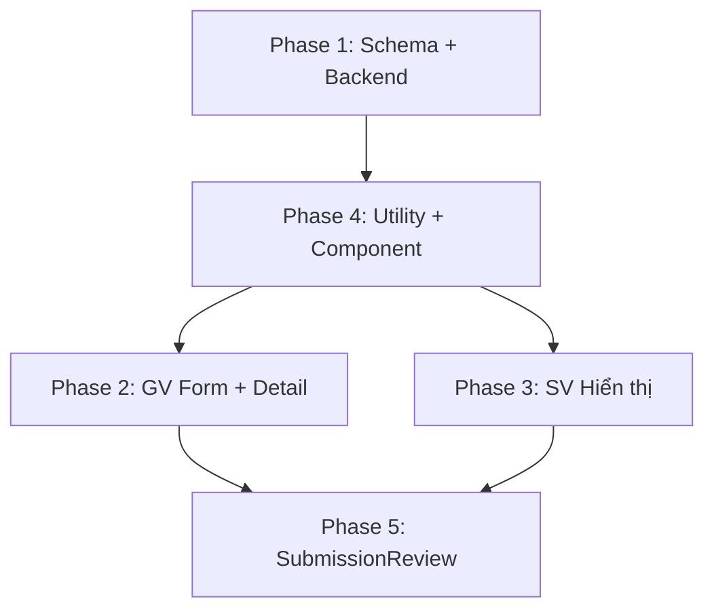

# #10 — Quản Lý Deadline Toàn Diện

## Mục tiêu

Triển khai hệ thống deadline do **Giảng viên đặt** trên mỗi đề tài, được **enforce ở cả backend lẫn frontend**, bao phủ toàn bộ vòng đời: Đăng ký → Tiến độ → Nộp báo cáo → Chấm điểm. Hiện tại schema đã có 3 trường deadline (`Deadline`, `HanDangKy`, `HanNopBaoCao`), backend đã enforce 2/3 trường (đăng ký + nộp báo cáo), nhưng **frontend chưa hiển thị** deadline nào cho sinh viên, và **tiến độ chưa có deadline riêng**.

---

## Hiện trạng (Đã có)

| Thành phần | Trạng thái | Chi tiết |
|---|---|---|
| **Schema `DeTai`** | ✅ Có 3 trường | `Deadline` (chung), `HanDangKy`, `HanNopBaoCao` |
| **GV tạo/sửa đề tài** (TopicManagement) | ✅ Có DatePicker | 3 trường deadline đều có form input |
| **Backend chặn đăng ký** (deTaiController) | ✅ Enforce | Dùng `HanDangKy \|\| Deadline` |
| **Backend chặn nộp báo cáo** (baoCaoController) | ✅ Enforce | Dùng `HanNopBaoCao \|\| Deadline` |
| **Backend chặn cập nhật tiến độ** | ❌ Không có | Chỉ chặn khi đã nộp báo cáo, chưa chặn theo deadline |
| **SV xem deadline** (tất cả trang) | ❌ Không hiển thị | TopicRegistration, ReportUpload, ProgressLog, Dashboard đều không show deadline |
| **GV xem deadline** (TopicManagement detail) | ⚠️ Lỗi | Hiện label "Hạn chót đăng ký" nhưng hiển thị `Deadline` chung, không show `HanDangKy` / `HanNopBaoCao` |
| **Cảnh báo gần hết hạn** | ❌ Không có | Cả GV và SV đều không có visual indicator |

---

## Proposed Changes

### Phase 1 — Schema & Backend Enforcement

---

#### [MODIFY] [DeTai.js](file:///c:/Users/Lenovo/Downloads/FileTaiLieuHK8/DoAnKySu/Web3-GiangVien/backend/models/DeTai.js)

Thêm trường `HanCapNhatTienDo` để GV có thể đặt deadline riêng cho tiến độ (optional, fallback = `HanNopBaoCao || Deadline`):

```diff
  HanNopBaoCao: { type: Date },
+ HanCapNhatTienDo: { type: Date },  // Hạn chót cập nhật nhật ký tiến độ
```

> [!NOTE]
> Trường này là **optional**. Nếu GV không đặt, logic sẽ fallback về `HanNopBaoCao || Deadline` — tức sinh viên được cập nhật tiến độ cho đến khi hết hạn nộp bài.

---

#### [MODIFY] [tienDoController.js](file:///c:/Users/Lenovo/Downloads/FileTaiLieuHK8/DoAnKySu/Web3-GiangVien/backend/controllers/tienDoController.js)

**Thêm chặn deadline** trước khi cho SV tạo/sửa tiến độ (trong `createProgressEntry` + `updateProgressEntry`):

```javascript
// Chặn cập nhật tiến độ sau hạn
const deTai = await DeTai.findById(deTaiId).select('HanCapNhatTienDo HanNopBaoCao Deadline');
const hanTienDo = deTai?.HanCapNhatTienDo || deTai?.HanNopBaoCao || deTai?.Deadline;
if (hanTienDo && new Date() > new Date(hanTienDo)) {
    return res.status(400).json({ 
        error: 'Đã quá hạn cập nhật tiến độ cho đề tài này.', 
        code: 'QUA_HAN_TIEN_DO' 
    });
}
```

---

#### [MODIFY] [baoCaoController.js](file:///c:/Users/Lenovo/Downloads/FileTaiLieuHK8/DoAnKySu/Web3-GiangVien/backend/controllers/baoCaoController.js)

Đã enforce rồi (line 54). **Không cần sửa.**

#### [MODIFY] [deTaiController.js](file:///c:/Users/Lenovo/Downloads/FileTaiLieuHK8/DoAnKySu/Web3-GiangVien/backend/controllers/deTaiController.js)

Đã enforce rồi (line 188). **Không cần sửa.**

---

### Phase 2 — GV: Form tạo/sửa đề tài + Hiển thị chi tiết

---

#### [MODIFY] [TopicManagement.js](file:///c:/Users/Lenovo/Downloads/FileTaiLieuHK8/DoAnKySu/Web3-GiangVien/frontend/src/components/lecturer/TopicManagement.js)

**2A. Form tạo/sửa** — Thêm DatePicker cho `HanCapNhatTienDo`:

- Thêm 1 dòng DatePicker mới sau hàng `HanDangKy / HanNopBaoCao` (hoặc cùng hàng nếu đủ rộng)
- Label: **"Hạn cập nhật tiến độ"** 
- Tooltip: "Sau mốc này SV không thể cập nhật nhật ký tiến độ. Bỏ trống = dùng Hạn nộp báo cáo."
- Cập nhật `handleSubmit` để gửi `HanCapNhatTienDo` lên API
- Cập nhật `handleEdit` để load giá trị từ record vào form

**2B. Detail view** — Sửa phần Descriptions:

Hiện tại chỉ hiện 1 mục "Hạn chót đăng ký" (nhưng lại dùng `record.Deadline`). Cần thay đổi:

```diff
- <Descriptions.Item label="Hạn chót đăng ký">
-   {record.Deadline ? ... : 'Không giới hạn'}
- </Descriptions.Item>
+ <Descriptions.Item label="Deadline (chung)">
+   {record.Deadline ? format(record.Deadline) : 'Không giới hạn'}
+ </Descriptions.Item>
+ <Descriptions.Item label="Hạn đăng ký">
+   {record.HanDangKy ? format(record.HanDangKy) : 'Dùng Deadline chung'}
+ </Descriptions.Item>
+ <Descriptions.Item label="Hạn nộp báo cáo">
+   {record.HanNopBaoCao ? format(record.HanNopBaoCao) : 'Dùng Deadline chung'}
+ </Descriptions.Item>
+ <Descriptions.Item label="Hạn cập nhật tiến độ">
+   {record.HanCapNhatTienDo ? format(record.HanCapNhatTienDo) : 'Dùng Hạn nộp báo cáo'}
+ </Descriptions.Item>
```

---

### Phase 3 — SV: Hiển thị deadline trên mọi trang liên quan

---

#### [MODIFY] [TopicRegistration.js](file:///c:/Users/Lenovo/Downloads/FileTaiLieuHK8/DoAnKySu/Web3-GiangVien/frontend/src/components/student/TopicRegistration.js)

**3A. Card đề tài** — Thêm dòng hiển thị deadline trên mỗi topic card:

```jsx
<Text type="secondary">Hạn đăng ký:</Text>
<Tag color={isExpired ? 'red' : isNearExpiry ? 'orange' : 'green'}>
  {formatDate(topic.HanDangKy || topic.Deadline)}
</Tag>
```

Nếu đã quá hạn → hiển thị Tag đỏ "Hết hạn đăng ký" + disable nút đăng ký ở frontend (backend đã chặn rồi nhưng FE nên reflect).

**3B. Modal chi tiết** — Thêm các dòng deadline vào modal xác nhận đăng ký:

```jsx
<Text type="secondary">Hạn đăng ký:</Text> <Tag>{...}</Tag>
<Text type="secondary">Hạn nộp báo cáo:</Text> <Tag>{...}</Tag>
```

---

#### [MODIFY] [ReportUpload.js](file:///c:/Users/Lenovo/Downloads/FileTaiLieuHK8/DoAnKySu/Web3-GiangVien/frontend/src/components/student/ReportUpload.js)

**Thêm Alert deadline** ở đầu trang nộp báo cáo:

- Nếu chưa hết hạn: Alert `info` hiển thị "Hạn nộp: DD/MM/YYYY HH:mm" + countdown còn lại (X ngày Y giờ)
- Nếu gần hết hạn (≤ 3 ngày): Alert `warning` "Sắp hết hạn nộp!"
- Nếu đã hết hạn: Alert `error` "Đã quá hạn nộp báo cáo" + disable upload form (backend đã chặn)

Cần access `registration.DeTai.HanNopBaoCao || registration.DeTai.Deadline` — dữ liệu này **đã được populate** từ API hiện tại.

---

#### [MODIFY] [ProgressLog.js](file:///c:/Users/Lenovo/Downloads/FileTaiLieuHK8/DoAnKySu/Web3-GiangVien/frontend/src/components/student/ProgressLog.js)

**Thêm Alert deadline** tương tự ReportUpload:

- Hiển thị "Hạn cập nhật tiến độ: DD/MM/YYYY" (dùng `HanCapNhatTienDo || HanNopBaoCao || Deadline`)
- Nếu đã hết hạn → disable nút "Tạo báo cáo tiến độ" + alert đỏ
- Nếu gần hết hạn → alert vàng

---

#### [MODIFY] [StudentDashboard.js](file:///c:/Users/Lenovo/Downloads/FileTaiLieuHK8/DoAnKySu/Web3-GiangVien/frontend/src/components/student/StudentDashboard.js)

Nếu SV đã đăng ký đề tài, hiển thị **tóm tắt các mốc deadline** trong phần thông tin đề tài:

```jsx
<Descriptions size="small" column={1}>
  <Descriptions.Item label="Hạn nộp báo cáo">
    <Tag color={...}>{format(...)}</Tag>
  </Descriptions.Item>
</Descriptions>
```

---

### Phase 4 — Utility: Helper function + Deadline Badge Component

---

#### [NEW] [deadlineUtils.js](file:///c:/Users/Lenovo/Downloads/FileTaiLieuHK8/DoAnKySu/Web3-GiangVien/frontend/src/utils/deadlineUtils.js)

Tạo utility functions dùng chung:

```javascript
/**
 * Tính trạng thái deadline
 * @returns {'expired' | 'urgent' | 'warning' | 'safe'}
 */
export const getDeadlineStatus = (deadline) => { ... }

/**
 * Format deadline thành text tiếng Việt + countdown
 * @returns { text: string, countdown: string }
 */
export const formatDeadline = (deadline) => { ... }

/**
 * Lấy deadline hiệu lực (fallback chain)
 */
export const getEffectiveDeadline = (deTai, type) => { ... }
// type: 'dangKy' → HanDangKy || Deadline
// type: 'baoCao' → HanNopBaoCao || Deadline  
// type: 'tienDo' → HanCapNhatTienDo || HanNopBaoCao || Deadline
```

---

#### [NEW] [DeadlineBadge.js](file:///c:/Users/Lenovo/Downloads/FileTaiLieuHK8/DoAnKySu/Web3-GiangVien/frontend/src/components/common/DeadlineBadge.js)

Component dùng lại ở nhiều trang:

```jsx
<DeadlineBadge deadline={...} label="Hạn nộp báo cáo" />
```

- `expired` → Tag đỏ `🚫 Đã hết hạn`
- `urgent` (≤ 1 ngày) → Tag đỏ nhấp nháy `⚠️ Còn X giờ`
- `warning` (≤ 3 ngày) → Tag cam `⏳ Còn X ngày`
- `safe` → Tag xanh `📅 DD/MM/YYYY`

---

### Phase 5 — SubmissionReview (GV) hiển thị deadline

---

#### [MODIFY] [SubmissionReview.js](file:///c:/Users/Lenovo/Downloads/FileTaiLieuHK8/DoAnKySu/Web3-GiangVien/frontend/src/components/lecturer/SubmissionReview.js)

Trong phần chi tiết đề tài trên bảng submission, thêm hiển thị:
- Hạn nộp báo cáo
- Nếu SV nộp trễ so với deadline → badge `Nộp trễ hạn` ở cột trạng thái

---

## Tổng hợp File Cần Thay Đổi

| # | File | Loại | Nội dung |
|---|------|------|----------|
| 1 | `backend/models/DeTai.js` | MODIFY | Thêm `HanCapNhatTienDo` |
| 2 | `backend/controllers/tienDoController.js` | MODIFY | Enforce deadline cho tiến độ |
| 3 | `frontend/src/utils/deadlineUtils.js` | NEW | Utility functions |
| 4 | `frontend/src/components/common/DeadlineBadge.js` | NEW | Reusable component |
| 5 | `frontend/.../lecturer/TopicManagement.js` | MODIFY | Form + Detail view |
| 6 | `frontend/.../student/TopicRegistration.js` | MODIFY | Card + Modal deadline |
| 7 | `frontend/.../student/ReportUpload.js` | MODIFY | Deadline alert + disable |
| 8 | `frontend/.../student/ProgressLog.js` | MODIFY | Deadline alert + disable |
| 9 | `frontend/.../student/StudentDashboard.js` | MODIFY | Deadline summary |
| 10 | `frontend/.../lecturer/SubmissionReview.js` | MODIFY | Hiển thị deadline + nộp trễ |

---

## Thứ tự thực thi



1. **Phase 1** — Backend: Schema + enforce (ít rủi ro nhất, backward compatible)
2. **Phase 4** — Utility: helper functions + DeadlineBadge (dùng chung cho các phase sau)
3. **Phase 2** — GV: Form tạo/sửa + hiển thị chi tiết
4. **Phase 3** — SV: Hiển thị deadline ở 4 trang
5. **Phase 5** — GV: SubmissionReview hiển thị trạng thái deadline

---

## Open Questions

> [!IMPORTANT]
> **Q1:** Khi GV **không nhập** HanCapNhatTienDo, mình dùng fallback `HanNopBaoCao || Deadline`. Bạn có muốn thêm logic **"SV được cập nhật tiến độ tối đa đến X ngày sau hạn nộp"** (grace period) không? Hay hết hạn là chặn cứng?

> [!IMPORTANT]  
> **Q2:** Nút đăng ký ở frontend — nếu đề tài đã quá hạn đăng ký, bạn muốn **ẩn nút hoàn toàn** hay **hiện nút disabled** kèm tag "Hết hạn đăng ký"? Mình đề xuất hiện disabled + tag để SV hiểu lý do.

> [!IMPORTANT]
> **Q3:** Phần "nộp trễ" ở SubmissionReview — chỉ hiển thị badge cảnh báo cho GV biết, hay có ảnh hưởng gì đến điểm (VD: trừ điểm tự động)? Mình đề xuất chỉ hiện badge, logic trừ điểm để GV tự quyết.

---

## Verification Plan

### Automated Tests
- `npm run build` — Frontend build thành công
- Backend restart — không crash

### Manual Verification
1. GV tạo đề tài với đầy đủ 4 deadlines → verify form hiển thị đúng
2. GV xem chi tiết đề tài → verify 4 deadlines hiện trong Descriptions
3. SV xem danh sách đề tài → verify deadline hiện trên card + quá hạn = disabled
4. SV vào trang nộp báo cáo → verify Alert deadline hiện đúng
5. SV vào trang tiến độ → verify Alert deadline hiện đúng
6. Thử nộp báo cáo / tạo tiến độ khi đã quá hạn → verify backend trả lỗi + FE hiện đúng
