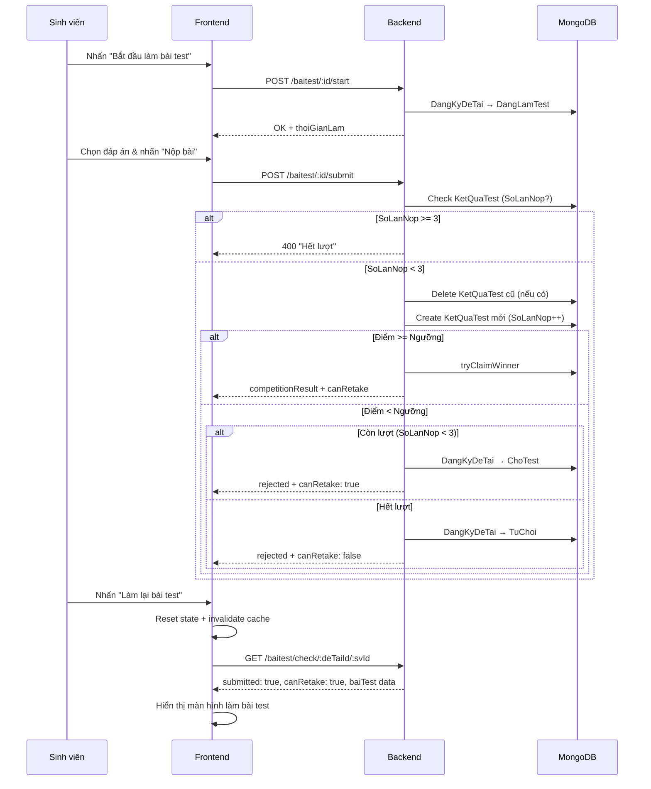

# Walkthrough: Tính năng Làm lại Bài Test (Max 3 lần) — Kaggle-like Competition

## Tổng kết rà soát & các lỗi đã fix

### ✅ Lỗi 1: `canRetake` và `SoLanNop` không được truyền vào result state khi nộp bài
**File:** [EntranceTest.js](file:///c:/Users/Lenovo/Downloads/FileTaiLieuHK8/DoAnKySu/Web3-GiangVien/frontend/src/components/student/EntranceTest.js#L193-L201)
**Vấn đề:** Sau khi nộp bài, `handleSubmit` set `result` bằng `...res.data` (KetQuaTest document) nhưng không map `res.canRetake` và `res.soLanNop` từ API response vào. Nút "Làm lại" kiểm tra `result.canRetake` → luôn `undefined` → nút không hiển thị.
**Fix:** Thêm `canRetake: res.canRetake` và `SoLanNop: res.soLanNop` vào `setResult()`.

---

### ✅ Lỗi 2: `baiTest` null khi nhấn "Làm lại" → "Không tìm thấy bài test"
**File:** [EntranceTest.js](file:///c:/Users/Lenovo/Downloads/FileTaiLieuHK8/DoAnKySu/Web3-GiangVien/frontend/src/components/student/EntranceTest.js#L55-L71)
**Vấn đề:** React Query `queryFn` khi `checkTestSubmitted` trả `submitted: true` thì `return data` sớm mà **không fetch baiTest**. Khi nhấn "Làm lại", state reset nhưng `baiTest` vẫn null.
**Fix:** Khi `canRetake = true`, vẫn fetch `baiTest` dự phòng cho lần retry. Thêm `retryingRef` để ngăn cache cũ ghi đè `submitted = true` lên state đã reset.

---

### ✅ Lỗi 3: `checkSubmitted` không map trạng thái `ChoTest` → frontend không hiểu
**File:** [baiTestController.js](file:///c:/Users/Lenovo/Downloads/FileTaiLieuHK8/DoAnKySu/Web3-GiangVien/backend/controllers/baiTestController.js#L486-L495)
**Vấn đề:** Khi sinh viên rớt và còn lượt, backend set `DangKyDeTai.TrangThai = 'ChoTest'`. Nhưng `checkSubmitted` không map `ChoTest` thành `competitionResult`, frontend nhận `undefined` → không hiểu đúng trạng thái.
**Fix:** Thêm mapping `ChoTest` / `DangLamTest` → `'rejected'` trong `checkSubmitted` (vì đã có kết quả test = đã rớt).

---

### ✅ Lỗi 4: `deTaiController.js` xóa đăng ký cũ không kiểm tra trạng thái
**File:** [deTaiController.js](file:///c:/Users/Lenovo/Downloads/FileTaiLieuHK8/DoAnKySu/Web3-GiangVien/backend/controllers/deTaiController.js#L275-L280)
**Vấn đề:** Đoạn cleanup `findOneAndDelete` xóa **bất kỳ** đăng ký nào khớp (kể cả `DaDuyet`, `ChoTest`). Có thể vô tình xóa đăng ký đang hoạt động.
**Fix:** Thêm filter `TrangThai: { $in: ['TuChoi', 'Thua'] }` → chỉ xóa bản ghi đã bị loại.

---

### ✅ Bổ sung: Cột "Lần nộp" cho Giảng viên
**File:** [EntranceTestManager.js](file:///c:/Users/Lenovo/Downloads/FileTaiLieuHK8/DoAnKySu/Web3-GiangVien/frontend/src/components/lecturer/EntranceTestManager.js#L202-L208)
**Thay đổi:** Thêm cột `Lần nộp` (hiển thị `X/3`) vào bảng kết quả test bên phía giảng viên.

---

## Luồng hoạt động sau khi fix

