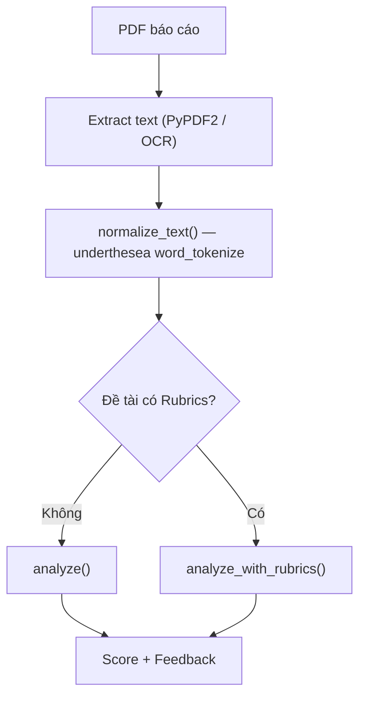
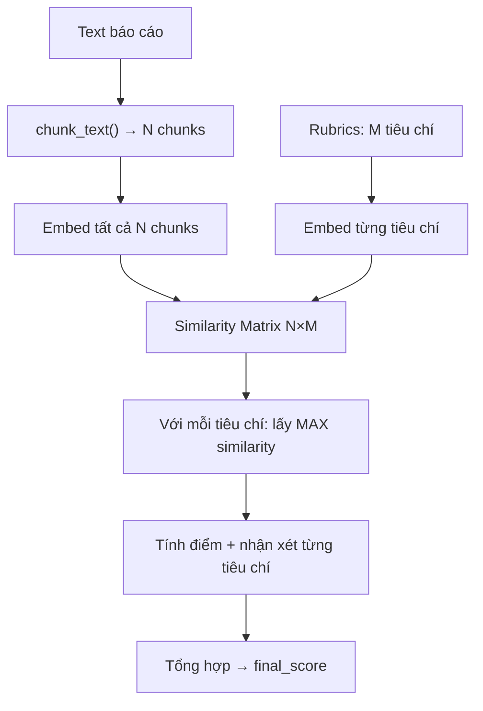

# Phân Tích Toàn Bộ Công Thức Chấm Điểm PhoBERT

> [!NOTE]
> Tài liệu này tổng hợp chi tiết cách hệ thống PhoBERT (`ml-service/models/phobert_analyzer.py`) chấm điểm một bài báo cáo. Có **2 chế độ chấm** tùy thuộc vào việc đề tài có gắn Rubrics hay không.

---

## Kiến Trúc Chung



### Tiền xử lý chung

| Bước | Hàm | Mô tả |
|------|-----|-------|
| 1 | `normalize_text()` | Tách từ tiếng Việt bằng `underthesea.word_tokenize` (VD: "Học sinh" → "Học_sinh"), lowercase, loại bỏ khoảng trắng thừa |
| 2 | `chunk_text()` | Chia văn bản thành chunks theo headings (Chương X, Mục Y.Z). Fallback: chia theo paragraphs nếu không detect được heading |
| 3 | `_get_embedding()` | Tokenize text → đưa qua PhoBERT → lấy vector `[CLS]` token (embedding 768 chiều) |

---

## Chế Độ 1: KHÔNG CÓ RUBRICS — `analyze()`

> Được gọi khi đề tài không gắn Rubrics template.

### Các thành phần

#### 1. Keyword Hit (substring matching)

```python
hits = extract_requirement_hits(clean_text, topic_requirements)
```

- Duyệt qua danh sách `topic_requirements` (yêu cầu kỹ năng/stack của đề tài)
- Mỗi requirement được `normalize_text()` rồi kiểm tra có xuất hiện trong text không (substring match)
- Kết quả: `hits` = số requirement xuất hiện trong text

#### 2. Semantic Hit (cosine similarity)

```python
chunks = chunk_text(clean_text)
# Embed tất cả chunks
for req in topic_requirements:
    best_sim = max(cosine_similarity(chunk_emb, req_emb) for chunk_emb)
    if best_sim > 0.45:
        semantic_hits += 1
```

- Chunk text → embed từng chunk bằng PhoBERT
- Embed từng requirement bằng PhoBERT
- Với mỗi requirement, tính cosine similarity với TẤT CẢ chunks, lấy **MAX**
- Nếu `max_sim > 0.45` → tính là "semantic hit"

#### 3. Repetition Penalty (phạt lặp lại)

```python
sentences = [câu có > 20 ký tự, split by '.']
repetition_ratio = 1.0 - (số câu unique / tổng số câu)
repetition_penalty = repetition_ratio * 3.0   # tối đa -3.0 điểm
```

#### 4. Công thức tổng hợp

```
total_hits = max(keyword_hits, semantic_hits)
keyword_density_score = (total_hits / số_requirements) × 1.5    # max = 1.5
semantic_bonus = 2.0 × min(1.0, total_hits / số_requirements)   # max = 2.0

base_score = 5.0 + keyword_density_score - repetition_penalty
final_score = clamp(base_score + semantic_bonus, 0.0, 10.0)
```

| Thành phần | Giá trị | Ý nghĩa |
|-----------|---------|---------|
| Base cố định | **5.0** | Điểm sàn — mọi bài đều bắt đầu từ 5.0 |
| `keyword_density_score` | **0 → 1.5** | Tỷ lệ keyword match × 1.5 |
| `semantic_bonus` | **0 → 2.0** | Thưởng ngữ nghĩa nếu PhoBERT detect nội dung liên quan |
| `repetition_penalty` | **0 → 3.0** | Phạt nếu phát hiện copy-paste (câu lặp lại) |
| **Tổng lý thuyết** | **2.0 → 8.5** | Base 5.0 + max bonus 3.5 - max penalty 3.0 |

> [!WARNING]
> Điểm max lý thuyết chỉ khoảng **8.5/10** nếu match 100% requirements. Rất khó đạt 9-10.

### Nhận xét (Feedback) — Chế độ 1

```python
if có issues (lặp lại, thiếu nội dung, quá ngắn):
    feedback = "Cần cải thiện: " + danh sách issues
else:
    feedback = "Nội dung đạt yêu cầu."
```

Issues có thể bao gồm:
- `"Báo cáo thiếu các kiến thức chuyên môn cốt lõi của đề tài."` — khi `total_hits == 0`
- `"Phát hiện nội dung lặp lại (X%) — kiểm tra copy-paste."` — khi `repetition_ratio > 0.3`
- `"Nội dung báo cáo quá ngắn, cần bổ sung thêm chi tiết kỹ thuật."` — khi `len(text) < 300`

---

## Chế Độ 2: CÓ RUBRICS — `analyze_with_rubrics()`

> Được gọi khi đề tài có gắn Rubrics template với danh sách tiêu chí.

### Flow tổng quát



### Bước 1: Chunking

Sử dụng `pdf_chunker.py`:

| Trường hợp | Cách chia | Heading |
|-----------|----------|---------|
| Có heading rõ (Chương X, Mục Y.Z, X.Y.Z) | Chia theo heading | Tên heading thực tế |
| Không có heading (< 2 headings detected) | Chia theo paragraphs, mỗi chunk ≤ 600 words | `"Phần 1"`, `"Phần 2"`, ... |
| Text rỗng hoặc quá ngắn | 1 chunk duy nhất | `"Toàn bộ nội dung"` |

> [!IMPORTANT]
> **Đây là lý do bạn thấy "Matched: Phần 1" cho tất cả tiêu chí.** PDF của sinh viên không có heading dạng "Chương X" hay "1.1 Tên mục", hoặc toàn bộ nội dung ≤ 600 words → hệ thống chỉ tạo được 1 chunk duy nhất tên "Phần 1".

### Bước 2: Embed tiêu chí

```python
criteria_text = f"{TenTieuChi} {MoTa} {' '.join(GoiYChoAI)}"
criteria_emb = _get_embedding(normalize_text(criteria_text))
```

Text đại diện tiêu chí = ghép nối **Tên** + **Mô tả** + **Từ khóa gợi ý AI** → normalize → embed.

### Bước 3: Similarity + Keyword Hit Rate

```python
# Cosine similarity với từng chunk
best_chunk_idx, best_sim = max(chunk_similarities)

# Keyword hit rate (chỉ trên chunk tốt nhất)
keyword_hits = đếm số GoiYChoAI xuất hiện trong best_chunk
keyword_hit_rate = keyword_hits / len(GoiYChoAI)    # 0.0 → 1.0
# Nếu GV không nhập GoiYChoAI → mặc định 0.5

# Blend
blended_sim = 0.7 × best_sim + 0.3 × keyword_hit_rate
```

| Thành phần | Trọng số | Nguồn |
|-----------|---------|-------|
| Cosine Similarity (PhoBERT) | **70%** | So sánh ngữ nghĩa giữa chunk và tiêu chí |
| Keyword Hit Rate | **30%** | Đếm từ khóa GoiYChoAI xuất hiện trực tiếp |

### Bước 4: Tính điểm từng tiêu chí

```python
raw_score = blended_sim × DiemToiDa × 1.3
score = clamp(raw_score, 0, DiemToiDa)
```

**Ví dụ cụ thể** (DiemToiDa = 10):

| blended_sim | raw_score | Điểm sau clamp |
|-------------|-----------|----------------|
| 0.35 | 4.55 | 4.55 |
| 0.45 | 5.85 | 5.85 |
| 0.50 | 6.50 | 6.50 |
| 0.60 | 7.80 | 7.80 |
| 0.70 | 9.10 | 9.10 |
| 0.77+ | 10.0+ | **10.0** (capped) |

> [!WARNING]
> **Vấn đề chính:** Cosine similarity của PhoBERT thường rơi trong khoảng **0.3 – 0.65** cho văn bản tiếng Việt. Rất hiếm khi đạt 0.7+. Hệ số `1.3` hiện tại quá thấp để kéo điểm lên vùng 8-9 khi similarity ở mức trung bình-khá.

### Bước 5: Tổng điểm có trọng số

```python
# Cho mỗi tiêu chí i:
weighted_i = (score_i / DiemToiDa_i) × TrongSo_i

total_weighted_score = Σ weighted_i    # Tổng các weighted

# Final score trên thang 10:
final_score = total_weighted_score / 10
```

**Ví dụ** (3 tiêu chí, TrongSo = 30%, 40%, 30%):

| Tiêu chí | Điểm | DiemToiDa | TrongSo | Weighted |
|----------|------|-----------|---------|----------|
| Cơ sở lý thuyết | 6.3 | 10 | 30 | 0.63 × 30 = 18.9 |
| Phân tích Smart Contract | 5.94 | 10 | 40 | 0.594 × 40 = 23.76 |
| Ứng dụng DEX | 5.04 | 10 | 30 | 0.504 × 30 = 15.12 |
| **Tổng** | | | **100** | **57.78** |

`final_score = 57.78 / 10 = 5.78` ✅ (khớp với UI)

### Nhận xét từng tiêu chí — Adaptive Threshold

```python
all_sims = [similarity của tiêu chí này với TẤT CẢ chunks]
mean_sim = trung bình(all_sims)
std_sim  = độ lệch chuẩn(all_sims)

good_threshold = min(0.75, mean_sim + 0.5 × std_sim)
ok_threshold   = max(0.20, mean_sim - 0.5 × std_sim)
```

| Điều kiện | Nhận xét |
|-----------|---------|
| `best_sim >= good_threshold` | **Tốt:** 'Chunk heading' thể hiện rõ nội dung 'Tên tiêu chí' |
| `best_sim >= ok_threshold` | **Khá:** Có đề cập 'Tên tiêu chí' tại 'Chunk heading' nhưng chưa sâu |
| `best_sim < ok_threshold` | **Yếu:** Thiếu nội dung liên quan đến 'Tên tiêu chí' |

> [!CAUTION]
> **Đây là nguyên nhân mâu thuẫn "Tốt" nhưng điểm thấp.**
>
> Khi chỉ có 1 chunk (Phần 1), tất cả tiêu chí đều match vào chunk đó. `all_sims` chỉ có 1 giá trị → `std_sim = 0` → `good_threshold = mean_sim` → **luôn là "Tốt"** bất kể similarity thấp hay cao.
>
> Ví dụ: `best_sim = 0.45`, `mean_sim = 0.45`, `std = 0` → `good_threshold = 0.45` → `0.45 >= 0.45` → "Tốt" ❌

### Nhận xét tổng hợp (Phản hồi trọng tâm)

Dựa trên `final_score` (đã được fix ở phiên trước):

| final_score | Phản hồi |
|-------------|---------|
| < 5.0 | "Báo cáo chưa đạt yêu cầu (X/10). Cần bổ sung và cải thiện nội dung." + liệt kê tiêu chí Yếu/Khá |
| 5.0 – 6.99 | "Báo cáo đạt mức trung bình (X/10). Cần cải thiện: [danh sách]." |
| 7.0 – 8.49 | "Báo cáo khá (X/10)." + nếu có Yếu thì ghi "Cần khắc phục" |
| ≥ 8.5 | "Báo cáo tốt (X/10), đáp ứng đầy đủ các tiêu chí Rubrics." |

---

## Tổng Hợp Vấn Đề Hiện Tại

| # | Vấn đề | Nguyên nhân | File |
|---|--------|-------------|------|
| 1 | Điểm max ~6.5 cho sim ~0.5 | Hệ số scale `1.3` quá thấp | [phobert_analyzer.py](file:///c:/Users/Lenovo/Downloads/FileTaiLieuHK8/DoAnKySu/Web3-GiangVien/ml-service/models/phobert_analyzer.py#L194) |
| 2 | Nhận xét "Tốt" nhưng điểm 5-6 | Adaptive threshold tính sai khi chỉ có 1 chunk | [phobert_analyzer.py](file:///c:/Users/Lenovo/Downloads/FileTaiLieuHK8/DoAnKySu/Web3-GiangVien/ml-service/models/phobert_analyzer.py#L202-L207) |
| 3 | Tất cả tiêu chí match "Phần 1" | PDF không có heading → chỉ 1 chunk duy nhất | [pdf_chunker.py](file:///c:/Users/Lenovo/Downloads/FileTaiLieuHK8/DoAnKySu/Web3-GiangVien/ml-service/utils/pdf_chunker.py#L121-L122) |
| 4 | Điểm max chế độ không rubrics ~8.5 | Base 5.0 + bonus 3.5 = 8.5 max | [phobert_analyzer.py](file:///c:/Users/Lenovo/Downloads/FileTaiLieuHK8/DoAnKySu/Web3-GiangVien/ml-service/models/phobert_analyzer.py#L98-L104) |

## Hướng Cải Thiện Đề Xuất

### A. Fix nhận xét mâu thuẫn
- Thay vì dùng adaptive threshold, **đồng bộ nhận xét theo điểm thực tế**:
  - `score >= 7.0` → "Tốt"
  - `score >= 5.0` → "Khá"  
  - `score < 5.0` → "Yếu"

### B. Fix điểm quá thấp
- Tăng hệ số scale từ `1.3` lên `1.6` hoặc `1.8` để phản ánh đúng hơn:
  - `sim 0.5 × 10 × 1.6 = 8.0` → hợp lý hơn cho bài đạt yêu cầu

### C. Fix "Phần 1" duy nhất
- Cải thiện `_split_by_paragraphs()`: giảm `max_words` từ 600 xuống 300-400 để tạo nhiều chunks hơn
- Hoặc bổ sung thêm regex detect heading tiếng Việt phổ biến (I., II., III., a), b), 1), 2)...)

### D. Fix chế độ không rubrics
- Nâng ceiling: tăng `semantic_bonus` max từ 2.0 lên 3.0 hoặc nâng base
