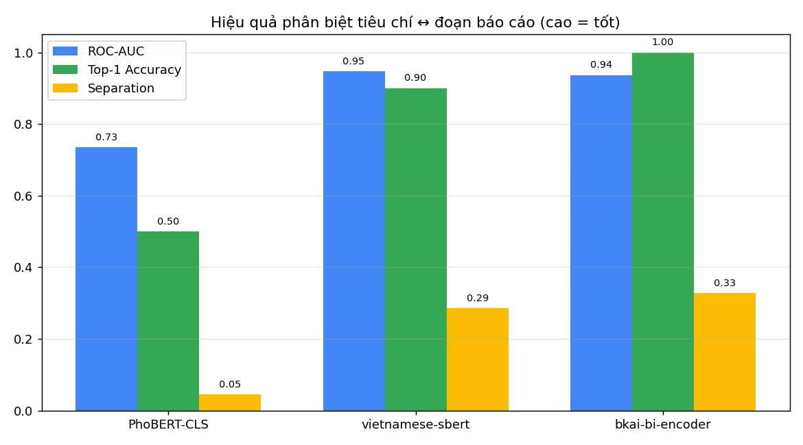
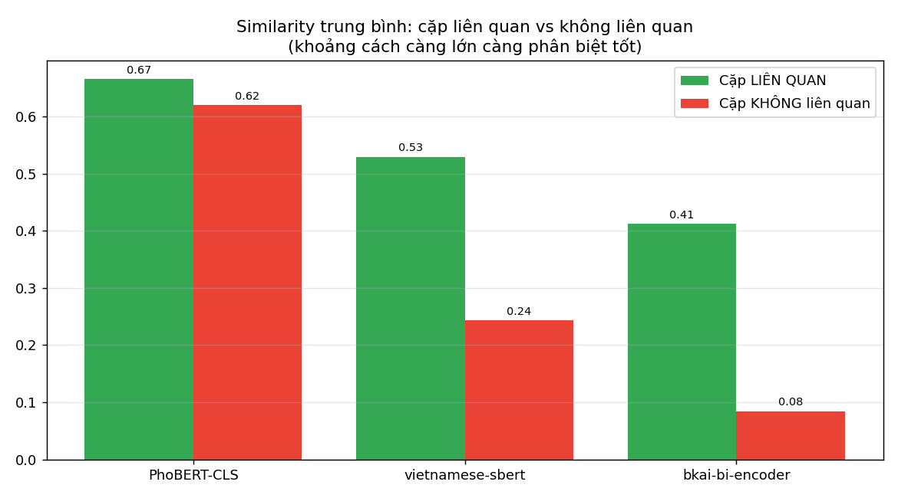

# So Sánh PhoBERT vs Vietnamese-SBERT cho bài toán chấm điểm ngữ nghĩa

> Thử nghiệm thực tế: thay vì chỉ lập luận, đã **chạy 3 mô hình** trên cùng bộ dữ liệu tiếng Việt có nhãn vàng (domain Blockchain/AI) và đo độ hiệu quả khi **so tiêu chí rubric ↔ đoạn báo cáo**.
> Script: [ml-service/scripts/benchmark_models.py](../../ml-service/scripts/benchmark_models.py).

## 1. Thiết lập

- **3 mô hình:**
  - `PhoBERT-CLS` — `vinai/phobert-base`, lấy vector `[CLS]` (đúng cách hệ thống đang dùng).
  - `vietnamese-sbert` — `keepitreal/vietnamese-sbert` (SBERT nền PhoBERT).
  - `bkai-bi-encoder` — `bkai-foundation-models/vietnamese-bi-encoder` (bi-encoder tiếng Việt).
- **Dữ liệu:** 5 tiêu chí × 13 đoạn báo cáo (10 đoạn có nhãn đúng + 3 đoạn lạc đề), tất cả tiếng Việt domain Blockchain/AI.
- **Tiền xử lý:** tách từ `underthesea` cho cả 3 (công bằng, giống pipeline thật).

## 2. Chỉ số đo

| Chỉ số | Ý nghĩa | Tốt khi |
|---|---|---|
| **Separation** | mean_sim(liên quan) − mean_sim(không liên quan) | càng **cao** |
| **ROC-AUC** | khả năng xếp cặp liên quan trên cặp không liên quan | gần **1.0** |
| **Top-1 Accuracy** | mỗi đoạn có được gán similarity cao nhất cho ĐÚNG tiêu chí không | gần **1.0** |
| **Range / Std** | độ giãn của similarity (dồn cục = kém phân biệt) | càng **rộng** |

## 3. Kết quả

| Mô hình | Mean(liên quan) | Mean(không LQ) | Separation | ROC-AUC | Top-1 | Range | Std |
|---|---|---|---|---|---|---|---|
| **PhoBERT-CLS** (hiện tại) | 0.665 | 0.620 | **0.045** | **0.735** | **0.50** | 0.203 | 0.050 |
| **vietnamese-sbert** | 0.529 | 0.243 | **0.286** | **0.947** | **0.90** | 0.602 | 0.159 |
| **bkai-bi-encoder** | 0.412 | 0.084 | **0.328** | **0.936** | **1.00** | 0.871 | 0.177 |

## 4. Phân tích

- **PhoBERT-CLS gần như không phân biệt được liên quan / không liên quan:** cặp liên quan trung bình 0.665, cặp lạc đề 0.620 — chênh **chỉ 0.045**. Top-1 = 0.50 (đoán đúng tiêu chí 1/2 số lần, gần mức ngẫu nhiên). Range chỉ 0.20 → đúng hiện tượng **"dồn cục 0.6"** ta thấy trong hệ thống thật, và là lý do phải nhân hệ số ×1.5 để bù.
- **Cả 2 Vietnamese-SBERT vượt trội rõ rệt:** AUC ~0.94, Top-1 0.90–1.00, Separation gấp **6–7 lần** PhoBERT-CLS. `bkai-bi-encoder` đạt **Top-1 = 1.00** (luôn match đúng tiêu chí) và separation cao nhất (0.328) — similarity giãn rộng (range 0.87) nên điểm phân tách tự nhiên, **không cần chỉnh hệ số**.
- **Tốc độ:** sau khi cache, cả 3 đều ~1–4s cho bộ test nhỏ — không khác biệt đáng kể về hiệu năng.

## 5. Kết luận & Khuyến nghị

> Bằng chứng định lượng **xác nhận**: PhoBERT thô (`[CLS]`) **không phù hợp cho cosine similarity** — đúng như phát hiện trong paper Sentence-BERT. Cho luồng chấm điểm (vốn dựa hoàn toàn vào cosine), **`bkai-foundation-models/vietnamese-bi-encoder`** là lựa chọn tốt nhất (Top-1 = 1.0, separation cao nhất), kế đến là `keepitreal/vietnamese-sbert`.

**Đề xuất hành động:**
1. **Đổi model luồng chấm** sang `bkai-bi-encoder` (qua `SentenceTransformer`), giữ PhoBERT cho phần "đọc hiểu/branding" nếu muốn.
2. **Bỏ / hạ hệ số ×1.5** vì similarity của SBERT đã giãn đẹp (không bị dồn cục) — chấm sẽ chính xác và tự nhiên hơn.
3. Vẫn nên giữ cơ chế **bật/tắt model** để so sánh trước/sau khi chuyển.

*(Lưu ý: bộ test nhỏ mang tính minh hoạ xu hướng; muốn số liệu chắc hơn nên mở rộng dataset có nhãn từ chính báo cáo sinh viên thật.)*
