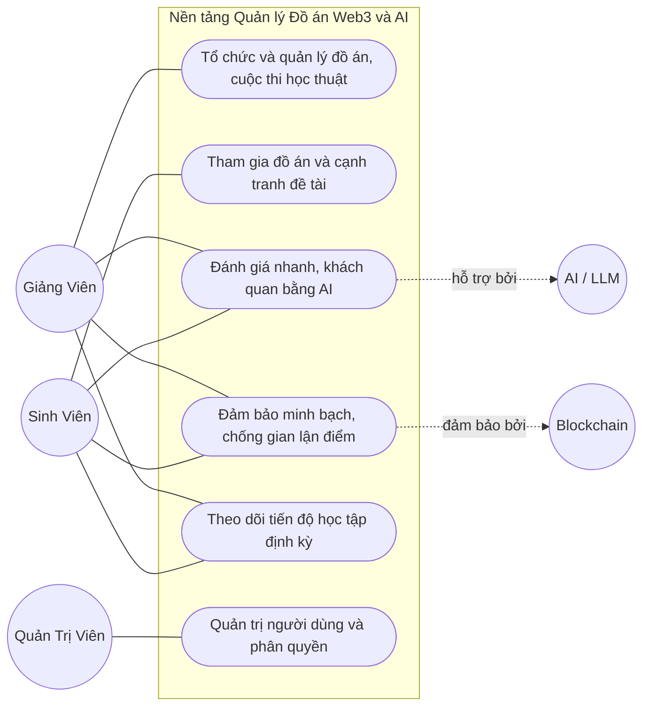
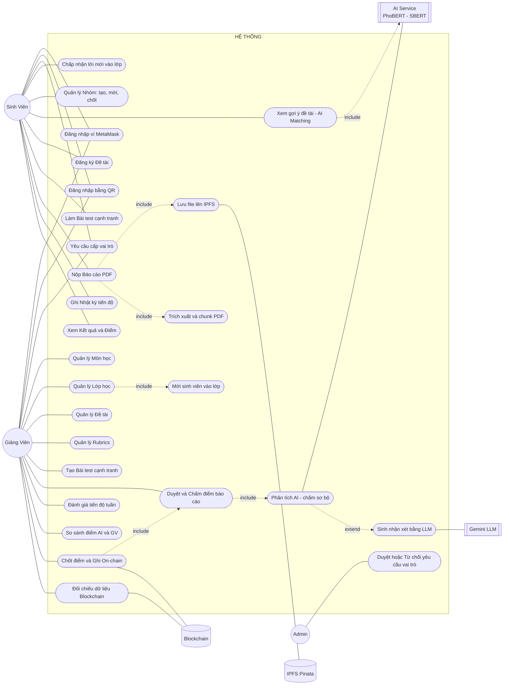
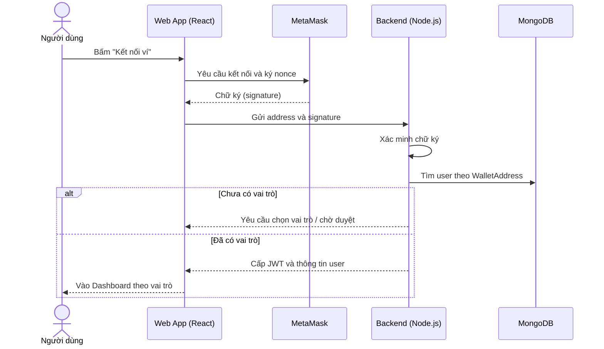
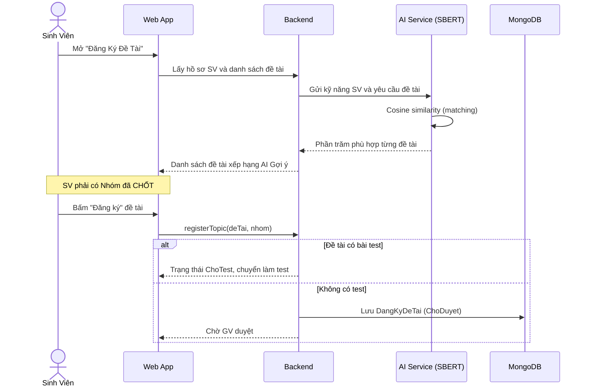
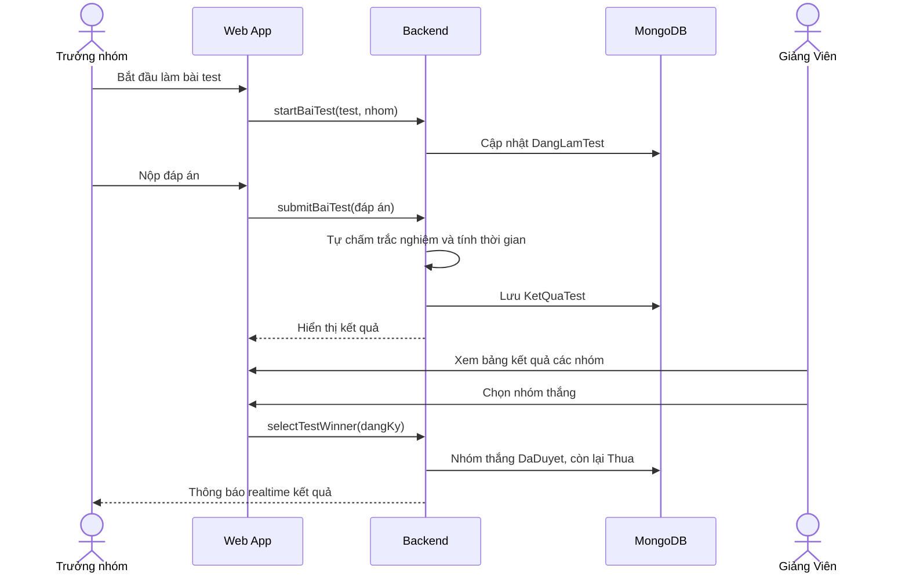
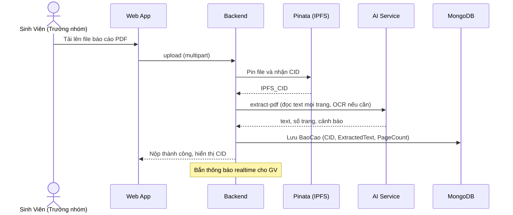
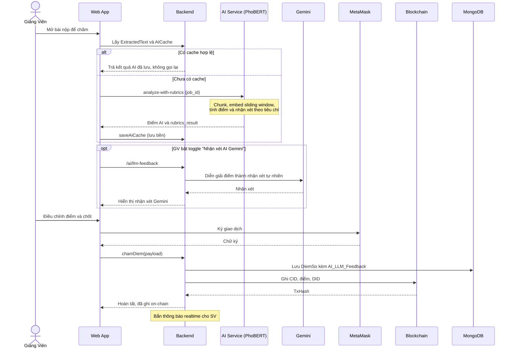
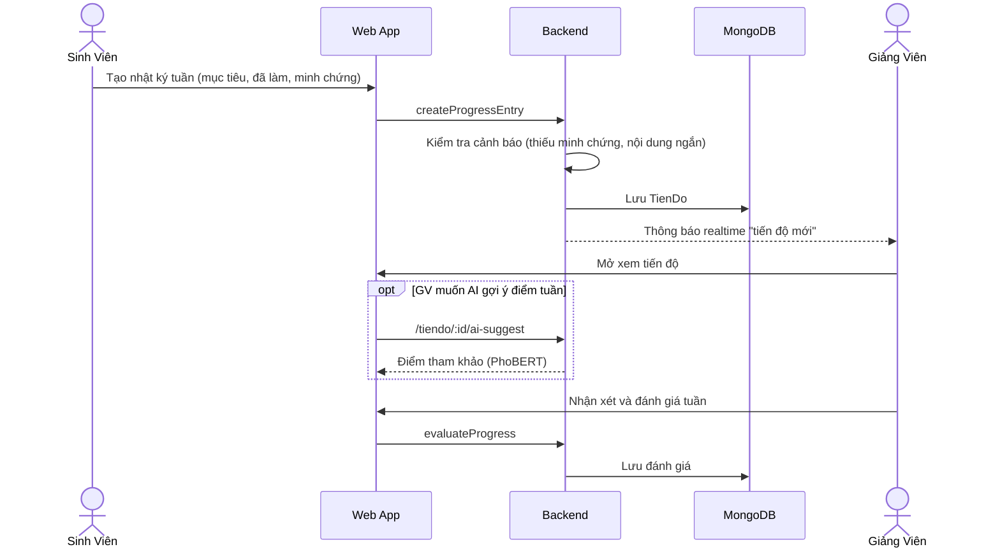
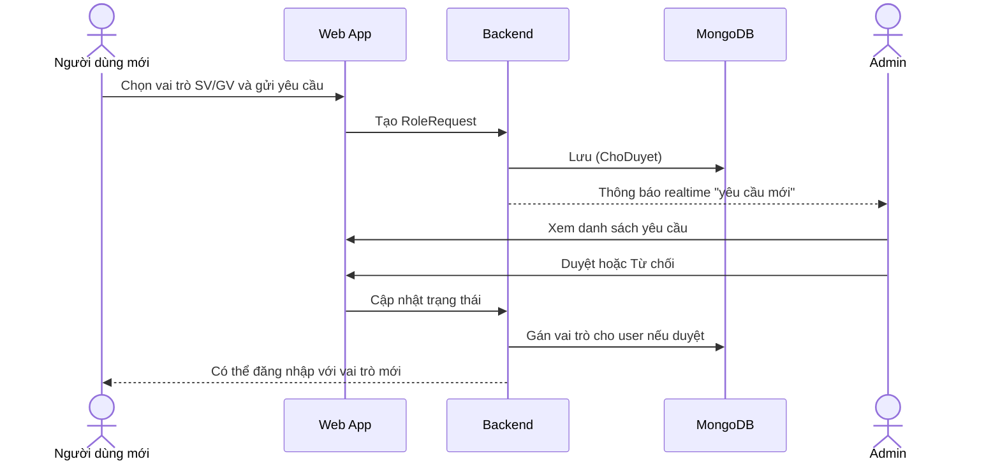

# UML Phân Tích & Thiết Kế — Web3 & AI Competition Platform (Cập nhật 11/06/2026)

> Vẽ lại đầy đủ theo hệ thống **hiện tại**: lớp học + lời mời, nhóm sinh viên, rubrics template, bài test cạnh tranh, nhật ký tiến độ, chấm điểm AI PhoBERT + nhận xét Gemini LLM, lưu IPFS + ghi blockchain, đăng nhập MetaMask/QR, vai trò Admin.
>
> Gồm 4 phần: **(1) Use Case Nghiệp Vụ**, **(2) Use Case Hệ Thống**, **(3) Sơ đồ Tuần Tự** nhiều luồng, **(4) Sơ đồ Phân Cấp Chức Năng**.

---

## 0. Tác Nhân (Actors)

| Tác nhân | Loại | Vai trò |
|----------|------|---------|
| **Sinh Viên** | Chính | Tham gia lớp, đăng ký/đấu đề tài, nộp báo cáo, ghi tiến độ, xem điểm |
| **Giảng Viên** | Chính | Quản lý môn/lớp/đề tài/rubrics, ra bài test, chấm điểm, chốt điểm on-chain |
| **Quản Trị Viên** | Chính | Duyệt yêu cầu cấp vai trò, quản lý người dùng |
| **Hệ thống AI** | Phụ | PhoBERT chấm ngữ nghĩa, SBERT gợi ý đề tài |
| **LLM Gemini** | Phụ | Sinh nhận xét tự nhiên từ kết quả chấm |
| **Blockchain Sepolia** | Phụ | Ghi bất biến điểm + CID |
| **IPFS Pinata** | Phụ | Lưu trữ phi tập trung file báo cáo |
| **Ví MetaMask** | Phụ | Định danh & ký giao dịch |

---

## 1. Use Case NGHIỆP VỤ (Business Use Case)

> Góc nhìn **mục tiêu nghiệp vụ** — hệ thống mang lại giá trị gì, không đi vào chi tiết kỹ thuật.

**Diễn giải nghiệp vụ:**
- **B1 — Tổ chức đồ án:** GV mở môn học, lớp học, đăng đề tài kèm tiêu chí chấm (rubrics) và tùy chọn bài test sàng lọc.
- **B2 — Tham gia & cạnh tranh:** SV vào lớp, lập nhóm, được AI gợi ý đề tài hợp kỹ năng, đăng ký; nếu đề tài "hot" thì thi test cạnh tranh để giành suất.
- **B3 — Đánh giá bằng AI:** AI đọc trước báo cáo, cho điểm sơ bộ + nhận xét, giúp GV tiết kiệm thời gian.
- **B4 — Minh bạch:** Điểm cuối + bằng chứng file ghi bất biến lên blockchain, không ai sửa được.
- **B5 — Theo dõi tiến độ:** SV ghi nhật ký tuần kèm minh chứng; GV nhận xét/đánh giá.
- **B6 — Quản trị:** Admin duyệt ai được làm GV/SV.

---

## 2. Use Case HỆ THỐNG (System Use Case)

> Góc nhìn **chức năng hệ thống** — từng thao tác người dùng tương tác với hệ thống, kèm quan hệ include/extend và tác nhân phụ.

**Ghi chú quan hệ:**
- `US6 include UI1, UI2`: Nộp báo cáo luôn kéo theo lưu IPFS + trích xuất/chunk PDF.
- `UG6 include UC1`: Mỗi lần mở chấm điểm đều gọi AI phân tích sơ bộ (có cache để không gọi lại).
- `UC1 extend UC2`: Nhận xét LLM là **tùy chọn** (GV bật toggle Gemini).
- `UG8 include UG6`: Chốt điểm bao gồm bước chấm; sau đó ghi blockchain.

---

## 3. Sơ Đồ TUẦN TỰ (Sequence Diagrams)

### 3.1. Đăng nhập bằng ví MetaMask

### 3.2. SV được AI gợi ý và đăng ký đề tài (kèm ghép nhóm)

### 3.3. Bài test cạnh tranh (Entrance Test)

### 3.4. Nộp báo cáo (PDF lên IPFS và trích xuất)

### 3.5. GV chấm điểm với AI, nhận xét Gemini và ghi blockchain

### 3.6. Ghi và đánh giá nhật ký tiến độ tuần

### 3.7. Admin duyệt yêu cầu cấp vai trò

---

## 4. Sơ Đồ PHÂN CẤP CHỨC NĂNG (Functional Hierarchy)

```mermaid
flowchart TD
    ROOT["HỆ THỐNG WEB3 và AI COMPETITION PLATFORM"]

    ROOT --- M0["0. Xác thực và Phân quyền"]
    ROOT --- M1["1. Quản lý Đào tạo - GV"]
    ROOT --- M2["2. Tham gia và Nộp bài - SV"]
    ROOT --- M3["3. Đánh giá và Chấm điểm"]
    ROOT --- M4["4. Web3 và Minh bạch"]
    ROOT --- M5["5. Quản trị hệ thống"]

    M0 --- M01["0.1 Đăng nhập ví MetaMask"]
    M0 --- M02["0.2 Đăng nhập QR"]
    M0 --- M03["0.3 Yêu cầu và cấp vai trò"]

    M1 --- M11["1.1 Quản lý Môn học"]
    M1 --- M12["1.2 Quản lý Lớp học"]
    M1 --- M13["1.3 Mời sinh viên vào lớp"]
    M1 --- M14["1.4 Quản lý Đề tài"]
    M1 --- M15["1.5 Quản lý Rubrics"]
    M1 --- M16["1.6 Tạo Bài test cạnh tranh"]

    M2 --- M21["2.1 Tham gia lớp - nhận lời mời"]
    M2 --- M22["2.2 Quản lý Nhóm"]
    M2 --- M23["2.3 AI Gợi ý đề tài - Matching"]
    M2 --- M24["2.4 Đăng ký Đề tài"]
    M2 --- M25["2.5 Làm Bài test cạnh tranh"]
    M2 --- M26["2.6 Nộp Báo cáo PDF"]
    M2 --- M27["2.7 Nhật ký Tiến độ"]
    M2 --- M28["2.8 Xem Kết quả và Điểm"]

    M3 --- M31["3.1 Trích xuất và Chunk PDF"]
    M3 --- M32["3.2 Chấm AI PhoBERT - rubrics hoặc không"]
    M3 --- M33["3.3 Nhận xét LLM - Gemini"]
    M3 --- M34["3.4 Chấm điểm thủ công GV"]
    M3 --- M35["3.5 So sánh điểm AI và GV"]
    M3 --- M36["3.6 Đánh giá tiến độ tuần"]
    M3 --- M37["3.7 Cache kết quả AI"]

    M4 --- M41["4.1 Upload file lên IPFS - Pinata"]
    M4 --- M42["4.2 Ghi điểm và CID lên Smart Contract"]
    M4 --- M43["4.3 Truy xuất và đối chiếu TxHash"]
    M4 --- M44["4.4 Thẻ QR xác thực blockchain"]

    M5 --- M51["5.1 Duyệt yêu cầu vai trò"]
    M5 --- M52["5.2 Quản lý người dùng"]
    M5 --- M53["5.3 Thông báo realtime Socket"]
```

---

## 5. Ghi chú khác biệt so với bản gốc (02/06/2026)

| Hạng mục | Bản gốc | Bản này (hiện tại) |
|----------|---------|--------------------|
| Lớp học | Chưa có | Có Lớp học + cơ chế **lời mời** SV |
| Nhóm | Chưa rõ | Có **quản lý nhóm** tạo/mời/chốt |
| Bài test | Chưa có | Có **bài test cạnh tranh** giành đề tài |
| Tiến độ | Chưa có | Có **nhật ký tiến độ tuần** + minh chứng |
| Nhận xét | Chỉ AI score | Thêm **nhận xét LLM Gemini** bật/tắt |
| Hiệu năng | — | Thêm **cache kết quả AI** không chấm lại |
| Vai trò | SV/GV | Thêm **Admin** + luồng duyệt vai trò |
| Đăng nhập | MetaMask | Thêm **QR login** |
