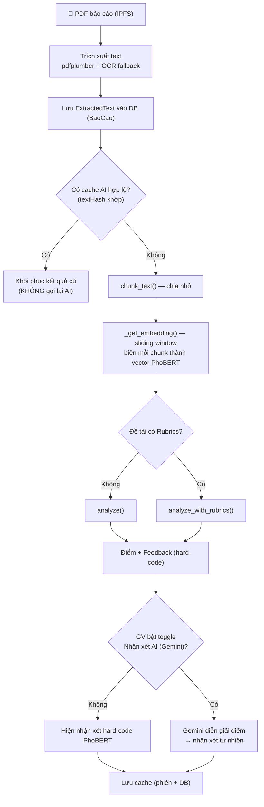
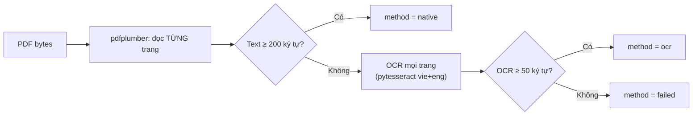
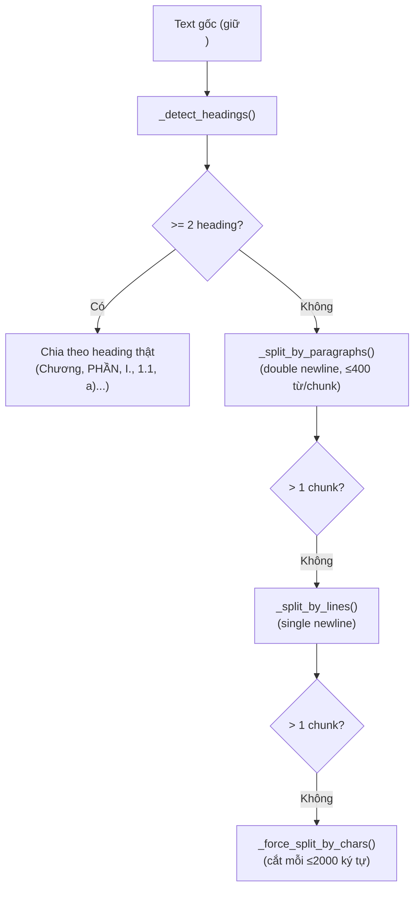
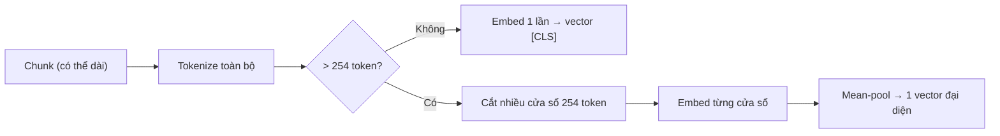
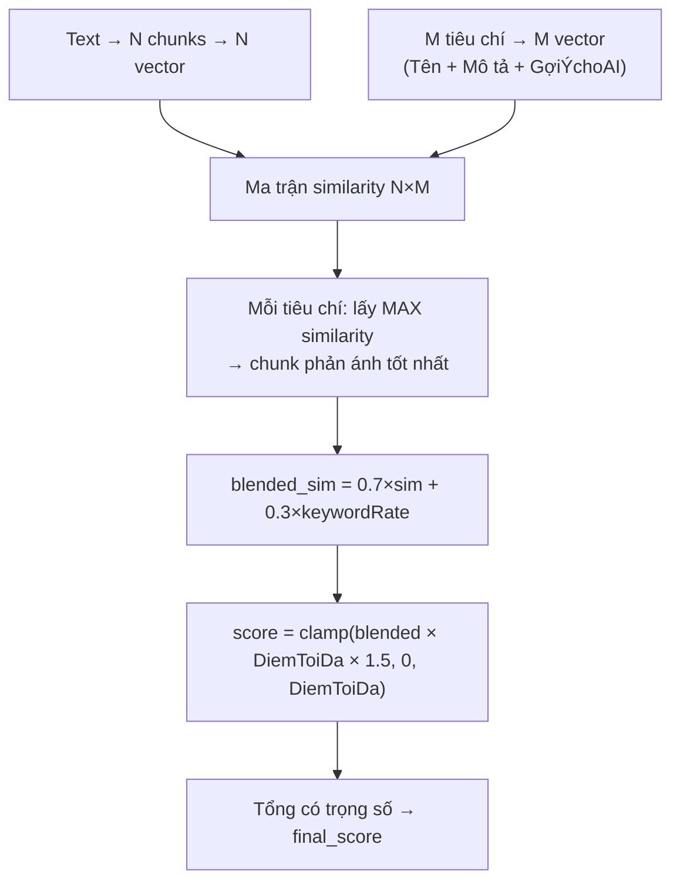
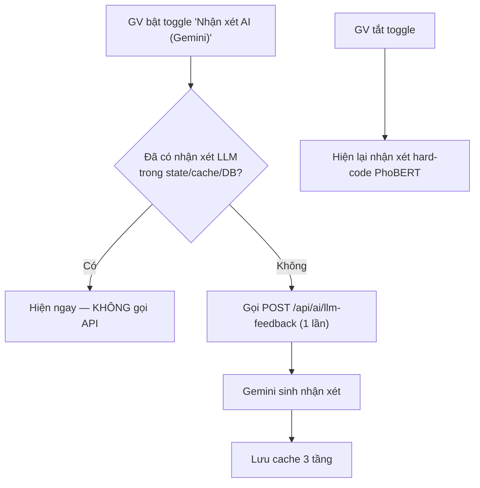
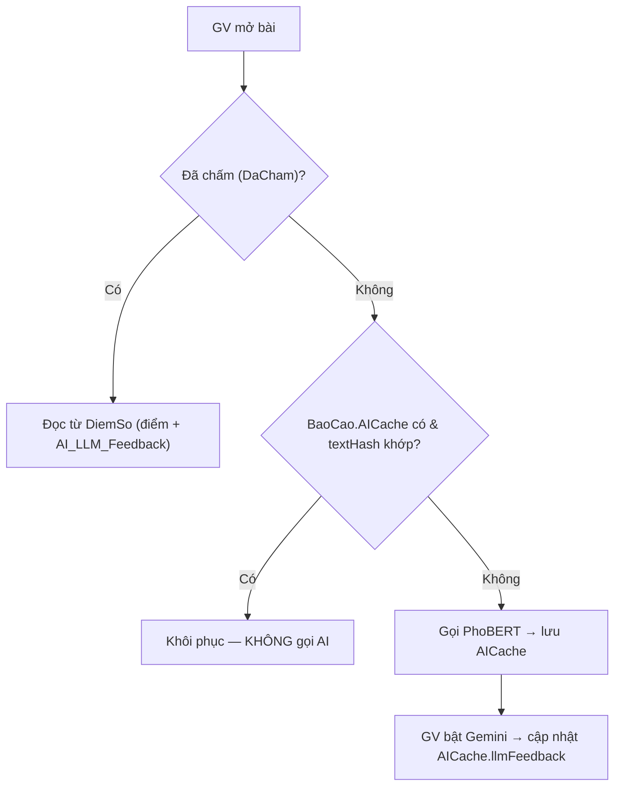
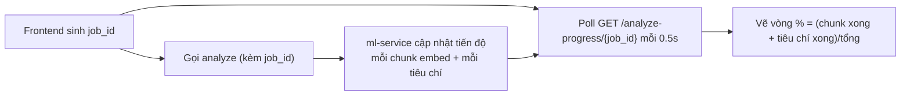

# Quy Trình Xử Lý Báo Cáo PDF → PhoBERT Chấm Điểm → Nhận Xét (Chi Tiết)

> [!NOTE]
> Tài liệu mô tả **toàn bộ hành trình** của một file báo cáo PDF: từ lúc đọc, chia nhỏ, đưa qua PhoBERT để chấm, đến lúc sinh nhận xét. Bao gồm **2 luồng** (CÓ và KHÔNG có Rubrics) và **chức năng nhận xét mới bằng Gemini (LLM)**.
> Phản ánh trạng thái mã nguồn **sau các cập nhật ngày 11/06/2026** (đã sửa bug heading, đọc hết chunk, hệ số 1.5, trần 9, cache bền, thanh tiến độ %).

---

## 1. Bức Tranh Tổng Quát



**Phân vai rõ ràng:**

| Công đoạn | Ai làm | Ghi chú |
|-----------|--------|---------|
| Đọc PDF → text | Code (`pdfplumber`/OCR) | Đọc đủ mọi trang |
| Chia chunk | Code (`pdf_chunker.py`) | Phủ 100% nội dung |
| Hiểu nghĩa tiếng Việt | **PhoBERT (AI)** | Tạo embedding 768 chiều |
| Đo độ giống | Công thức cosine similarity | Chuẩn toán học |
| Quy ra điểm | Code (hệ số, base, blend) | Không phải AI |
| Nhận xét mặc định | Code (if/else theo điểm) | Hard-code |
| **Nhận xét nâng cao** | **Gemini (LLM)** ✨ | Mới — diễn giải điểm thành văn xuôi |

---

## 2. Trích Xuất Text Từ PDF — `pdf_extractor.py`



| Đặc điểm | Chi tiết |
|----------|----------|
| Đọc đủ trang | Lặp qua **tất cả** `pdf.pages`, nối bằng `\n\n` |
| PDF scan (ảnh) | Tự fallback OCR toàn bộ trang |
| Cảnh báo bảo mật | Phát hiện text ẩn (font < 1px), dấu hiệu prompt injection |
| Kết quả lưu | `ExtractedText`, `PageCount`, `ExtractionMethod`, `ExtractionWarnings` |

> [!IMPORTANT]
> **Đảm bảo đọc 100% nội dung, không sót trang** — kể cả PDF scan (qua OCR). Số trang đọc được hiển thị trên UI ("Hệ thống đã đọc N trang bài làm").

---

## 3. Chia Nhỏ Nội Dung (Chunking) — `pdf_chunker.py`

> [!IMPORTANT]
> **Bản sửa 11/06:** trước đây `normalize_text()` được gọi **trước** `chunk_text()` → xóa mọi `\n` → regex heading không bao giờ khớp (chunk luôn tên "Khối N" vô nghĩa). Nay `chunk_text(text)` chạy trên **text gốc giữ `\n`**, chỉ `normalize_text()` **từng chunk** lúc embed → heading detection sống lại.

### Thứ tự ưu tiên chia chunk



| Mức | Heading nhận diện |
|-----|-------------------|
| 1 | `Chương X`, `CHƯƠNG`, `Chapter`, `PHẦN I/1`, `MỞ ĐẦU`, `KẾT LUẬN`, `TÀI LIỆU THAM KHẢO`... |
| 2 | `X.Y` (1.1, 2.3), `Phần X`, `Mục X`, số La Mã `I.` `II.` `III.` |
| 3 | `X.Y.Z`, `a)` `b)`, `a.` `b.`, `1)` `2)` |

> [!NOTE]
> **Phủ 100% nội dung, không sót:** nếu không detect được heading, hệ thống lần lượt fallback xuống paragraph → line → **force-split theo ký tự** (cắt tại dấu câu gần nhất). Force-split chạy liên tục từ đầu đến cuối text nên **không mất chữ nào**.

---

## 4. Biến Chunk Thành Vector — `_get_embedding()` (Sliding Window)

> [!IMPORTANT]
> **Bản sửa 11/06:** PhoBERT-base giới hạn cứng **256 token/lần forward**. Trước đây chunk dài bị cắt còn 256 token → phần sau bị bỏ. Nay dùng **cửa sổ trượt**: chunk dài được cắt thành nhiều cửa sổ ≤254 token, embed từng cửa sổ rồi **lấy trung bình (mean-pool)** → PhoBERT thật sự "đọc hết" chunk.



Kết quả: mỗi chunk → 1 vector 768 chiều đại diện cho toàn bộ ý nghĩa của nó.

---

## 5. LUỒNG 1 — KHÔNG CÓ RUBRICS: `analyze()`

> Dùng khi đề tài **không** gắn Rubrics. Giống "chấm nhanh": kiểm tra bài có đúng chủ đề không.

### Các thành phần điểm

| # | Thành phần | Cách tính | Khoảng |
|---|-----------|-----------|--------|
| 1 | Keyword hit | Đếm `topic_requirements` xuất hiện trong text (substring) | — |
| 2 | Semantic hit | Mỗi requirement so cosine với MAX của tất cả chunks; `> 0.45` = hit | — |
| 3 | `keyword_density_score` | `(total_hits / số_req) × 1.5` | 0 → **1.5** |
| 4 | `semantic_bonus` | `2.5 × min(1, total_hits/số_req)` | 0 → **2.5** |
| 5 | `repetition_penalty` | `tỷ_lệ_câu_lặp × 3.0` | 0 → −3.0 |

### Công thức

```
total_hits   = max(keyword_hits, semantic_hits)
base_score   = 5.0 + keyword_density_score − repetition_penalty
final_score  = clamp(base_score + semantic_bonus, 0, 10)
```

| Thành phần | Giá trị |
|-----------|---------|
| Base cố định | **5.0** (điểm sàn) |
| + keyword tối đa | +1.5 |
| + semantic tối đa | +2.5 |
| **Trần thực tế** | **= 9.0** |

> [!NOTE]
> **Bản sửa 11/06:** trần nâng từ **8.5 → 9.0** (`semantic_bonus` 2.0→2.5). Theo yêu cầu, luồng không rubrics **không vượt 9.0** (để dành 9–10 cho luồng rubrics có chấm chi tiết).

### Nhận xét (hard-code)

- Có vấn đề → `"Cần cải thiện: " + danh sách issues`
- Không → `"Nội dung đạt yêu cầu."`

Issues khả dĩ: thiếu kiến thức cốt lõi (`total_hits == 0`), lặp nội dung (`repetition > 0.3`), bài quá ngắn (`< 300` ký tự).

---

## 6. LUỒNG 2 — CÓ RUBRICS: `analyze_with_rubrics()`

> Dùng khi đề tài gắn Rubrics (danh sách tiêu chí + trọng số). Giống "chấm theo barem".



### Bước tính điểm mỗi tiêu chí

```
criteria_text = TenTieuChi + MoTa + GoiYChoAI
blended_sim   = 0.7 × best_sim + 0.3 × keyword_hit_rate
score         = clamp(blended_sim × DiemToiDa × 1.5, 0, DiemToiDa)
```

| Thành phần | Trọng số |
|-----------|---------|
| Cosine similarity (PhoBERT) | 70% |
| Keyword hit rate (GoiYChoAI) | 30% |

> [!NOTE]
> **Bản sửa 11/06:** hệ số scale **1.3 → 1.5**. Phổ điểm mới (DiemToiDa = 10):

| blended_sim | điểm (×1.5) |
|-------------|-------------|
| 0.45 | 6.75 |
| 0.55 | 8.25 |
| 0.65 | 9.75 |
| ≥ 0.70 | 10.0 (clamp) |

### Tổng điểm có trọng số

```
weighted_i  = (score_i / DiemToiDa_i) × TrongSo_i
final_score = (Σ weighted_i) / 10
```

### Nhận xét TỪNG tiêu chí — theo điểm thực tế

> [!IMPORTANT]
> **Bản sửa 11/06:** bỏ "adaptive threshold" (mean±std). Lý do: khi chỉ 1 chunk → `std = 0` → luôn ra "Tốt" dù điểm thấp (mâu thuẫn). Nay bám **tỷ lệ điểm thật** `score_ratio = score / DiemToiDa`:

| Điều kiện | Nhận xét |
|-----------|---------|
| `score_ratio ≥ 0.7` | **Tốt:** thể hiện rõ nội dung |
| `score_ratio ≥ 0.5` | **Khá:** có đề cập nhưng chưa sâu |
| `< 0.5` | **Yếu:** thiếu nội dung liên quan |

### Nhận xét tổng hợp (theo `final_score`)

| final_score | Phản hồi |
|-------------|---------|
| < 5.0 | Chưa đạt yêu cầu + liệt kê tiêu chí Yếu/Khá |
| 5.0 – 6.99 | Trung bình + cần cải thiện |
| 7.0 – 8.49 | Khá tốt |
| ≥ 8.5 | Tốt, đáp ứng đầy đủ tiêu chí |

---

## 7. NHẬN XÉT NÂNG CAO BẰNG GEMINI (LLM) — *mới*

> [!NOTE]
> PhoBERT là mô hình **encoder** (chỉ hiểu nghĩa, không sinh văn bản). Nhận xét hard-code khá khô. Vì vậy bổ sung **Gemini** để *diễn giải* điểm + kết quả tiêu chí thành đoạn nhận xét tự nhiên kiểu giảng viên. **Gemini KHÔNG chấm điểm** — điểm vẫn 100% do PhoBERT.

### Cơ chế bật/tắt + chống tốn phí



| Đặc điểm | Chi tiết |
|----------|----------|
| Model | `gemini-2.5-flash` (free tier, cấu hình qua `.env` `GEMINI_MODEL`) |
| Đầu vào | `score`, `isRubrics`, `rubricsResult` (hoặc `issues` nếu không rubrics), tên đề tài |
| Ràng buộc prompt | Không bịa nội dung, không đổi điểm, 3–5 câu tiếng Việt, không markdown |
| Tắt "thinking" | `thinkingConfig.thinkingBudget = 0` (tránh nhận xét bị cụt) |
| Fallback | Thiếu API key / lỗi / timeout → tự dùng nhận xét hard-code (`usedLLM=false`) |
| 2 luồng | Hỗ trợ cả CÓ và KHÔNG rubrics |

### Chống gọi lại API (cache 3 tầng)

| Tầng | Phạm vi | Mục đích |
|------|---------|----------|
| State + `aiCacheRef` | Trong phiên | Toggle qua lại không gọi lại |
| `BaoCao.AICache` (DB) | Bài **chưa chấm**, qua reload | Reload không gọi lại Gemini |
| `DiemSo.AI_LLM_Feedback` (DB) | Bài **đã chấm** | Mở lại đọc thẳng từ điểm đã lưu |

---

## 8. Cache Kết Quả AI (Không Chấm Lại Khi Reload)

> [!IMPORTANT]
> **Plan B (11/06):** trước đây reload trang là bài chưa chấm bị PhoBERT chấm lại (lãng phí) và Gemini có thể bị gọi lại (tốn phí). Nay lưu kết quả vào `BaoCao.AICache` kèm `textHash`.



> [!NOTE]
> `textHash` = SHA-256 của `ExtractedText`. SV **nộp lại bài** (nội dung đổi) → hash đổi → cache **tự vô hiệu** → chấm mới.

---

## 9. Thanh Tiến Độ % Thật (Job + Polling)

> [!NOTE]
> Thay spinner xoay vòng bằng **vòng tròn % thật** (gradient màu Google) + dòng "đã xử lý X/Y phần • N chunk • số trang".



| Thành phần | Vị trí |
|-----------|--------|
| Store tiến độ in-memory | `ml-service/utils/progress.py` |
| Cập nhật theo job_id | `phobert_analyzer.py` (vòng lặp chunk + tiêu chí) |
| Endpoint trả tiến độ | `GET /analyze-progress/{job_id}` (không rate-limit) |
| Proxy backend | `GET /api/ai/analyze-progress/:jobId` |

> [!CAUTION]
> Store là in-memory trong **1 tiến trình**. Nếu chạy uvicorn **nhiều worker**, cần chuyển sang Redis để poll không trúng worker khác.

---

## 10. Bản Đồ Endpoint Liên Quan

| Method | Endpoint | Vai trò |
|--------|----------|---------|
| POST | `/api/ai/analyze-report` | Chấm không rubrics |
| POST | `/api/ai/analyze-rubrics` | Chấm có rubrics |
| POST | `/api/ai/llm-feedback` | Sinh nhận xét Gemini |
| GET | `/api/ai/analyze-progress/:jobId` | Tiến độ % |
| GET | `/api/baocao/:id/extracted` | Lấy text + `aiCache` |
| POST | `/api/baocao/:id/ai-cache` | Lưu cache AI bền |
| POST | `/api/diemso` | Chốt điểm (lưu `AI_LLM_Feedback`) |

---

## 11. Tóm Tắt Một Câu

> File PDF được **đọc đủ mọi trang** → **chia chunk phủ 100%** → **PhoBERT đọc hết từng chunk** → tính điểm theo **1 trong 2 luồng** (không rubrics tối đa 9, có rubrics tối đa 10) → nhận xét **hard-code mặc định**, hoặc bật **Gemini** để có nhận xét tự nhiên — tất cả được **cache bền** để reload không chấm lại, và hiển thị **tiến độ % thật** khi đang chấm.
