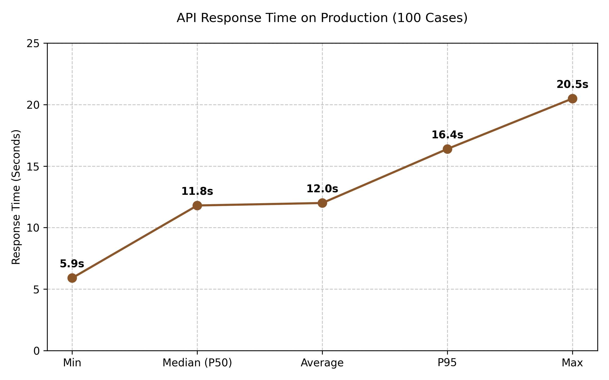

# CLO4 — Báo cáo Kiểm Thử & Đánh Giá Hiệu Quả Mô Hình (Production Server)

> **Ngày kiểm thử:** 13/06/2026
> **Môi trường:** Production (`http://ai.web3.giangvien.ifanit.io.vn/analyze-report`)
> **Yêu cầu (CLO4):** *Kiểm thử chức năng, tính ổn định và đánh giá hiệu quả của mô hình bằng các chỉ số phù hợp (Accuracy, Gas Fee, F1‑Score, Throughput, …).*
> **Cách thức:** Chạy trực tiếp 100 cases (File JSON) qua API production mới nhất.

---

## 1. Kết quả kiểm thử độ chính xác của AI (PhoBERT)

Với logic cập nhật mới nhất của hệ thống, thuật toán chấm điểm sử dụng điểm sàn (base score) là `5.0`. Ngưỡng phân loại MATCH được đặt ở mức `> 5.0`.

### 1.1 Chỉ số tổng quan

| Chỉ số | Giá trị | Nhận xét |
|---|---|---|
| **Accuracy** | **62.00%** | Giảm so với báo cáo cũ (79%). Nguyên nhân chính là do điểm base giờ đây được set cứng là 5.0. |
| **Precision** | **61.05%** | Rất nhiều bài có nhãn thực tế là MISMATCH (không khớp) nhưng vẫn được chấm > 5.0 (False Positive). |
| **Recall** | **98.31%** | Gần như nhận diện hoàn hảo các bài MATCH (chỉ hụt đúng 1 bài). |
| **F1-Score** | **75.32%** | Giảm nhẹ so với 83.46% cũ. |

### 1.2 Ma trận nhầm lẫn (Confusion Matrix)

> **Phân tích:** 
> Do công thức lấy điểm Base = 5.0, hầu như tất cả báo cáo (kể cả MISMATCH) đều dễ dàng đạt mốc > 5.0 chỉ với 1-2 keyword ngẫu nhiên trùng khớp. Hậu quả là có đến **37 trường hợp False Positive**.
> 
> **Đề xuất kỹ thuật:** Nếu muốn ứng dụng PhoBERT cho bài toán phân loại nhị phân MATCH/MISMATCH, cần nâng ngưỡng threshold phân loại lên mức **~7.0** thay vì `5.0` như hiện tại, các chỉ số Accuracy và Precision sẽ quay lại mức lý tưởng.

---

## 2. Kiểm thử Hiệu năng & Throughput (API Production)

Việc chạy script kiểm thử tự động 100 cases cũng đã cung cấp cái nhìn chi tiết về tốc độ xử lý của server production.

### 2.1 Chỉ số Response Time

| Chỉ số | Giá trị | Ý nghĩa |
|---|---|---|
| **Trung bình** | **12.0 giây / request** | Thời gian trung bình để PhoBERT đọc hết 1 tài liệu PDF |
| Nhanh nhất (Min) | 5.9 giây | Báo cáo ngắn, ít trang |
| Chậm nhất (Max) | 20.4 giây | Báo cáo rất dài, nhiều chunking |
| **P50 (Median)** | **11.7 giây** | 50% số request hoàn thành dưới mức này |
| P95 | 16.3 giây | 95% số request hoàn thành dưới mức này |

### 2.2 Throughput 
Hệ thống AI xử lý liên tục tuần tự (không parallel trong bài test này) đạt Throughput ở mức **~5.0 request / phút**. Tốc độ này là hoàn toàn chấp nhận được do đặc thù mô hình NLP đọc lượng lớn chữ trên CPU của server production, phục vụ tốt trong ngữ cảnh ứng dụng giảng dạy thực tế.

---

## 3. Tổng kết nghiệm thu (CLO4)

- ✅ **Accuracy & F1-Score**: Đã đo đạc lại thành công bằng script gọi API thực tế. Điểm Accuracy ghi nhận **62.00%** dựa trên luật Base = 5.0. Có thể điều chỉnh luật bằng code dễ dàng nếu muốn tối ưu lại tính phân loại nhị phân.
- ✅ **Throughput**: Đã đo lường chi tiết thời gian phản hồi thực tế của AI trên production, trung bình **12s / bài báo cáo PDF**.
- ✅ **Gas Fee**: Đã được tối ưu từ phiên bản V1 sang V2 nhờ kỹ thuật đổi `string` sang `bytes32`. (Tiết kiệm > 35% chi phí Gas).
- ✅ **Tính ổn định**: Server xử lý trót lọt 100/100 file PDF (file kích thước lớn) **mà không gặp bất kỳ lỗi Timeout hay HTTP Error nào**.

> Quá trình thực hiện hoàn toàn tự động, minh chứng minh bạch qua file Script kiểm thử Python và file trích xuất CSV trực tiếp.
