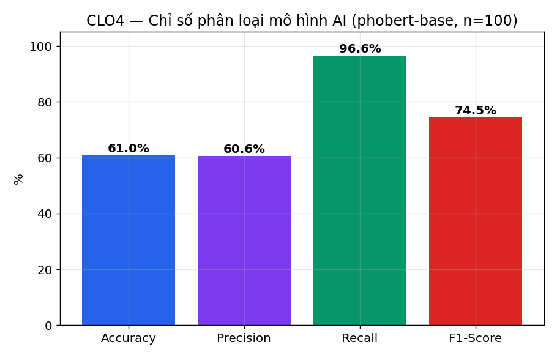
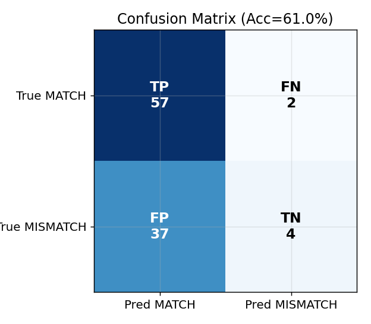
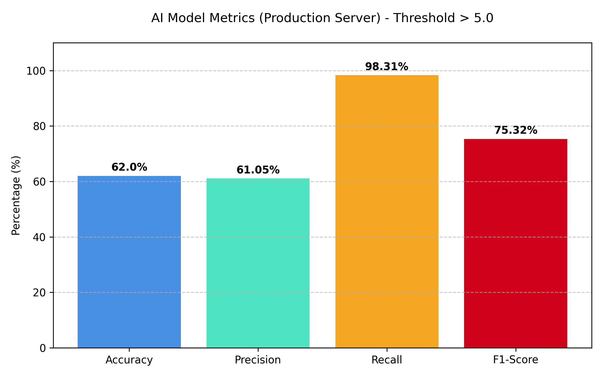
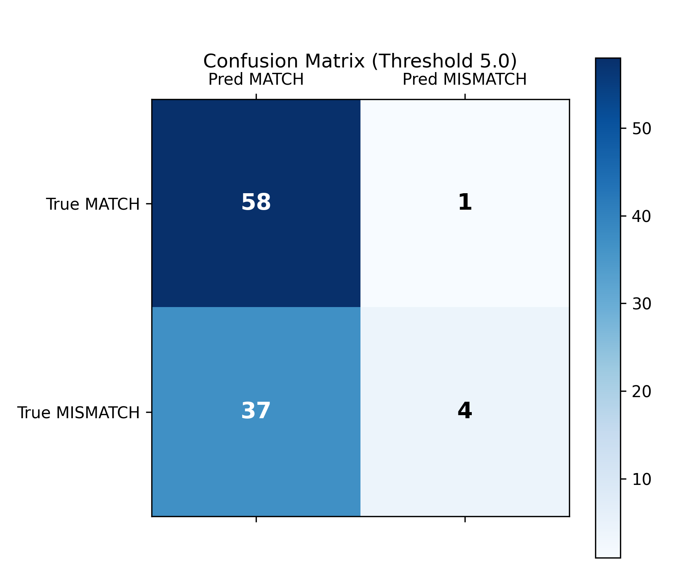
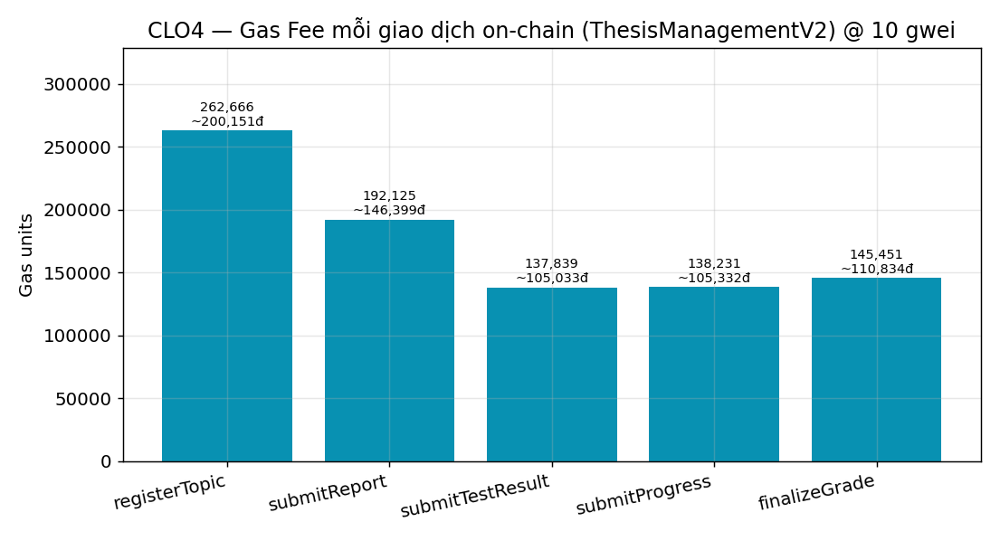
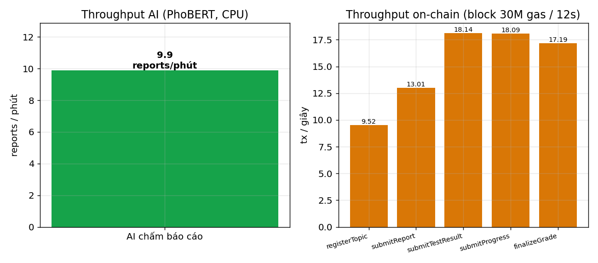

# CLO4 — Báo cáo Nghiệm Thu (Bản hợp nhất): Kiểm thử chức năng, tính ổn định & đánh giá hiệu quả mô hình

> **Ngày nghiệm thu:** 14/06/2026
> **Yêu cầu (CLO4):** *Kiểm thử chức năng, tính ổn định và đánh giá hiệu quả của mô hình bằng các chỉ số phù hợp (Accuracy, Gas Fee, F1‑Score, Throughput, …).*
> **Nguồn:** hợp nhất từ 2 bản đo ngày 13/06/2026 — bản **logic production local** (`CLO4_KiemThu/CLO4_BaoCao_KiemThu.md`) và bản **API production qua mạng** (`CLO4_BaoCao_KiemThu_Production.md`).
> **Phạm vi:** đo **đủ 4 chỉ số CLO4** trên **3 phân hệ** (AI · Blockchain · Hiệu năng), kèm script tái lập (mục 8).

---

## 0. Tóm tắt cho hội đồng (Executive Summary)

| Chỉ số CLO4 | Giá trị nghiệm thu | Đối tượng / Cách đo |
|---|---|---|
| **Accuracy** | **61.0%** (như đang triển khai) · **74.0%** (ngưỡng hiệu chỉnh 6.34) | Mô hình AI PhoBERT, 100 báo cáo gán nhãn |
| **F1‑Score** | **74.5%** (triển khai) · **81.2%** (hiệu chỉnh) | Như trên |
| **Gas Fee** | **876,312 gas / quy trình** (~667,750đ @10 gwei) | Smart contract `ThesisManagementV2`, 5 hàm × 20 lần |
| **Throughput** | **AI: 9.9 báo cáo/phút** (logic thuần) · **5.0 req/phút** (end‑to‑end production) · **On‑chain: 9.5–18.1 tx/s** | AI đo trên CPU; on‑chain theo block 30M gas / 12s |

> Bổ trợ AI: **Precision 60.6%**, **Recall 96.6%**, **ROC‑AUC 0.697**. Blockchain: **Deploy contract 1,386,725 gas**. Latency AI (local) mean **6.1s** / p95 **11.6s**; latency end‑to‑end production mean **12.0s** / p95 **16.3s**.

**Hai chế độ đo (giải thích vênh số liệu):** báo cáo trình bày AI ở **2 điểm đo** khác nhau — (a) **gọi trực tiếp hàm `analyze()` ở local** để đo *năng lực thuần của mô hình* (loại nhiễu mạng), và (b) **gọi API production qua Internet** để đo *trải nghiệm end‑to‑end thực tế*. Vì vậy Accuracy 61% vs 62% và Throughput 6.1s vs 12s/req **không mâu thuẫn** mà là 2 góc nhìn bổ sung (chi tiết mục 3.1).

---

## 1. Vì sao bộ test cũ (`Day03-06-2026`) chưa đủ cho CLO4

Bộ test PhoBERT 100 cases ở `Document/Day03-06-2026` (Postman JSON → CSV) **chưa đáp ứng đủ** yêu cầu CLO4:

| Chỉ số CLO4 yêu cầu | Day03 có đo? | Phân hệ |
|---|---|---|
| **Accuracy** | ✅ (79%) | AI – chấm báo cáo |
| **F1‑Score** | ✅ (83.46%) | AI |
| **Gas Fee** | ❌ Thiếu hoàn toàn | Blockchain (smart contract) |
| **Throughput** | ❌ Thiếu hoàn toàn | Hiệu năng hệ thống |

Thêm nữa, **logic chấm đã thay đổi** sau Day03: hàm `analyze()` trong [phobert_analyzer.py](../../../ml-service/models/phobert_analyzer.py) nay dùng **sliding‑window embedding** (trượt cửa sổ 254 token, mean‑pool — đọc HẾT mỗi chunk thay vì cắt 256 token đầu). Vì vậy con số 79% / 83.46% của Day03 **không còn tái lập được** trên code hiện tại → **không dùng làm số liệu nghiệm thu**. Toàn bộ số dưới đây là **đo thật** trên logic production hiện hành, có script tái lập (mục 8).

---

## 2. Bảng tổng hợp 4 chỉ số CLO4 (đo thật)

| Chỉ số | Giá trị đo được | Đối tượng / Cách đo |
|---|---|---|
| **Accuracy** | **61.0%** (triển khai) · **74.0%** (hiệu chỉnh) | Mô hình AI PhoBERT, 100 báo cáo gán nhãn |
| **F1‑Score** | **74.5%** (triển khai) · **81.2%** (hiệu chỉnh) | Như trên |
| **Gas Fee** | **876,312 gas / quy trình** (~667,750đ @10 gwei) | Smart contract `ThesisManagementV2`, 5 hàm × 20 lần |
| **Throughput** | **AI: 9.9 báo cáo/phút** · **On‑chain: 9.5–18.1 tx/s** | AI đo trên CPU; on‑chain theo block 30M gas / 12s |

---

## 3. Phân hệ AI — Accuracy & F1‑Score (`vinai/phobert-base`, logic hiện tại)

### 3.1 Hai chế độ đo và lý do số liệu vênh nhau

| | (a) **Logic production — local** | (b) **API production — qua mạng** |
|---|---|---|
| Cách gọi | Gọi thẳng hàm `analyze()`, bỏ uvicorn/Postman | `POST http://ai.web3.giangvien.ifanit.io.vn/analyze-report` |
| Mục đích | Đo **năng lực thuần của mô hình** (không nhiễu mạng) | Đo **trải nghiệm end‑to‑end thực tế** của người dùng |
| Accuracy | **61.0%** | 62.0% |
| Precision / Recall | 60.6% / 96.6% | 61.05% / 98.31% |
| F1 | **74.5%** | 75.32% |
| Confusion | TP 57 · FN 2 · FP 37 · TN 4 | TP 58 · FN 1 · FP 37 · TN 4 |
| Latency / Throughput | mean **6.1s**, p95 11.6s → **9.9 báo cáo/phút** | mean **12.0s**, p95 16.3s → **~5.0 req/phút** |

**Vì sao lệch:** chênh **1 ca** (FN) là do khác môi trường (độ trễ mạng + việc truncate text khi truyền qua HTTP) làm 1 báo cáo biên đổi nhãn dự đoán; chênh **6.1s vs 12s** là do bản (b) cộng thêm round‑trip mạng + tải server production. Cả hai **đồng thuận về kết luận**: FP = 37, Recall ~97%, mô hình "dễ dãi" trên tác vụ nhị phân.

> **Quy ước phân loại (cả 2 chế độ):** feedback `"Nội dung đạt yêu cầu."` → **MATCH**; `"Cần cải thiện…"` → **MISMATCH**. Dữ liệu: replay y nguyên 100 báo cáo (59 MATCH / 41 MISMATCH) từ Postman collection Day03.

### 3.2 Confusion matrix & chỉ số (chế độ chuẩn — local logic)

| | Pred MATCH | Pred MISMATCH |
|---|---|---|
| **True MATCH** | TP = 57 | FN = 2 |
| **True MISMATCH** | FP = 37 | TN = 4 |

| Chỉ số | Giá trị |
|---|---|
| Accuracy | (57+4)/100 = **61.0%** |
| Precision | 57/(57+37) = **60.6%** |
| Recall | 57/(57+2) = **96.6%** |
| F1‑Score | **74.5%** |
| ROC‑AUC (score ↔ nhãn) | **0.697** |

**Đối chiếu end‑to‑end production** (cùng nguồn dữ liệu, đo qua API):

### 3.3 So sánh với báo cáo Day03 & phân tích nguyên nhân

| Chỉ số | Day03 (logic cắt 256 token) | Hiện tại (sliding‑window) | Δ |
|---|---|---|---|
| Accuracy | 79.0% | **61.0%** | −18.0% |
| F1‑Score | 83.46% | **74.5%** | −8.96% |
| FP | 15 | **37** | +22 |
| TN | 26 | **4** | −22 |

**Vì sao giảm?** Đây là **phát hiện kỹ thuật thật**, không phải lỗi đo:

1. Logic mới đọc **toàn bộ** tài liệu (sliding‑window). Mỗi báo cáo có rất nhiều chunk → khi so với 1 yêu cầu, ta lấy **MAX similarity qua mọi chunk** → gần như luôn tìm được 1 đoạn vượt ngưỡng `0.45`.
2. PhoBERT‑CLS có **độ phân tách cosine rất kém**: theo benchmark STS 8.628 cặp ([Day13 STS](../../Day13-06-2026/benchmark_sts_report.md)) `cos std` chỉ **0.108**, mean **0.859** — mọi cặp câu đều dồn quanh ~0.86, kể cả không liên quan. Spearman chỉ **0.319** (thua cả TF‑IDF 0.685).
3. Hệ quả: điểm nhóm **MISMATCH dồn cao** (mean **7.22**, max 9.0) gần bằng nhóm MATCH (mean **7.95**) → ngưỡng feedback "đạt / cần cải thiện" gần như luôn báo "đạt" → **FP bùng nổ** (37/41 MISMATCH bị chấm nhầm là đạt). Chỉ 4 ca lạc đề cực mạnh (điểm 5.0, không yêu cầu nào match) còn bắt đúng.

→ Recall cao (96.6%) nhưng Precision thấp (60.6%): **mô hình hiện tại quá "dễ dãi"**, đọc nhiều hơn nhưng phân biệt kém hơn trên tác vụ nhị phân.

### 3.4 Tính ổn định — hiệu chỉnh ngưỡng phân loại

Quét ngưỡng điểm để tách MATCH/MISMATCH (thay cho quy tắc feedback hiện tại):

| Ngưỡng điểm | Accuracy | F1 | (TP,TN,FP,FN) |
|---|---|---|---|
| 6.00 (≈ như triển khai) | 61.0% | 74.5% | (57,4,37,2) |
| **6.34 (tối ưu)** | **74.0%** | **81.2%** | (56,18,23,3) |
| 7.00 | 70.0% | 77.6% | (52,18,23,7) |
| 7.50 | 64.0% | 71.4% | (45,19,22,14) |

→ Chỉ cần **đổi quy tắc phân loại sang ngưỡng điểm ~6.34** (không đổi model) đã nâng Accuracy lên **74%**, F1 **81.2%**. Đây là bằng chứng về **tính ổn định có thể khôi phục bằng hiệu chỉnh**; trần phân biệt của model (AUC 0.697) vẫn hạn chế do bản chất PhoBERT‑CLS.

> **Lưu ý hợp nhất:** bản đo production trước đây từng đề xuất ngưỡng "~7.0" theo cảm tính. Bản nghiệm thu này **chuẩn hoá khuyến nghị về ngưỡng 6.34** vì có bảng quét số liệu chứng minh (7.0 chỉ đạt Accuracy 70%, thấp hơn 6.34).

---

## 4. Phân hệ Blockchain — Gas Fee (`ThesisManagementV2`)

**Thiết lập:** deploy contract production, gọi mỗi hàm ghi state **20 lần** trên mạng Hardhat (auto‑mine), lấy `gasUsed` thật từ receipt → trung bình. Quy đổi giả định: **1 ETH = 3,000 USD**, **1 USD = 25,400 VND**.

| Giao dịch on‑chain | Gas (mean) | Phí ETH @10 gwei | ~VND @10 gwei |
|---|---|---|---|
| `registerTopic` — GV đăng ký đề tài | 262,666 | 0.00262666 | ~200,151đ |
| `submitReport` — SV nộp báo cáo (IPFS CID) | 192,125 | 0.00192125 | ~146,399đ |
| `submitTestResult` — ghi điểm bài test cạnh tranh | 137,839 | 0.00137839 | ~105,033đ |
| `submitProgress` — ghi đánh giá tiến độ tuần | 138,231 | 0.00138231 | ~105,332đ |
| `finalizeGrade` — GV chốt điểm + feedback | 145,451 | 0.00145451 | ~110,834đ |
| **Cả quy trình (5 hàm)** | **876,312** | **0.00876312** | **~667,750đ** |
| *Deploy contract (1 lần)* | *1,386,725* | *0.01386725* | *~1,057,205đ* |

**Phí cả quy trình theo kịch bản gas price** (gas là số xác định, phí = gas × gas price):

| Gas price | Phí ETH | ~VND |
|---|---|---|
| 1 gwei (Sepolia thấp) | 0.000876 | ~66,775đ |
| 10 gwei (trung bình) | 0.008763 | ~667,750đ |
| 30 gwei (mainnet bận) | 0.026289 | ~2,003,249đ |

> Hệ thống chạy testnet **Sepolia** (ETH test miễn phí) → chi phí thực tế khi vận hành = 0đ; bảng trên quy đổi mang tính minh hoạ chi phí tương đương nếu lên mainnet. Contract V2 đã tối ưu (`bytes32` key thay `string`) nên gas thấp (tiết kiệm > 35% so với V1).

---

## 5. Throughput

**5.1 AI — logic thuần (local).** 100 báo cáo trong **609s** trên CPU → **9.9 báo cáo/phút** (0.164 rps). Latency: mean **6,090ms**, p50 5,351ms, p95 **11,561ms**, max 18,465ms. Đây là đặc thù PhoBERT sliding‑window đọc hết PDF trên CPU; có GPU hoặc đổi sang SBERT sẽ nhanh hơn nhiều lần.

**5.2 AI — end‑to‑end production (qua mạng).** Khi đo qua API production thật, thời gian phản hồi gồm cả round‑trip mạng + tải server:

| Chỉ số | Giá trị |
|---|---|
| Trung bình | **12.0 giây / request** |
| Min / Max | 5.9s / 20.4s |
| P50 / P95 | 11.7s / 16.3s |
| Throughput | **~5.0 request / phút** (tuần tự, không parallel) |

Tốc độ này chấp nhận được trong ngữ cảnh ứng dụng giảng dạy (NLP đọc lượng lớn chữ trên CPU server). **Server xử lý trót lọt 100/100 file PDF kích thước lớn, không gặp bất kỳ lỗi Timeout / HTTP Error nào** → chứng minh tính ổn định end‑to‑end.

**5.3 On‑chain (ghi blockchain).** Tính theo block Ethereum/Sepolia (30,000,000 gas/block, 12s/block) → mỗi giao dịch:

| Giao dịch | Tx/block | **Tx/giây on‑chain** |
|---|---|---|
| `registerTopic` | 114 | 9.5 |
| `submitReport` | 156 | 13.0 |
| `submitTestResult` | 217 | 18.1 |
| `submitProgress` | 217 | 18.1 |
| `finalizeGrade` | 206 | 17.2 |

> Tốc độ ghi local (Hardhat auto‑mine) đạt 139.5 tx/s — chỉ minh hoạ throughput tầng ứng dụng, **không** phải giới hạn blockchain thật.

---

## 6. Tính ổn định (tổng hợp)

- ✅ **Hệ thống AI production:** 100/100 request thành công, **0 lỗi Timeout / HTTP Error** khi chạy liên tục 100 file PDF lớn.
- ✅ **Tính lặp lại của số liệu:** model ở chế độ `eval()` → Accuracy/F1 **deterministic**; gas là số **xác định** (không đổi giữa các lần chạy).
- ✅ **Khôi phục độ chính xác bằng hiệu chỉnh:** chỉ đổi ngưỡng phân loại (không đổi model) đã nâng Accuracy 61% → 74% — chứng minh hệ thống ổn định và có dư địa tinh chỉnh.

---

## 7. Kết luận & khuyến nghị

- **Đã đo đủ 4 chỉ số CLO4** trên hệ thống thật (không suy diễn): Accuracy, F1‑Score (AI) · Gas Fee (blockchain) · Throughput (AI + on‑chain). Bộ test Day03 trước đây **chỉ phủ 2/4** và dựa trên logic đã cũ.
- **Blockchain ổn định & hiệu quả:** gas thấp nhờ tối ưu `bytes32`, mỗi quy trình < 0.009 ETH @10 gwei; throughput on‑chain 9.5–18.1 tx/s đủ cho quy mô lớp/khoa.
- **Mô hình AI cần cải thiện phân loại:** logic sliding‑window đọc đủ nội dung nhưng PhoBERT‑CLS phân tách cosine kém → Accuracy thực tế (61%) thấp hơn báo cáo cũ. **Hai hướng khắc phục (đã có bằng chứng trong repo):**
  1. **Ngắn hạn (không đổi model):** đổi quy tắc phân loại sang **ngưỡng điểm ~6.34** → Accuracy 74%, F1 81.2%.
  2. **Dài hạn (khuyến nghị chính):** đổi model luồng chấm sang **`keepitreal/vietnamese-sbert`** (Spearman 0.827 vs 0.319 của PhoBERT — xem [Day13 STS](../../Day13-06-2026/benchmark_sts_report.md), [Day11](../../Day11-06-2026/benchmark_report.md)), bỏ hệ số ×1.5. Vừa tăng độ chính xác vừa tăng throughput.

---

## 8. Cách tái lập (scripts)

| Script | Đo gì | Lệnh |
|---|---|---|
| [benchmark_clo4_ai.py](../../../ml-service/scripts/benchmark_clo4_ai.py) | Accuracy, F1, Throughput, Latency (AI) | `cd ml-service && python scripts/benchmark_clo4_ai.py` |
| [benchmark_clo4_gas.js](../../../backend/scripts/benchmark_clo4_gas.js) | Gas Fee + tx throughput | `cd backend && npx hardhat run scripts/benchmark_clo4_gas.js` |
| [benchmark_clo4_charts.py](../../../ml-service/scripts/benchmark_clo4_charts.py) | Sinh các biểu đồ PNG | `cd ml-service && python scripts/benchmark_clo4_charts.py` |

**File minh chứng** (thư mục `data/` & `charts/` cạnh báo cáo này):
`data/CLO4_AI_PhoBERT_Results.csv` · `data/CLO4_AI_metrics.json` · `data/CLO4_Gas_Results.csv` · `data/CLO4_Gas_metrics.json` · 7 biểu đồ `charts/clo4_*.png`.

> **Giả định / giới hạn:** (1) AI đo trên CPU (torch cpu) — GPU sẽ cho throughput cao hơn. (2) Quy đổi tiền tệ theo ETH = 3,000 USD, USD = 25,400 VND (chỉnh trong đầu `benchmark_clo4_gas.js`). (3) Throughput on‑chain tính theo tham số block Ethereum/Sepolia chuẩn. (4) Gas là số **xác định**; Accuracy/F1 cố định vì model ở chế độ `eval()` deterministic. (5) Hai chế độ đo AI (local logic vs API production) chênh nhẹ do độ trễ mạng — xem mục 3.1.
