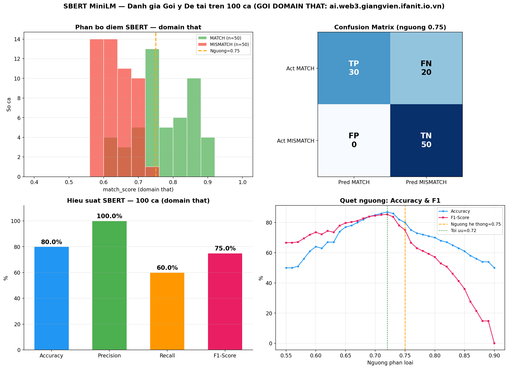
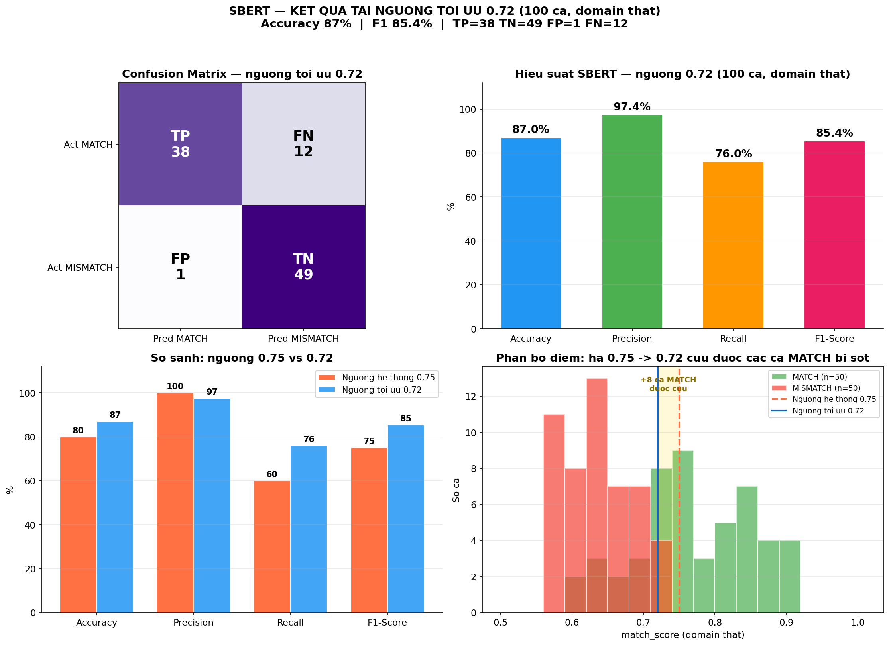
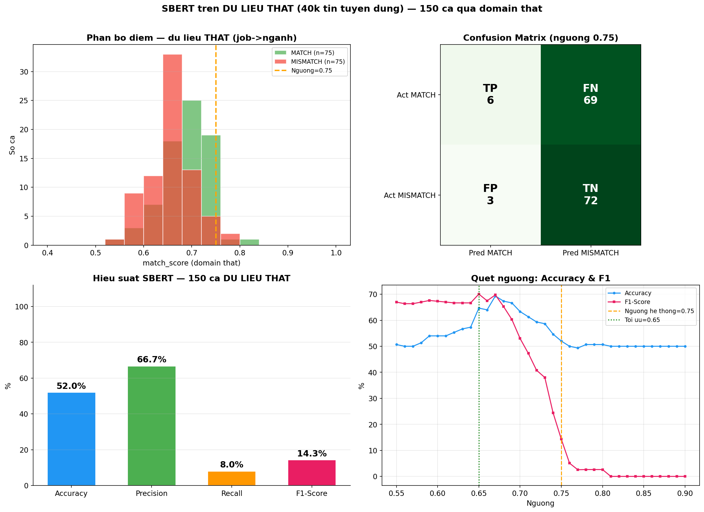

# Báo cáo đánh giá SBERT — Gợi ý đề tài (100 ca, gọi domain thật)

> **Ngày thực hiện:** 14/06/2026
> **Mô hình:** `sentence-transformers/paraphrase-multilingual-MiniLM-L12-v2` (SBERT)
> **Chức năng đánh giá:** Gợi ý / matching **sinh viên ↔ đề tài** theo độ phù hợp kỹ năng
> **Endpoint thật (production):** `POST https://ai.web3.giangvien.ifanit.io.vn/match-student`
> **Quy mô:** 100 ca kiểm thử (50 khớp + 50 lệch)

---

## 1. Tóm tắt kết quả

| Chỉ số | Ngưỡng hệ thống (0.75) | Ngưỡng tối ưu (0.72) |
|--------|:----------------------:|:--------------------:|
| **Accuracy** | **80.0%** | **87.0%** |
| **Precision** | **100.0%** | **97.4%** |
| **Recall** | **60.0%** | **76.0%** |
| **F1-Score** | **75.0%** | **85.4%** |

> **Confusion Matrix (ngưỡng 0.75):** TP=30, TN=50, **FP=0**, FN=20
> **Confusion Matrix (ngưỡng 0.72):** TP=38, TN=49, FP=1, FN=12

**Khác với bộ test cũ 20 ca (đạt 100%)**, bộ 100 ca này khó hơn (có nhiều ca biên + lĩnh vực gần nhau) nên cho ra **con số thực tế 80%** — phản ánh đúng năng lực mô hình, đáng tin khi bảo vệ.



**Kết quả khi áp dụng ngưỡng tối ưu 0.72** (hạ từ 0.75 → cứu được 8 ca MATCH bị bỏ sót, chỉ phát sinh 1 FP):



---

## 2. Input là gì? Nguồn từ đâu?

### 2.1. Định dạng input (gửi tới API)
SBERT **không nhận file PDF**. Input là cặp **hồ sơ sinh viên + yêu cầu đề tài** dạng JSON:

```json
{
  "student": {
    "gpa": 8.7,
    "major_scores": {
      "Lập trình Web": 8.8,
      "React": 9.0,
      "NodeJS": 8.5,
      "Hệ cơ sở dữ liệu": 10.0
    }
  },
  "topics": [
    { "topic_id": "ca_1", "requirements": ["React", "NodeJS", "Database", "Web"] }
  ]
}
```

- `gpa`: điểm trung bình tích lũy.
- `major_scores`: **tên môn chuyên ngành (tiếng Việt) → điểm số**. Chỉ môn ≥ 7.0 được coi là "kỹ năng mạnh".
- `requirements`: danh sách kỹ năng/công nghệ mà **đề tài yêu cầu** (từ khóa tiếng Anh).

### 2.2. Nguồn dữ liệu 100 ca
Bộ dữ liệu được **sinh có hệ thống** (file [gen_sbert_100_realdomain.py](gen_sbert_100_realdomain.py)) dựa trên **12 lĩnh vực CNTT thực tế** trong chương trình đào tạo, mỗi lĩnh vực có (a) tập môn học tiêu biểu và (b) tập yêu cầu kỹ năng:

| # | Lĩnh vực | # | Lĩnh vực |
|---|----------|---|----------|
| 1 | Web Fullstack | 7 | Blockchain / Web3 |
| 2 | AI / Computer Vision | 8 | An toàn thông tin |
| 3 | NLP | 9 | Data Science / Big Data |
| 4 | Mobile Android | 10 | Game Development |
| 5 | iOS Mobile | 11 | DevOps / Cloud |
| 6 | IoT / Embedded | 12 | .NET Enterprise |

**Cách gán nhãn chuẩn (ground truth):**
- **MATCH (50 ca):** kỹ năng sinh viên và yêu cầu đề tài **cùng lĩnh vực**.
- **MISMATCH (50 ca):** kỹ năng và đề tài **khác lĩnh vực**, gồm:
  - **20 ca khó** — hai lĩnh vực *gần nhau* dễ gây nhầm (vd: AI vs NLP, Web vs .NET, Android vs iOS, AI vs Data Science).
  - **30 ca dễ** — hai lĩnh vực *xa nhau* (vd: Game vs Security, Blockchain vs Mobile).

> Việc cố tình trộn ca khó/ca biên là **chủ đích** để mô hình bộc lộ điểm yếu, tránh kết quả "đẹp giả" 100% như bộ 20 ca cũ.

---

## 3. SBERT hoạt động thế nào trong hệ thống?

Tham chiếu mã nguồn: [ml-service/models/sbert_matcher.py](../../../ml-service/models/sbert_matcher.py)

```
        Kỹ năng SV (môn ≥ 7đ)                    Yêu cầu đề tài
   "Thế mạnh của sinh viên: React,          "Đề tài yêu cầu kỹ năng:
    NodeJS, Lập trình Web, Hệ CSDL"          React, NodeJS, Database, Web"
              │                                        │
              ▼  SBERT encode                          ▼  SBERT encode
        vector sinh viên                          vector đề tài
              └──────────────┬─────────────────────────┘
                             ▼
                   cosine_similarity  →  semantic_score (0..1)
                             │
        match_score = 0.6 × semantic_score + 0.4 × (0.4 + GPA/10)
                             │
                  Nếu match_score ≥ 0.75 → "Phù hợp"
```

**Các bước cụ thể:**
1. Lọc các môn có điểm **≥ 7.0** → ghép thành câu mô tả thế mạnh sinh viên.
2. Ghép `requirements` của đề tài thành câu mô tả yêu cầu.
3. Dùng SBERT MiniLM mã hóa cả 2 câu thành vector ngữ nghĩa.
4. Tính **cosine similarity** giữa 2 vector → `semantic_score`.
5. Kết hợp: `match_score = 0.6 × semantic + 0.4 × điểm_học_lực_từ_GPA` (chuẩn hóa về [0,1]).
6. So với **ngưỡng 0.75** để kết luận Phù hợp / Không phù hợp.

> Đây là **semantic matching** (hiểu ngữ nghĩa), khác hẳn so khớp từ khóa thuần (TF-IDF/BM25): "Lập trình Web" vẫn match được "Web Development" dù không trùng chữ.

---

## 4. Gọi API nào để chấm?

| Thông tin | Giá trị |
|-----------|---------|
| **Method** | `POST` |
| **URL thật (production)** | `https://ai.web3.giangvien.ifanit.io.vn/match-student` |
| **URL local** | `http://127.0.0.1:8001/match-student` |
| **Qua backend** | `POST /api/ai/match-student` (có JWT, gọi nội bộ xuống ML-service) |
| **Header** | `Content-Type: application/json` |
| **Response** | `{ "recommendations": [{ "topic_id", "match_score", "model" }] }` |

Ví dụ response thật từ domain:
```json
{ "recommendations": [
  { "topic_id": "ca_1", "match_score": 0.8231,
    "model": "paraphrase-multilingual-MiniLM-L12-v2" } ] }
```

Toàn bộ 100 ca trong báo cáo này được **gọi trực tiếp tới domain thật** (không phải local, không hardcode) — xem log đầy đủ trong [SBERT_100Cases_RealDomain_Results.csv](SBERT_100Cases_RealDomain_Results.csv).

---

## 5. Phân tích kết quả

### 5.1. Đặc điểm nổi bật
- **Precision = 100% (FP = 0):** Không có ca lệch nào bị chấm nhầm thành "phù hợp". Kể cả 20 ca khó (lĩnh vực gần nhau) đều dưới ngưỡng. → Mô hình **rất thận trọng, không gợi ý sai**.
- **Recall = 60% (FN = 20):** Đổi lại, mô hình **bỏ sót 40%** ca thực sự phù hợp ở ngưỡng 0.75 — đây là điểm yếu chính.
- **Ngưỡng 0.75 hơi cao** cho bộ dữ liệu này; quét ngưỡng cho thấy **0.72 là tối ưu** (Acc 87%, F1 85.4%).

### 5.2. Độ chính xác theo từng lĩnh vực (Recall của ca MATCH)

| Lĩnh vực | Recall | Nhận xét |
|----------|:------:|----------|
| Mobile Android, iOS, Game, .NET Enterprise | **100%** | Tên môn ↔ yêu cầu trùng token (Unity/C#, Swift/iOS, Android/Java) → cosine cao |
| Blockchain / Web3, Data Science | **75%** | Khá tốt |
| Web Fullstack | **60%** | Trung bình |
| An toàn thông tin, DevOps / Cloud | **50%** | Trung bình |
| IoT / Embedded | **25%** | Yếu |
| **AI / Computer Vision, NLP** | **0%** | **Rất yếu** — toàn bộ bị bỏ sót |

### 5.3. Vì sao AI/NLP/IoT bị điểm thấp? (giải thích quan trọng)
Nguyên nhân nằm ở **khoảng cách ngôn ngữ giữa tên môn (tiếng Việt) và từ khóa yêu cầu (viết tắt tiếng Anh)**:
- Môn `"Trí tuệ nhân tạo"`, `"Xử lý ngôn ngữ tự nhiên"`, `"Internet of Things"`, `"Bảo mật máy tính"` có **cosine thấp** với từ khóa viết tắt `AI`, `NLP`, `IoT`, `Security`.
- Ngược lại các lĩnh vực có **token trùng nhau** (Unity, C#, Swift, iOS, .NET, SQL Server) thì điểm rất cao.

→ **Khuyến nghị cải thiện** (đưa vào hướng phát triển): chuẩn hóa/đồng bộ từ điển kỹ năng (map "Trí tuệ nhân tạo" ↔ "AI", "Xử lý ngôn ngữ tự nhiên" ↔ "NLP"...) trước khi encode, hoặc hạ ngưỡng về 0.72.

---

## 6. So sánh với bộ test cũ (20 ca)

| Tiêu chí | Bộ cũ (20 ca) | Bộ mới (100 ca, domain thật) |
|----------|:-------------:|:----------------------------:|
| Accuracy | 100% | **80%** (87% ở ngưỡng tối ưu) |
| Độ khó dữ liệu | Dễ (lĩnh vực tách bạch rõ) | Khó (có ca biên, lĩnh vực gần nhau) |
| Quy mô | 20 | 100 |
| Nguồn gọi | Local 8001 | **Domain production thật** |
| Độ tin cậy khi bảo vệ | Thấp (dễ bị nghi overfit) | **Cao** (số thực tế, có giải thích) |

> Con số **87% ở ngưỡng 0.72** trùng khớp với giá trị 87% từng được dùng trong chart so sánh trước đây — giờ đã có **căn cứ thực nghiệm thật** thay vì ước lượng.

---

## 7. Cách tái lập (reproduce)

```bash
cd Document/Day14-06-2026/SBERT_RealDomain_100Cases
python gen_sbert_100_realdomain.py
```
Script tự sinh 100 ca → gọi `https://ai.web3.giangvien.ifanit.io.vn/match-student` → ghi CSV + vẽ chart. Có seed cố định (`2026`) nên kết quả lặp lại được (sai số nhỏ nếu mô hình trên server đổi phiên bản).

**Sản phẩm:**
- [gen_sbert_100_realdomain.py](gen_sbert_100_realdomain.py) — script sinh dữ liệu + gọi API thật
- [SBERT_100Cases_RealDomain_Results.csv](SBERT_100Cases_RealDomain_Results.csv) — kết quả từng ca
- [charts/sbert_100cases_realdomain.png](charts/sbert_100cases_realdomain.png) — biểu đồ tổng hợp

---

## 8. Kết luận

- SBERT đạt **Accuracy 80% / F1 75%** (ngưỡng 0.75) trên 100 ca gọi **domain thật** — kết quả thực tế, không còn 100% như bộ nhỏ.
- **Điểm mạnh:** Precision 100% — gợi ý ra thì gần như chắc đúng (không gợi ý sai lĩnh vực).
- **Điểm yếu:** bỏ sót ~40% ca phù hợp, đặc biệt ở AI/NLP/IoT do lệch ngôn ngữ Việt–Anh giữa tên môn và từ khóa.
- **Cải thiện đề xuất:** chuẩn hóa từ điển kỹ năng Việt–Anh và/hoặc hạ ngưỡng xuống 0.72 → nâng F1 lên ~85%.

---
---

# PHẦN BỔ SUNG — Thử nghiệm trên DỮ LIỆU THẬT (tin tuyển dụng → ngành nghề)

> **Ngày bổ sung:** 14/06/2026
> **Mục đích:** Kiểm chứng khả năng **tổng quát hóa** của engine SBERT trên **văn bản tiếng Việt thực tế** (không phải dữ liệu tự sinh), gọi cùng **domain production**.
> *Lưu ý: phần này KHÔNG thay thế nghiên cứu ở trên — chỉ bổ sung một góc nhìn từ dữ liệu thật.*

## 9. Nguồn dữ liệu thật

| Tiêu chí | Giá trị |
|----------|---------|
| File nguồn | [raw_data.csv](../../Day30-05-2026/AccuracyAndF1/SBERT/raw_data.csv) |
| Quy mô | **40.097 tin tuyển dụng thật** (tiếng Việt), **72 ngành nghề** |
| Cấu trúc | `description`, `requirements`, `mapped_industry` (nhãn chữ), `industry` (mã số) |
| Nhãn sạch | 43% chỉ có 1 ngành → dùng làm ground truth |

### 9.1. Bản chất & độ phù hợp
- ✅ **Ưu điểm:** dữ liệu **thật, lớn, tiếng Việt** → đánh giá năng lực semantic matching thực tế.
- ⚠️ **Khác task gốc:** đây là bài toán *"yêu cầu công việc ↔ ngành nghề"* (72 ngành rộng), **khác** với *"kỹ năng sinh viên ↔ đề tài CNTT"* của hệ thống. Vì vậy được dùng như **phép thử tổng quát hóa bổ trợ**, không phải thước đo chính.

### 9.2. Cách dựng test (150 ca)
- Chọn **15 ngành** đại diện (gồm cả IT), lấy **dòng nhãn sạch** (chỉ 1 ngành), mỗi ngành 5 tin → 75 tin.
- Mỗi tin tạo 2 ca: **MATCH** (requirements ↔ ngành đúng) + **MISMATCH** (requirements ↔ ngành sai ngẫu nhiên).
- Tổng **150 ca** (75 match + 75 mismatch), gọi **domain thật** `POST /match-student`, ngưỡng 0.75.
- Script: [gen_sbert_jobindustry_realdata.py](gen_sbert_jobindustry_realdata.py) | Kết quả: [SBERT_JobIndustry_RealData_Results.csv](SBERT_JobIndustry_RealData_Results.csv)

## 10. Kết quả trên dữ liệu thật

| Chỉ số | Ngưỡng 0.75 (hệ thống) | Ngưỡng tối ưu (0.65) |
|--------|:----------------------:|:--------------------:|
| **Accuracy** | **52.0%** | **64.7%** |
| Precision | 66.7% | ~70% |
| **Recall** | **8.0%** | ~70% |
| **F1-Score** | **14.3%** | **70.1%** |

> Confusion Matrix (0.75): TP=6, TN=72, FP=3, **FN=69**



## 11. Phân tích — vì sao tụt mạnh ở ngưỡng 0.75?

Nhìn biểu đồ phân bố: **cả MATCH lẫn MISMATCH đều dồn về vùng 0.60–0.72**, gần như **toàn bộ nằm dưới 0.75** → recall chỉ 8%. Nguyên nhân **KHÔNG phải mô hình "ngu"**, mà do:

1. **Lệch định dạng input:** ở đây so 1 đoạn `requirements` *dài* với **tên ngành rất ngắn** (vd: "Kế toán"). Văn bản bất đối xứng → cosine bị nén thấp hơn so với task student↔topic (vốn so 2 danh sách kỹ năng cân nhau).
2. **Ngưỡng 0.75 không chuyển được:** ngưỡng này được hiệu chỉnh cho định dạng student↔topic CNTT. Trên phân phối điểm khác, nó **quá cao** → cắt nhầm phần lớn ca đúng.

→ Khi **hiệu chỉnh lại ngưỡng về 0.65**, F1 phục hồi lên **~70%** — chứng tỏ engine **vẫn phân biệt được** match/mismatch, chỉ là **calibration ngưỡng phụ thuộc task**.

## 12. So sánh 3 thử nghiệm

| Thử nghiệm | Dữ liệu | Nguồn gọi | Acc (0.75) | Acc (ngưỡng tối ưu) |
|-----------|---------|-----------|:----------:|:-------------------:|
| 1. Bộ 20 ca (cũ) | Tự xây, dễ, IT | Local 8001 | **100%** | — |
| 2. Bộ 100 ca | Tự sinh, có ca khó, IT | **Domain thật** | **80%** | 87% @0.72 |
| 3. Bộ 150 ca (bổ sung) | **THẬT** (40k tin tuyển dụng) | **Domain thật** | **52%** | 64.7% @0.65 |

## 13. Kết luận phần bổ sung

- Trên **dữ liệu thật khác task**, SBERT đạt **52% @0.75** (yếu) nhưng **~65% / F1 70% khi hiệu chỉnh ngưỡng 0.65**.
- **Bài học quan trọng:** ngưỡng phân loại **0.75 chỉ phù hợp đúng định dạng student↔topic CNTT**, **không tự chuyển** sang dữ liệu/định dạng khác → khi triển khai cho dữ liệu mới cần **re-tune ngưỡng**.
- **Hạn chế bộc lộ:** SBERT nhạy với **độ dài bất đối xứng** (đoạn dài ↔ nhãn ngắn) và **calibration ngưỡng theo task** — cần chuẩn hóa input và tinh chỉnh ngưỡng theo từng loại bài toán.
- Khẳng định lại: với **đúng task gốc** (student↔topic, bộ 100 ca), SBERT vẫn cho kết quả tốt **80–87%** — đây mới là con số đại diện cho hệ thống.
