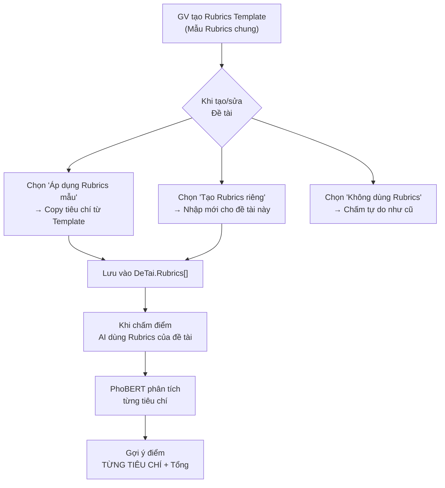
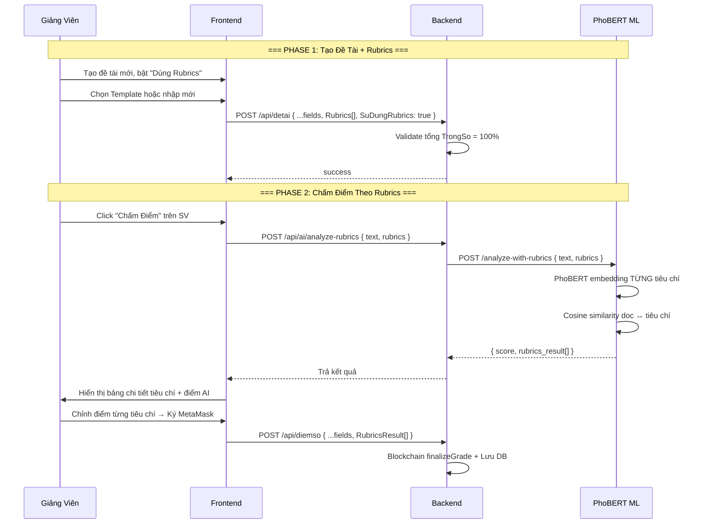

# 📋 Kế Hoạch Triển Khai Tính Năng Rubrics Chấm Điểm

## Tổng Quan

Thêm tính năng **Rubrics chấm điểm** cho giảng viên, cho phép tạo bộ tiêu chí đánh giá có trọng số. AI (PhoBERT) sẽ dựa trên các tiêu chí này để phân tích báo cáo và gợi ý điểm chi tiết theo từng tiêu chí.

---

## Phân Tích Phương Án Thiết Kế

### Yêu cầu từ bạn:
- GV có thể nhập Rubrics
- AI chấm theo Rubrics → gợi ý điểm từng tiêu chí
- Rubrics có thể áp dụng **chung** (tất cả đề tài) hoặc **riêng** (custom từng đề tài)

### Phương Án Được Chọn: "Rubrics Template + Override Per-Topic" (2 tầng)



### Tại sao phương án này tối ưu:

| Tiêu chí | Rubrics chỉ chung | Rubrics chỉ riêng | **Template + Override ✅** |
|----------|:-:|:-:|:-:|
| GV nhập 1 lần, dùng nhiều đề tài | ✅ | ❌ Phải nhập lại | ✅ Copy từ template |
| Custom riêng cho đề tài đặc thù | ❌ | ✅ | ✅ Override thoải mái |
| Không cần tạo collection mới phức tạp | ❌ | ✅ | ✅ Embed vào DeTai |
| Linh hoạt cho AI phân tích | ✅ | ✅ | ✅ |

> [!IMPORTANT]
> **Quyết định kiến trúc**: Rubrics được **embed trực tiếp** vào model `DeTai.Rubrics[]` thay vì tạo collection riêng. Lý do:
> - Mỗi đề tài có thể custom Rubrics khác nhau
> - Không cần JOIN/populate khi chấm điểm
> - Rubrics Template lưu riêng trong collection `RubricsTemplate` để GV tái sử dụng

---

## User Review Required

> [!WARNING]
> **Quyết định cần xác nhận:**
> 1. **Cấu trúc Rubrics**: Mỗi tiêu chí gồm `TenTieuChi`, `MoTa`, `TrongSo (%)`, `DiemToiDa`. Tổng trọng số các tiêu chí = 100%. Bạn có muốn thêm/bớt field nào không?
> 2. **AI chấm từng tiêu chí**: PhoBERT sẽ phân tích text báo cáo rồi tính cosine similarity VỚI TỪNG tiêu chí → cho điểm riêng từng mục. GV có quyền override tất cả. Bạn đồng ý cách này?
> 3. **Rubrics Template**: GV có một danh sách "Rubrics mẫu" riêng, khi tạo đề tài mới có thể chọn copy từ mẫu. Có cần xóa/sửa template sau khi đã áp dụng không?

---

## Proposed Changes

### Tổng quan thay đổi

| Layer | File | Thay đổi |
|-------|------|----------|
| Backend – Model | `DeTai.js` | Thêm `Rubrics[]` embed |
| Backend – Model | `DiemSo.js` | Thêm `RubricsResult[]` |
| Backend – Model | **[NEW]** `RubricsTemplate.js` | Collection lưu mẫu Rubrics |
| Backend – Controller | **[NEW]** `rubricsController.js` | CRUD Rubrics Template |
| Backend – Controller | `deTaiController.js` | Update create/update để xử lý Rubrics |
| Backend – Routes | `server.js` | Thêm routes Rubrics |
| Backend – Service | `aiService.js` | Thêm hàm analyzeWithRubrics |
| Backend – Controller | `aiController.js` | Thêm endpoint analyze với Rubrics |
| ML Service | `phobert_analyzer.py` | Thêm hàm `analyze_with_rubrics()` |
| ML Service | `analyze.py` | Thêm route mới |
| Frontend – Service | `aiService.js` | Thêm API calls cho Rubrics |
| Frontend – Lecturer | `TopicManagement.js` | Form nhập/chọn Rubrics |
| Frontend – Lecturer | `SubmissionReview.js` | Hiển thị chấm theo Rubrics |

---

### Component 1: Backend – Models

---

#### [MODIFY] [DeTai.js](file:///c:/Users/Lenovo/Downloads/FileTaiLieuHK8/DoAnKySu/Web3-GiangVien/backend/models/DeTai.js)

Thêm field `Rubrics[]` embed vào schema:

```diff
 const deTaiSchema = new mongoose.Schema({
   MaDeTai: { type: String, required: true, unique: true },
   TenDeTai: { type: String, required: true },
   MoTa: { type: String },
   MoTaChiTiet: { type: String, default: '' },
   YeuCau: [{ type: String }],
   ChiTietBoSung: [{
     TieuDe: { type: String, default: '' },
     NoiDung: { type: String, default: '' }
   }],
+  Rubrics: [{
+    TenTieuChi: { type: String, required: true },    // VD: "Nội dung kỹ thuật"
+    MoTa: { type: String, default: '' },              // VD: "Đánh giá mức độ hiểu biết kỹ thuật"
+    TrongSo: { type: Number, required: true, min: 0, max: 100 },  // % trọng số (tổng = 100)
+    DiemToiDa: { type: Number, default: 10 },         // Thang điểm tối đa tiêu chí này
+    TuKhoa: [{ type: String }]                        // Keywords cho AI matching (VD: ["React","API"])
+  }],
+  SuDungRubrics: { type: Boolean, default: false },   // Có dùng Rubrics không
   SoLuongSinhVien: { type: Number, default: 1, min: 1 },
   Deadline: { type: Date, required: true },
   ...
 });
```

**Giải thích field:**
- `Rubrics[]`: Danh sách tiêu chí, mỗi tiêu chí có tên, mô tả, trọng số %, điểm tối đa, và từ khóa cho AI
- `SuDungRubrics`: Flag để phân biệt đề tài có dùng Rubrics hay không
- `TuKhoa[]`: Keywords riêng cho từng tiêu chí → PhoBERT sẽ dùng cosine similarity **từng tiêu chí** thay vì chỉ topic_requirements chung

---

#### [MODIFY] [DiemSo.js](file:///c:/Users/Lenovo/Downloads/FileTaiLieuHK8/DoAnKySu/Web3-GiangVien/backend/models/DiemSo.js)

Lưu kết quả chấm theo từng tiêu chí:

```diff
 const diemSoSchema = new mongoose.Schema({
   BaoCao: { type: mongoose.Schema.Types.ObjectId, ref: 'BaoCao', required: true },
   GiangVienCam: { type: mongoose.Schema.Types.ObjectId, ref: 'GiangVien', required: true },
   SinhVien: { type: mongoose.Schema.Types.ObjectId, ref: 'SinhVien', required: true },
   DeTai: { type: mongoose.Schema.Types.ObjectId, ref: 'DeTai', required: true },
   Diem: { type: Number, required: true },
   NhanXet: { type: String },
   AI_Score: { type: Number },
   AI_Feedback: { type: String },
+  RubricsResult: [{
+    TenTieuChi: { type: String },
+    TrongSo: { type: Number },
+    AI_DiemTieuChi: { type: Number },          // Điểm AI gợi ý cho tiêu chí này
+    GV_DiemTieuChi: { type: Number },          // Điểm GV chấm thực tế
+    AI_NhanXetTieuChi: { type: String }        // Feedback AI riêng cho tiêu chí này
+  }],
   TxHash: { type: String }
 }, { timestamps: true });
```

---

#### [NEW] [RubricsTemplate.js](file:///c:/Users/Lenovo/Downloads/FileTaiLieuHK8/DoAnKySu/Web3-GiangVien/backend/models/RubricsTemplate.js)

Model lưu các mẫu Rubrics để GV tái sử dụng:

```javascript
const mongoose = require('mongoose');

const rubricsTemplateSchema = new mongoose.Schema({
  TenMau: { type: String, required: true },             // VD: "Rubrics Đồ án CNTT"
  MoTaMau: { type: String, default: '' },               // Mô tả ngắn
  GiangVien: { type: mongoose.Schema.Types.ObjectId, ref: 'GiangVien', required: true },
  TieuChi: [{
    TenTieuChi: { type: String, required: true },
    MoTa: { type: String, default: '' },
    TrongSo: { type: Number, required: true, min: 0, max: 100 },
    DiemToiDa: { type: Number, default: 10 },
    TuKhoa: [{ type: String }]
  }],
  MacDinh: { type: Boolean, default: false }            // GV đánh dấu đây là mẫu mặc định
}, { timestamps: true });

// Mỗi GV chỉ có 1 mẫu mặc định
rubricsTemplateSchema.index({ GiangVien: 1, MacDinh: 1 });

module.exports = mongoose.model('RubricsTemplate', rubricsTemplateSchema);
```

---

### Component 2: Backend – Controllers & Routes

---

#### [NEW] [rubricsController.js](file:///c:/Users/Lenovo/Downloads/FileTaiLieuHK8/DoAnKySu/Web3-GiangVien/backend/controllers/rubricsController.js)

CRUD cho Rubrics Template:

```javascript
// Chức năng:
// - getTemplatesByGV(gvId) → Lấy tất cả mẫu Rubrics của GV
// - createTemplate(body) → Tạo mẫu mới (validate tổng TrongSo = 100)
// - updateTemplate(id, body) → Sửa mẫu
// - deleteTemplate(id) → Xóa mẫu
// - setDefaultTemplate(id) → Đặt làm mẫu mặc định
```

---

#### [MODIFY] [deTaiController.js](file:///c:/Users/Lenovo/Downloads/FileTaiLieuHK8/DoAnKySu/Web3-GiangVien/backend/controllers/deTaiController.js)

Trong hàm `create()` và `update()`: Validate Rubrics khi `SuDungRubrics = true`:

```javascript
// Validation logic:
// 1. Nếu SuDungRubrics === true → Rubrics[] phải có ít nhất 1 tiêu chí
// 2. Tổng TrongSo của tất cả tiêu chí PHẢI = 100
// 3. Mỗi TieuChi phải có TenTieuChi và TrongSo > 0
```

---

#### [MODIFY] [server.js](file:///c:/Users/Lenovo/Downloads/FileTaiLieuHK8/DoAnKySu/Web3-GiangVien/backend/server.js)

Thêm routes mới:

```diff
+const rubricsController = require('./controllers/rubricsController');

+// 10. Rubrics Template
+app.get('/api/rubrics/giangvien/:gvId', rubricsController.getTemplatesByGV);
+app.post('/api/rubrics', rubricsController.createTemplate);
+app.put('/api/rubrics/:id', rubricsController.updateTemplate);
+app.delete('/api/rubrics/:id', rubricsController.deleteTemplate);
+app.put('/api/rubrics/:id/default', rubricsController.setDefaultTemplate);
```

---

#### [MODIFY] [aiController.js](file:///c:/Users/Lenovo/Downloads/FileTaiLieuHK8/DoAnKySu/Web3-GiangVien/backend/controllers/aiController.js)

Thêm endpoint phân tích theo Rubrics:

```diff
+exports.analyzeReportWithRubrics = async (req, res) => {
+    try {
+        const { text, rubrics } = req.body;
+        if (!text || !rubrics || !rubrics.length) {
+            return res.status(400).json({ error: "Cần text và rubrics" });
+        }
+        const result = await aiService.analyzeWithRubrics(text, rubrics);
+        res.json(result);
+    } catch (err) {
+        res.status(500).json({ error: err.message });
+    }
+};
```

Route mới trong `server.js`:
```diff
+app.post('/api/ai/analyze-rubrics', aiController.analyzeReportWithRubrics);
```

---

#### [MODIFY] [aiService.js (Backend)](file:///c:/Users/Lenovo/Downloads/FileTaiLieuHK8/DoAnKySu/Web3-GiangVien/backend/services/aiService.js)

Thêm hàm gọi FastAPI endpoint mới:

```diff
+const RUBRICS_ENDPOINT = 'http://127.0.0.1:8001/analyze-with-rubrics';

+exports.analyzeWithRubrics = async (text, rubrics) => {
+    const response = await axios.post(RUBRICS_ENDPOINT, { text, rubrics }, {
+        headers: { 'Content-Type': 'application/json' }
+    });
+    return response.data;
+};
```

---

### Component 3: ML Service (PhoBERT)

---

#### [MODIFY] [phobert_analyzer.py](file:///c:/Users/Lenovo/Downloads/FileTaiLieuHK8/DoAnKySu/Web3-GiangVien/ml-service/models/phobert_analyzer.py)

Thêm method `analyze_with_rubrics()`:

```python
def analyze_with_rubrics(self, text: str, rubrics: list[dict]) -> dict:
    """
    Phân tích text theo từng tiêu chí Rubrics.
    Mỗi rubric: { TenTieuChi, MoTa, TrongSo, DiemToiDa, TuKhoa[] }
    
    Logic:
    1. Với MỖI tiêu chí → lấy embedding của (MoTa + TuKhoa)
    2. Cosine similarity giữa doc embedding ↔ tiêu chí embedding
    3. Tính điểm = similarity * DiemToiDa
    4. Tổng điểm = Σ (điểm_tiêu_chí × TrongSo / 100)
    """
    clean_text = normalize_text(text)
    doc_emb = self._get_embedding(clean_text)
    
    results = []
    total_weighted_score = 0
    
    for rubric in rubrics:
        # Tạo text đại diện cho tiêu chí
        criteria_text = f"{rubric['TenTieuChi']} {rubric.get('MoTa', '')} {' '.join(rubric.get('TuKhoa', []))}"
        criteria_emb = self._get_embedding(normalize_text(criteria_text))
        
        # Cosine similarity
        sim = F.cosine_similarity(doc_emb, criteria_emb).item()
        
        # Chuyển similarity → điểm (scale và clamp)
        diem_toi_da = rubric.get('DiemToiDa', 10)
        raw_score = max(0, min(diem_toi_da, sim * diem_toi_da * 1.3))
        score = round(raw_score, 2)
        
        # Trọng số
        trong_so = rubric.get('TrongSo', 0)
        total_weighted_score += score / diem_toi_da * trong_so
        
        # Feedback cho tiêu chí
        if sim > 0.6:
            nhan_xet = f"Tốt: Bài báo cáo thể hiện rõ nội dung '{rubric['TenTieuChi']}'"
        elif sim > 0.4:
            nhan_xet = f"Khá: Có đề cập '{rubric['TenTieuChi']}' nhưng chưa sâu"
        else:
            nhan_xet = f"Yếu: Thiếu nội dung liên quan đến '{rubric['TenTieuChi']}'"
        
        results.append({
            "TenTieuChi": rubric['TenTieuChi'],
            "TrongSo": trong_so,
            "DiemToiDa": diem_toi_da,
            "AI_DiemTieuChi": score,
            "AI_NhanXetTieuChi": nhan_xet,
            "Similarity": round(sim, 4)
        })
    
    # Tổng điểm trên thang 10
    final_score = round(total_weighted_score / 10, 2)
    
    return {
        "score": final_score,
        "rubrics_result": results,
        "feedback": f"Phân tích {len(rubrics)} tiêu chí Rubrics hoàn tất.",
        "model": self.model_name
    }
```

---

#### [MODIFY] [analyze.py (Routes)](file:///c:/Users/Lenovo/Downloads/FileTaiLieuHK8/DoAnKySu/Web3-GiangVien/ml-service/routes/analyze.py)

Thêm route mới:

```diff
+class RubricItem(BaseModel):
+    TenTieuChi: str
+    MoTa: str = ""
+    TrongSo: float
+    DiemToiDa: float = 10
+    TuKhoa: list[str] = Field(default_factory=list)

+class AnalyzeRubricsRequest(BaseModel):
+    text: str = Field(..., min_length=1)
+    rubrics: list[RubricItem]

+@router.post("/analyze-with-rubrics")
+def analyze_with_rubrics(payload: AnalyzeRubricsRequest):
+    rubrics_dicts = [r.model_dump() for r in payload.rubrics]
+    result = analyzer.analyze_with_rubrics(payload.text, rubrics_dicts)
+    return result
```

---

### Component 4: Frontend

---

#### [MODIFY] [aiService.js (Frontend)](file:///c:/Users/Lenovo/Downloads/FileTaiLieuHK8/DoAnKySu/Web3-GiangVien/frontend/src/services/aiService.js)

Thêm API calls mới:

```diff
+    // === RUBRICS ===
+
+    // Lấy danh sách Rubrics Template của GV
+    getRubricsTemplates: async (gvId) => {
+        const response = await axios.get(`${API_URL}/rubrics/giangvien/${gvId}`, { headers: getAuthHeaders() });
+        return response.data;
+    },
+
+    // Tạo Rubrics Template mới
+    createRubricsTemplate: async (data) => {
+        const response = await axios.post(`${API_URL}/rubrics`, data, { headers: getAuthHeaders() });
+        return response.data;
+    },
+
+    // Sửa Rubrics Template
+    updateRubricsTemplate: async (id, data) => {
+        const response = await axios.put(`${API_URL}/rubrics/${id}`, data, { headers: getAuthHeaders() });
+        return response.data;
+    },
+
+    // Xóa Rubrics Template
+    deleteRubricsTemplate: async (id) => {
+        const response = await axios.delete(`${API_URL}/rubrics/${id}`, { headers: getAuthHeaders() });
+        return response.data;
+    },
+
+    // Đặt Rubrics mặc định
+    setDefaultRubricsTemplate: async (id) => {
+        const response = await axios.put(`${API_URL}/rubrics/${id}/default`, {}, { headers: getAuthHeaders() });
+        return response.data;
+    },
+
+    // Gọi AI phân tích theo Rubrics
+    analyzeReportWithRubrics: async (text, rubrics) => {
+        const response = await axios.post(`${API_URL}/ai/analyze-rubrics`, { text, rubrics }, { headers: getAuthHeaders() });
+        return response.data;
+    },
```

---

#### [MODIFY] [TopicManagement.js](file:///c:/Users/Lenovo/Downloads/FileTaiLieuHK8/DoAnKySu/Web3-GiangVien/frontend/src/components/lecturer/TopicManagement.js)

Thêm phần nhập Rubrics vào **Modal Tạo Đề Tài**:

**Thay đổi chính:**

1. **Toggle "Sử dụng Rubrics"** → Switch on/off
2. **Nếu bật**: Hiển thị 2 lựa chọn:
   - **"Chọn từ mẫu có sẵn"** → Dropdown chọn RubricsTemplate → Auto-fill tiêu chí
   - **"Tạo Rubrics mới"** → Form nhập thủ công
3. **Form Rubrics**: Danh sách tiêu chí dynamic (thêm/xóa), mỗi tiêu chí gồm:
   - Tên tiêu chí (Input)
   - Mô tả (TextArea)
   - Trọng số % (InputNumber)
   - Điểm tối đa (InputNumber, default 10)
   - Từ khóa AI (Select tags)
4. **Validation**: Cảnh báo nếu tổng trọng số ≠ 100%
5. **Nút "Lưu làm mẫu"**: Tùy chọn lưu Rubrics vừa nhập thành Template mới

**UI Mockup:**
```
┌────────────────────────────────────────────────────────────┐
│  Đăng Ký Đề Tài Mới                                       │
│ ───────────────────────────────────────────────────────── │
│  ...các field hiện tại...                                  │
│                                                            │
│ ═══ Rubrics Chấm Điểm ═══                                 │
│  ☐ Sử dụng Rubrics chấm điểm                              │
│                                                            │
│  ┌─ (Khi bật Switch) ──────────────────────────────────┐   │
│  │  ○ Chọn từ mẫu:  [▾ Rubrics Đồ Án CNTT       ]    │   │
│  │  ○ Tạo Rubrics mới                                  │   │
│  │                                                      │   │
│  │  Tiêu chí chấm điểm:          Tổng trọng số: 100% ✅│   │
│  │  ┌──────────────────────────────────────────────┐    │   │
│  │  │ 1. [Nội dung kỹ thuật    ]                   │    │   │
│  │  │    Mô tả: [Đánh giá hiểu biết kỹ thuật...  ]│    │   │
│  │  │    Trọng số: [40] %  |  Điểm max: [10]      │    │   │
│  │  │    Từ khóa AI: [React] [NodeJS] [API]        │    │   │
│  │  │                                      [🗑 Xóa]│    │   │
│  │  └──────────────────────────────────────────────┘    │   │
│  │  ┌──────────────────────────────────────────────┐    │   │
│  │  │ 2. [Trình bày & Cấu trúc ]                  │    │   │
│  │  │    Mô tả: [Đánh giá bố cục, format...      ]│    │   │
│  │  │    Trọng số: [30] %  |  Điểm max: [10]      │    │   │
│  │  │    Từ khóa AI: [mục lục] [tham khảo]         │    │   │
│  │  │                                      [🗑 Xóa]│    │   │
│  │  └──────────────────────────────────────────────┘    │   │
│  │  ┌──────────────────────────────────────────────┐    │   │
│  │  │ 3. [Kết quả & Demo      ]                   │    │   │
│  │  │    Mô tả: [Mức độ hoàn thiện sản phẩm     ]│    │   │
│  │  │    Trọng số: [30] %  |  Điểm max: [10]      │    │   │
│  │  │    Từ khóa AI: [deploy] [test] [demo]        │    │   │
│  │  │                                      [🗑 Xóa]│    │   │
│  │  └──────────────────────────────────────────────┘    │   │
│  │                                                      │   │
│  │  [+ Thêm tiêu chí]  [💾 Lưu làm mẫu Rubrics]       │   │
│  └──────────────────────────────────────────────────────┘   │
│                                                            │
│  [Hủy]                                      [Lưu Đề Tài] │
└────────────────────────────────────────────────────────────┘
```

---

#### [MODIFY] [SubmissionReview.js](file:///c:/Users/Lenovo/Downloads/FileTaiLieuHK8/DoAnKySu/Web3-GiangVien/frontend/src/components/lecturer/SubmissionReview.js)

**Thay đổi trong luồng chấm điểm (Drawer):**

1. **Nếu đề tài có Rubrics** (`SuDungRubrics === true`):
   - Gọi endpoint mới `/api/ai/analyze-rubrics` thay vì `/api/ai/analyze-report`
   - Hiển thị bảng chi tiết từng tiêu chí với:
     - Tên tiêu chí + Trọng số
     - Điểm AI gợi ý (đọc-only)
     - Điểm GV chấm (InputNumber, editable)
     - Nhận xét AI cho tiêu chí đó
   - Tổng điểm = Σ (GV_DiemTieuChi × TrongSo / 100) → tự tính
   - GV vẫn có thể override tổng điểm cuối cùng

2. **Nếu đề tài KHÔNG có Rubrics**: Giữ nguyên luồng hiện tại (chấm tự do)

**UI Mockup khi chấm theo Rubrics:**
```
┌─────────────────────────────────────────────────────────────┐
│  📋 Chấm Điểm Theo Rubrics                                  │
│  ──────────────────────────────────────────────────────────  │
│                                                              │
│  ┌────────────────────────────────────────────────────────┐  │
│  │ Tiêu chí         │ Trọng số │ AI Gợi ý │ GV Chấm     │  │
│  │──────────────────│──────────│──────────│─────────────│  │
│  │ Nội dung kỹ thuật│   40%    │  8.5/10  │ [8.5▾]/10   │  │
│  │   → AI: "Tốt, thể hiện rõ nội dung kỹ thuật"         │  │
│  │──────────────────│──────────│──────────│─────────────│  │
│  │ Trình bày        │   30%    │  7.0/10  │ [7.5▾]/10   │  │
│  │   → AI: "Khá, có cấu trúc nhưng chưa đầy đủ"        │  │
│  │──────────────────│──────────│──────────│─────────────│  │
│  │ Kết quả & Demo   │   30%    │  9.0/10  │ [8.0▾]/10   │  │
│  │   → AI: "Tốt, có demo và kết quả rõ ràng"            │  │
│  └────────────────────────────────────────────────────────┘  │
│                                                              │
│  Tổng điểm (theo trọng số): 8.05 / 10                       │
│  Điểm GV chốt ghi Blockchain: [8.0▾] (có thể override)     │
│                                                              │
│  [🔐 Ký MetaMask & Ghi Blockchain]                          │
└─────────────────────────────────────────────────────────────┘
```

---

#### [MODIFY] [diemSoController.js](file:///c:/Users/Lenovo/Downloads/FileTaiLieuHK8/DoAnKySu/Web3-GiangVien/backend/controllers/diemSoController.js)

Trong hàm `chamDiem()`: Lưu thêm `RubricsResult[]` nếu có:

```diff
 const result = new DiemSo({
   BaoCao: baoCaoId,
   GiangVienCam: giangVienId,
   SinhVien: sinhVienId,
   DeTai: deTaiId,
   Diem: diem,
   NhanXet: nhanXet,
   AI_Score: aiScore,
   AI_Feedback: aiFeedback,
+  RubricsResult: rubricsResult || [],    // Array từ frontend
   TxHash: txHash
 });
```

---

## Luồng Hoạt Động Tổng Thể



---

## Open Questions

> [!IMPORTANT]
> **Câu hỏi cần bạn trả lời trước khi triển khai:**
>
> 1. **Bạn có muốn thêm "Rubrics Template mặc định sẵn" cho lần đầu sử dụng không?** Ví dụ: khi GV chưa tạo template nào, hệ thống gợi ý 1 mẫu Rubrics chuẩn (Nội dung kỹ thuật 40%, Trình bày 30%, Kết quả 30%).
>
> 2. **Khi GV đã chấm điểm 1 SV theo Rubrics, SV có thể xem chi tiết điểm từng tiêu chí không?** Hay chỉ xem tổng điểm?
>
> 3. **Bạn có muốn tách tab "Quản Lý Rubrics Template" riêng** trên giao diện GV (giống tab "Quản Lý Đề Tài" và "Duyệt Báo Cáo")? Hay tích hợp vào trong Modal tạo đề tài là đủ?

---

## Verification Plan

### Automated Tests
1. **Validate model**: Tạo đề tài với Rubrics, kiểm tra tổng trọng số ≠ 100 → reject
2. **API test**: `POST /api/ai/analyze-rubrics` → trả về đúng format `rubrics_result[]`
3. **API test**: `POST /api/diemso` với `RubricsResult[]` → lưu thành công
4. **CRUD test**: Rubrics Template CRUD qua API

### Manual Verification
1. Browser test: Tạo đề tài mới, bật Rubrics, nhập tiêu chí → verify lưu thành công
2. Browser test: Chấm điểm SV có Rubrics → xem bảng chi tiết AI + GV
3. Browser test: Tạo/chọn/sửa Template → verify auto-fill tiêu chí
4. Browser test: Đề tài không có Rubrics → luồng cũ hoạt động bình thường

---

## Danh Sách Công Việc & Sprint

### Sprint Rubrics-1: Backend + ML (2-3 ngày)

| # | Công việc | Files | Phức tạp |
|---|----------|-------|---------|
| R1.1 | Model `RubricsTemplate.js` mới | models/ | THẤP |
| R1.2 | Mở rộng model `DeTai.js` thêm `Rubrics[]` | models/ | THẤP |
| R1.3 | Mở rộng model `DiemSo.js` thêm `RubricsResult[]` | models/ | THẤP |
| R1.4 | Controller `rubricsController.js` CRUD | controllers/ | TRUNG BÌNH |
| R1.5 | Sửa `deTaiController.js` validate Rubrics | controllers/ | THẤP |
| R1.6 | Sửa `diemSoController.js` lưu RubricsResult | controllers/ | THẤP |
| R1.7 | ML: `phobert_analyzer.py` thêm `analyze_with_rubrics()` | ml-service/ | CAO |
| R1.8 | ML: route `/analyze-with-rubrics` | ml-service/ | THẤP |
| R1.9 | Backend: `aiService.js` + `aiController.js` + routes mới | backend/ | THẤP |

### Sprint Rubrics-2: Frontend (2-3 ngày)

| # | Công việc | Files | Phức tạp |
|---|----------|-------|---------|
| R2.1 | Frontend `aiService.js`: thêm API calls Rubrics | services/ | THẤP |
| R2.2 | `TopicManagement.js`: Form nhập Rubrics + chọn Template | components/ | CAO |
| R2.3 | `SubmissionReview.js`: Hiển thị chấm theo Rubrics | components/ | CAO |
| R2.4 | Hiển thị Rubrics trong expanded row (bảng đề tài) | components/ | THẤP |

### Tổng kết

| Metric | Giá trị |
|--------|---------|
| Models mới | 1 (RubricsTemplate) |
| Models sửa | 2 (DeTai, DiemSo) |
| Controllers mới | 1 (rubricsController) |
| Controllers sửa | 3 (deTai, diemSo, aiController) |
| ML Service sửa | 2 files (analyzer + route) |
| Frontend sửa | 3 files (aiService, TopicManagement, SubmissionReview) |
| API endpoints mới | 6 |
| Ước tính thời gian | 4-6 ngày |
