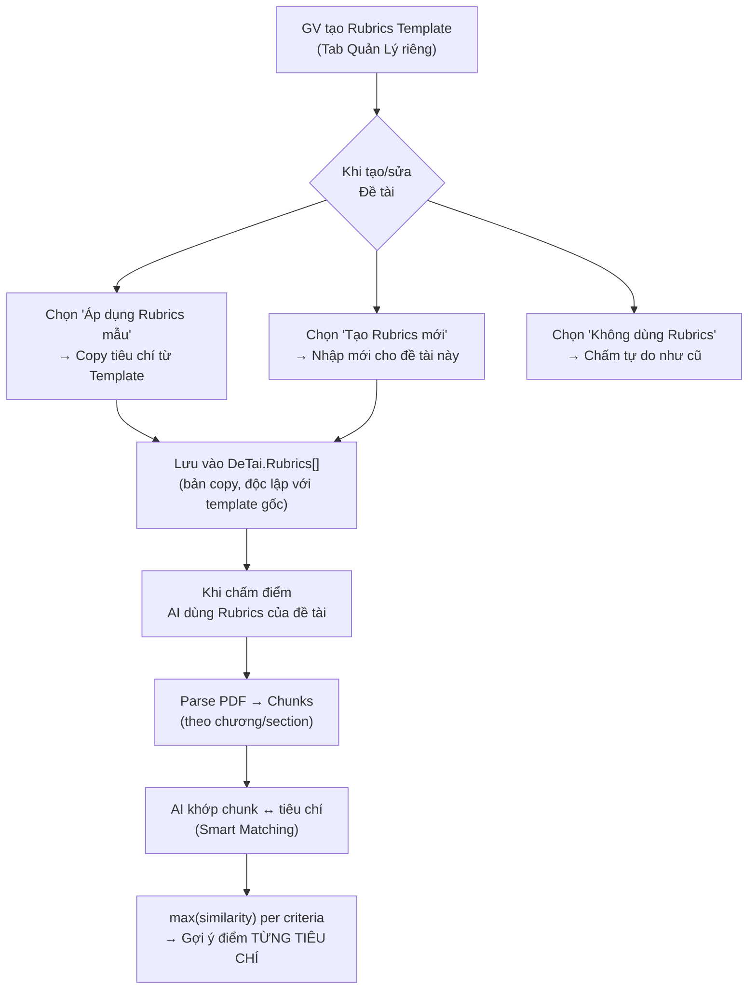
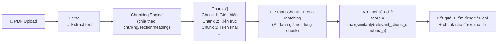
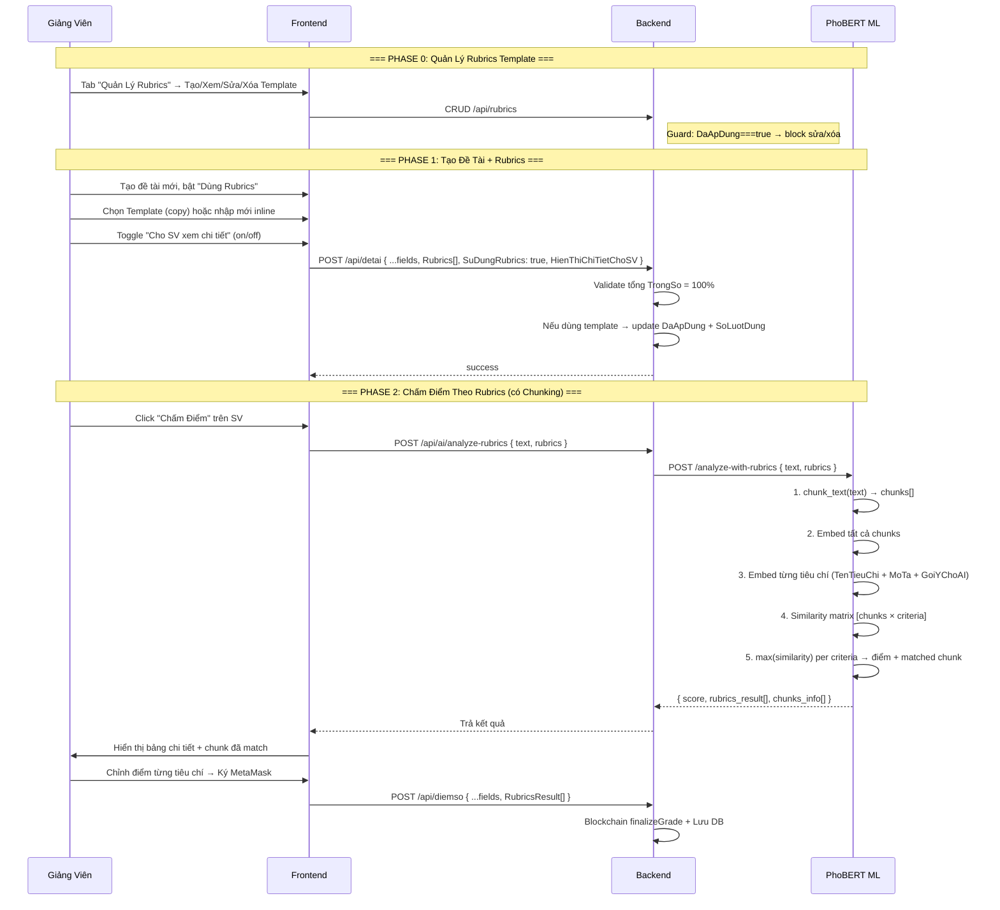

# 📋 Kế Hoạch Triển Khai Tính Năng Rubrics Chấm Điểm (v2 — Updated)

## Tổng Quan

Thêm tính năng **Rubrics chấm điểm** cho giảng viên, cho phép tạo bộ tiêu chí đánh giá có trọng số. AI (PhoBERT) sẽ dựa trên các tiêu chí này để phân tích báo cáo và gợi ý điểm chi tiết theo từng tiêu chí.

> [!IMPORTANT]
> **Phiên bản v2** — Cập nhật theo feedback:
> - `GoiYChoAI[]` (array) thay vì string/TuKhoa
> - 🔥 **Smart Chunking Strategy** — parse PDF → chunks, AI khớp đúng chunk ↔ tiêu chí
> - GV kiểm soát việc SV xem chi tiết điểm Rubrics
> - Tab quản lý Rubrics Template riêng biệt
> - Template bất biến (immutable) sau khi đã áp dụng vào đề tài

---

## Phân Tích Phương Án Thiết Kế

### Yêu cầu từ bạn:
- GV có thể nhập Rubrics
- AI chấm theo Rubrics → gợi ý điểm từng tiêu chí
- Rubrics có thể áp dụng **chung** (tất cả đề tài) hoặc **riêng** (custom từng đề tài)

### Phương Án Được Chọn: "Rubrics Template + Override Per-Topic" (2 tầng)



### Tại sao phương án này tối ưu:

| Tiêu chí | Rubrics chỉ chung | Rubrics chỉ riêng | **Template + Override ✅** |
|----------|:-:|:-:|:-:|
| GV nhập 1 lần, dùng nhiều đề tài | ✅ | ❌ Phải nhập lại | ✅ Copy từ template |
| Custom riêng cho đề tài đặc thù | ❌ | ✅ | ✅ Override thoải mái |
| Không cần tạo collection mới phức tạp | ❌ | ✅ | ✅ Embed vào DeTai |
| Linh hoạt cho AI phân tích | ✅ | ✅ | ✅ |

> [!IMPORTANT]
> **Quyết định kiến trúc**:
> - Rubrics được **embed trực tiếp** vào model `DeTai.Rubrics[]` (copy từ template, không reference)
> - **Template bất biến**: Sau khi template đã được áp dụng vào bất kỳ đề tài nào, GV **KHÔNG được sửa/xóa** template gốc → đảm bảo tính nhất quán & bằng chứng trên Blockchain
> - Nếu muốn thay đổi tiêu chí, GV sửa **trực tiếp trên Rubrics của Đề tài** đó

---

## Các Quyết Định Đã Chốt (Từ Feedback)

### ✅ QĐ 1: Cấu trúc Rubric Item

```json
{
  "TenTieuChi": "Cấu trúc hệ thống",
  "MoTa": "Mô tả kiến trúc Web3 và cách các thành phần tương tác",
  "TrongSo": 30,
  "DiemToiDa": 10,
  "GoiYChoAI": ["Sơ đồ kiến trúc", "Smart Contract", "Provider", "Signer"]
}
```

> [!NOTE]
> **`GoiYChoAI`** dùng **array** (không phải string):
> - Dễ xử lý, dễ expand
> - Sau này muốn nâng cấp → đổi thành `[{ "keyword": "React", "weight": 0.3 }]` là xong
> - AI dùng đây kết hợp với `MoTa` để tính Cosine Similarity chính xác hơn

### ✅ QĐ 2: SV xem chi tiết điểm — GV quyết định

- Thêm field `HienThiChiTietChoSV` trên `DeTai` (Boolean, default `false`)
- GV toggle ON/OFF khi tạo/sửa đề tài
- Nếu `true`: SV thấy bảng điểm từng tiêu chí + AI feedback
- Nếu `false`: SV chỉ thấy tổng điểm + nhận xét chung

### ✅ QĐ 3: Tab Quản Lý Rubrics Template — TÁCH RIÊNG

- **Tab riêng** "Quản Lý Rubrics" trên giao diện GV (ngang hàng với "Quản Lý Đề Tài", "Duyệt Báo Cáo")
- Trong luồng tạo đề tài: chỉ hiện dropdown chọn template hoặc nút "Tạo Rubrics mới inline"
- **Không** tích hợp CRUD template vào modal tạo đề tài (tránh nặng)

### ✅ QĐ 4: Template Immutability

- Khi GV chọn template → dữ liệu **COPY** vào `DeTai.Rubrics[]`
- Template gốc sau khi đã được áp dụng vào ≥1 đề tài → **khóa sửa/xóa**
- Thêm field `DaApDung` (Boolean) + `SoLuotDung` (Number) vào `RubricsTemplate`
- GV muốn thay đổi tiêu chí → sửa trực tiếp trên Rubrics của **Đề tài**

---

## 🔥 Chunking Strategy — Thiết Kế Chi Tiết

> [!CAUTION]
> **Đây là yếu tố quyết định accuracy của AI**, quan trọng hơn cả GoiYChoAI!
> Không thể lấy nguyên file PDF dài dằng dặc đi so với 1 tiêu chí nhỏ xíu → kết quả sẽ bị loãng.

### Flow phân tích đúng:



### Bước 1: Parse PDF → Chunks

```
PDF → pdfplumber/PyMuPDF → raw text
    → Detect headings (regex: "Chương X", "CHƯƠNG X", "Section", font-size lớn)
    → Chia thành chunks theo:
        1. Chương (Chapter)
        2. Section/Mục
        3. Heading/Tiêu đề phụ
    → Mỗi chunk kèm metadata: { index, heading, level, content }
```

### Bước 2: 🧠 Smart Chunk-Criteria Matching (QUAN TRỌNG)

> [!WARNING]
> **Không phải blind matching!** AI phải đánh giá **nội dung** từng chunk để xác định chunk nào thuộc tiêu chí nào, tránh:
> - Chunk về "Giới thiệu chung" match với tiêu chí "Triển khai hệ thống"
> - Chunk A (kiến thức A) bị so với tiêu chí B, mặc dù tiêu chí B đã được trình bày ở chunk B

**Logic matching 2 bước:**

```python
# Bước 2a: Tính similarity giữa MỖI chunk với MỖI tiêu chí
# → Ma trận similarity [num_chunks x num_criteria]
similarity_matrix = []
for chunk in chunks:
    chunk_emb = get_embedding(chunk.content)
    row = []
    for criteria in rubrics:
        criteria_text = f"{criteria.TenTieuChi} {criteria.MoTa} {' '.join(criteria.GoiYChoAI)}"
        criteria_emb = get_embedding(criteria_text)
        sim = cosine_similarity(chunk_emb, criteria_emb)
        row.append(sim)
    similarity_matrix.append(row)

# Bước 2b: Với MỖI tiêu chí → lấy MAX similarity từ tất cả chunks
# → Đây là chunk PHẢN ÁNH TỐT NHẤT nội dung tiêu chí đó
for j, criteria in enumerate(rubrics):
    scores = [similarity_matrix[i][j] for i in range(len(chunks))]
    best_score = max(scores)
    best_chunk_idx = scores.index(best_score)
    # → Tiêu chí j được match tốt nhất bởi chunk best_chunk_idx
    # → Điểm = best_score * DiemToiDa (scale + clamp)
```

**Tại sao dùng `max()` thay vì `average()`?**
- Nếu SV viết rất kỹ về kiến trúc ở Chương 3, nhưng các chương khác không nói → `average()` sẽ kéo điểm "Kiến trúc" xuống thấp sai
- `max()` chọn chunk liên quan nhất → phản ánh đúng hơn

### Bước 3: Kết quả trả về

```json
{
  "score": 7.85,
  "rubrics_result": [
    {
      "TenTieuChi": "Cấu trúc hệ thống",
      "TrongSo": 30,
      "DiemToiDa": 10,
      "AI_DiemTieuChi": 8.5,
      "AI_NhanXetTieuChi": "Tốt: Chương 3 thể hiện rõ kiến trúc hệ thống",
      "Similarity": 0.7234,
      "MatchedChunk": { "index": 2, "heading": "Chương 3: Kiến trúc hệ thống" }
    },
    ...
  ],
  "chunks_info": [
    { "index": 0, "heading": "Chương 1: Giới thiệu", "char_count": 2500 },
    { "index": 1, "heading": "Chương 2: Cơ sở lý thuyết", "char_count": 4200 },
    { "index": 2, "heading": "Chương 3: Kiến trúc hệ thống", "char_count": 3800 }
  ]
}
```

---

## Proposed Changes

### Tổng quan thay đổi

| Layer | File | Thay đổi |
|-------|------|----------|
| Backend – Model | `DeTai.js` | Thêm `Rubrics[]` embed + `HienThiChiTietChoSV` |
| Backend – Model | `DiemSo.js` | Thêm `RubricsResult[]` |
| Backend – Model | **[NEW]** `RubricsTemplate.js` | Collection lưu mẫu Rubrics (+ `DaApDung`, `SoLuotDung`) |
| Backend – Controller | **[NEW]** `rubricsController.js` | CRUD Rubrics Template (có guard immutability) |
| Backend – Controller | `deTaiController.js` | Update create/update để xử lý Rubrics |
| Backend – Routes | `server.js` | Thêm routes Rubrics |
| Backend – Service | `aiService.js` | Thêm hàm analyzeWithRubrics |
| Backend – Controller | `aiController.js` | Thêm endpoint analyze với Rubrics |
| ML Service | `phobert_analyzer.py` | Thêm `analyze_with_rubrics()` + **chunking** |
| ML Service | **[NEW]** `pdf_chunker.py` | Module parse PDF → smart chunks |
| ML Service | `analyze.py` | Thêm route mới |
| Frontend – Service | `aiService.js` | Thêm API calls cho Rubrics |
| Frontend – Lecturer | `TopicManagement.js` | Form chọn/nhập Rubrics (nhẹ) |
| Frontend – Lecturer | **[NEW]** `RubricsManagement.js` | Tab quản lý Rubrics Template |
| Frontend – Lecturer | `SubmissionReview.js` | Hiển thị chấm theo Rubrics |

---

### Component 1: Backend – Models

---

#### [MODIFY] [DeTai.js](file:///c:/Users/Lenovo/Downloads/FileTaiLieuHK8/DoAnKySu/Web3-GiangVien/backend/models/DeTai.js)

Thêm fields `Rubrics[]`, `SuDungRubrics`, `HienThiChiTietChoSV`:

```diff
 const deTaiSchema = new mongoose.Schema({
   MaDeTai: { type: String, required: true, unique: true },
   TenDeTai: { type: String, required: true },
   MoTa: { type: String },
   MoTaChiTiet: { type: String, default: '' },
   YeuCau: [{ type: String }],
   ChiTietBoSung: [{
     TieuDe: { type: String, default: '' },
     NoiDung: { type: String, default: '' }
   }],
+  // === RUBRICS CHẤM ĐIỂM ===
+  Rubrics: [{
+    TenTieuChi: { type: String, required: true },
+    MoTa: { type: String, default: '' },
+    TrongSo: { type: Number, required: true, min: 0, max: 100 },
+    DiemToiDa: { type: Number, default: 10 },
+    GoiYChoAI: [{ type: String }]  // Keywords cho AI matching (VD: ["React","API"])
+  }],
+  SuDungRubrics: { type: Boolean, default: false },
+  HienThiChiTietChoSV: { type: Boolean, default: false },  // GV quyết định SV có xem chi tiết không
   SoLuongSinhVien: { type: Number, default: 1, min: 1 },
   Deadline: { type: Date, required: true },
   ...
 });
```

**Giải thích fields:**
- `Rubrics[]`: Danh sách tiêu chí (copy từ template hoặc nhập mới, **độc lập** với template gốc)
- `SuDungRubrics`: Flag phân biệt đề tài có dùng Rubrics hay không
- `HienThiChiTietChoSV`: GV toggle → SV thấy/không thấy chi tiết điểm từng tiêu chí
- `GoiYChoAI[]`: Array keywords → PhoBERT dùng kết hợp MoTa tính cosine similarity **từng tiêu chí**

---

#### [MODIFY] [DiemSo.js](file:///c:/Users/Lenovo/Downloads/FileTaiLieuHK8/DoAnKySu/Web3-GiangVien/backend/models/DiemSo.js)

Lưu kết quả chấm theo từng tiêu chí:

```diff
 const diemSoSchema = new mongoose.Schema({
   BaoCao: { type: mongoose.Schema.Types.ObjectId, ref: 'BaoCao', required: true },
   GiangVienCam: { type: mongoose.Schema.Types.ObjectId, ref: 'GiangVien', required: true },
   SinhVien: { type: mongoose.Schema.Types.ObjectId, ref: 'SinhVien', required: true },
   DeTai: { type: mongoose.Schema.Types.ObjectId, ref: 'DeTai', required: true },
   Diem: { type: Number, required: true },
   NhanXet: { type: String },
   AI_Score: { type: Number },
   AI_Feedback: { type: String },
+  RubricsResult: [{
+    TenTieuChi: { type: String },
+    TrongSo: { type: Number },
+    DiemToiDa: { type: Number },
+    AI_DiemTieuChi: { type: Number },          // Điểm AI gợi ý cho tiêu chí này
+    GV_DiemTieuChi: { type: Number },          // Điểm GV chấm thực tế
+    AI_NhanXetTieuChi: { type: String },       // Feedback AI riêng cho tiêu chí này
+    MatchedChunk: {                             // Chunk nào AI đã match
+      index: { type: Number },
+      heading: { type: String }
+    }
+  }],
   TxHash: { type: String }
 }, { timestamps: true });
```

---

#### [NEW] [RubricsTemplate.js](file:///c:/Users/Lenovo/Downloads/FileTaiLieuHK8/DoAnKySu/Web3-GiangVien/backend/models/RubricsTemplate.js)

Model lưu các mẫu Rubrics để GV tái sử dụng:

```javascript
const mongoose = require('mongoose');

const rubricsTemplateSchema = new mongoose.Schema({
  TenMau: { type: String, required: true },             // VD: "Rubrics Đồ án CNTT"
  MoTaMau: { type: String, default: '' },               // Mô tả ngắn
  GiangVien: { type: mongoose.Schema.Types.ObjectId, ref: 'GiangVien', required: true },
  TieuChi: [{
    TenTieuChi: { type: String, required: true },
    MoTa: { type: String, default: '' },
    TrongSo: { type: Number, required: true, min: 0, max: 100 },
    DiemToiDa: { type: Number, default: 10 },
    GoiYChoAI: [{ type: String }]                       // Keywords cho AI
  }],
  MacDinh: { type: Boolean, default: false },            // GV đánh dấu đây là mẫu mặc định

  // === IMMUTABILITY TRACKING ===
  DaApDung: { type: Boolean, default: false },           // Đã áp dụng vào ≥1 đề tài chưa
  SoLuotDung: { type: Number, default: 0 }              // Số đề tài đã dùng template này
}, { timestamps: true });

// Index
rubricsTemplateSchema.index({ GiangVien: 1, MacDinh: 1 });

module.exports = mongoose.model('RubricsTemplate', rubricsTemplateSchema);
```

> [!WARNING]
> **Immutability Rule**: Khi `DaApDung === true`:
> - API update → trả lỗi 400 "Không thể sửa template đã được áp dụng"
> - API delete → trả lỗi 400 "Không thể xóa template đã được áp dụng"
> - GV muốn thay đổi → phải tạo template mới hoặc sửa Rubrics trên **Đề tài cụ thể**

---

### Component 2: Backend – Controllers & Routes

---

#### [NEW] [rubricsController.js](file:///c:/Users/Lenovo/Downloads/FileTaiLieuHK8/DoAnKySu/Web3-GiangVien/backend/controllers/rubricsController.js)

CRUD cho Rubrics Template (có guard immutability):

```javascript
// Chức năng:
// - getTemplatesByGV(gvId) → Lấy tất cả mẫu Rubrics của GV
// - createTemplate(body) → Tạo mẫu mới (validate tổng TrongSo = 100)
// - updateTemplate(id, body) → Sửa mẫu (❌ BLOCK nếu DaApDung === true)
// - deleteTemplate(id) → Xóa mẫu (❌ BLOCK nếu DaApDung === true)
// - setDefaultTemplate(id) → Đặt làm mẫu mặc định
// - applyTemplate(templateId, deTaiId) → Copy tiêu chí vào đề tài + tăng SoLuotDung + set DaApDung = true
```

**Guard immutability example:**
```javascript
exports.updateTemplate = async (req, res) => {
    const template = await RubricsTemplate.findById(req.params.id);
    if (template.DaApDung) {
        return res.status(400).json({
            error: "Không thể sửa template đã được áp dụng vào đề tài. " +
                   "Hãy sửa trực tiếp trên Rubrics của Đề tài, hoặc tạo template mới."
        });
    }
    // ... proceed update
};
```

---

#### [MODIFY] [deTaiController.js](file:///c:/Users/Lenovo/Downloads/FileTaiLieuHK8/DoAnKySu/Web3-GiangVien/backend/controllers/deTaiController.js)

Trong hàm `create()` và `update()`: Validate Rubrics khi `SuDungRubrics = true`:

```javascript
// Validation logic:
// 1. Nếu SuDungRubrics === true → Rubrics[] phải có ít nhất 1 tiêu chí
// 2. Tổng TrongSo của tất cả tiêu chí PHẢI = 100
// 3. Mỗi TieuChi phải có TenTieuChi và TrongSo > 0
// 4. Nếu chọn từ template → copy tiêu chí + update template.DaApDung/SoLuotDung
```

---

#### [MODIFY] [server.js](file:///c:/Users/Lenovo/Downloads/FileTaiLieuHK8/DoAnKySu/Web3-GiangVien/backend/server.js)

Thêm routes mới:

```diff
+const rubricsController = require('./controllers/rubricsController');

+// 10. Rubrics Template
+app.get('/api/rubrics/giangvien/:gvId', rubricsController.getTemplatesByGV);
+app.post('/api/rubrics', rubricsController.createTemplate);
+app.put('/api/rubrics/:id', rubricsController.updateTemplate);
+app.delete('/api/rubrics/:id', rubricsController.deleteTemplate);
+app.put('/api/rubrics/:id/default', rubricsController.setDefaultTemplate);
+app.post('/api/rubrics/:id/apply/:deTaiId', rubricsController.applyTemplate);
```

---

#### [MODIFY] [aiController.js](file:///c:/Users/Lenovo/Downloads/FileTaiLieuHK8/DoAnKySu/Web3-GiangVien/backend/controllers/aiController.js)

Thêm endpoint phân tích theo Rubrics:

```diff
+exports.analyzeReportWithRubrics = async (req, res) => {
+    try {
+        const { text, rubrics } = req.body;
+        if (!text || !rubrics || !rubrics.length) {
+            return res.status(400).json({ error: "Cần text và rubrics" });
+        }
+        const result = await aiService.analyzeWithRubrics(text, rubrics);
+        res.json(result);
+    } catch (err) {
+        res.status(500).json({ error: err.message });
+    }
+};
```

Route mới trong `server.js`:
```diff
+app.post('/api/ai/analyze-rubrics', aiController.analyzeReportWithRubrics);
```

---

#### [MODIFY] [aiService.js (Backend)](file:///c:/Users/Lenovo/Downloads/FileTaiLieuHK8/DoAnKySu/Web3-GiangVien/backend/services/aiService.js)

Thêm hàm gọi FastAPI endpoint mới:

```diff
+const RUBRICS_ENDPOINT = 'http://127.0.0.1:8001/analyze-with-rubrics';

+exports.analyzeWithRubrics = async (text, rubrics) => {
+    const response = await axios.post(RUBRICS_ENDPOINT, { text, rubrics }, {
+        headers: { 'Content-Type': 'application/json' }
+    });
+    return response.data;
+};
```

---

### Component 3: ML Service (PhoBERT + Chunking)

---

#### [NEW] [pdf_chunker.py](file:///c:/Users/Lenovo/Downloads/FileTaiLieuHK8/DoAnKySu/Web3-GiangVien/ml-service/utils/pdf_chunker.py)

Module mới: Parse text thành smart chunks:

```python
import re
from dataclasses import dataclass

@dataclass
class TextChunk:
    index: int
    heading: str
    level: int          # 1 = Chương, 2 = Section, 3 = Sub-heading
    content: str
    char_count: int

def chunk_text(text: str) -> list[TextChunk]:
    """
    Chia text thành chunks theo headings.
    
    Detect patterns:
    - "Chương X", "CHƯƠNG X", "Chapter X"       → level 1
    - "X.Y", "Phần X", "Section X"              → level 2  
    - "X.Y.Z", headlines in CAPS, bold markers   → level 3
    
    Fallback: nếu không detect được heading → chia theo paragraph blocks (mỗi 500-800 từ)
    """
    # Regex patterns cho Vietnamese headings
    chapter_pattern = r'(?:^|\n)((?:Chương|CHƯƠNG|Chapter)\s*\d+[.:]\s*.*?)(?:\n)'
    section_pattern = r'(?:^|\n)(\d+\.\d+\.?\s+.*?)(?:\n)'
    
    chunks = []
    # ... implementation: split by headings, build chunk list
    # Mỗi chunk = phần text từ heading này đến heading tiếp theo
    
    # Fallback nếu không tìm được heading
    if len(chunks) <= 1:
        chunks = _split_by_paragraphs(text, max_words=600)
    
    return chunks

def _split_by_paragraphs(text: str, max_words: int = 600) -> list[TextChunk]:
    """Fallback: chia theo paragraphs nếu không có headings rõ ràng."""
    # ...
```

---

#### [MODIFY] [phobert_analyzer.py](file:///c:/Users/Lenovo/Downloads/FileTaiLieuHK8/DoAnKySu/Web3-GiangVien/ml-service/models/phobert_analyzer.py)

Thêm method `analyze_with_rubrics()` — **có chunking + smart matching**:

```python
from utils.pdf_chunker import chunk_text

def analyze_with_rubrics(self, text: str, rubrics: list[dict]) -> dict:
    """
    Phân tích text theo từng tiêu chí Rubrics, SỬ DỤNG CHUNKING.
    
    Flow:
    1. Chunk text → danh sách chunks
    2. Embed tất cả chunks
    3. Embed tất cả tiêu chí (TenTieuChi + MoTa + GoiYChoAI)
    4. Tính similarity matrix [chunks x criteria]
    5. Với MỖI tiêu chí → lấy MAX similarity → đó là chunk phản ánh tốt nhất
    6. Tính điểm + feedback
    """
    clean_text = normalize_text(text)
    
    if not clean_text:
        return {
            "score": 0.0,
            "feedback": "Không có nội dung.",
            "rubrics_result": [],
            "chunks_info": [],
            "model": self.model_name
        }
    
    # === BƯỚC 1: CHUNKING ===
    chunks = chunk_text(clean_text)
    
    # === BƯỚC 2: EMBED TẤT CẢ CHUNKS ===
    chunk_embeddings = []
    for chunk in chunks:
        emb = self._get_embedding(chunk.content)
        chunk_embeddings.append(emb)
    
    # === BƯỚC 3+4: EMBED TIÊU CHÍ + TÍNH SIMILARITY MATRIX ===
    results = []
    total_weighted_score = 0
    
    for rubric in rubrics:
        # Tạo text đại diện cho tiêu chí (kết hợp GoiYChoAI)
        goi_y = rubric.get('GoiYChoAI', [])
        criteria_text = f"{rubric['TenTieuChi']} {rubric.get('MoTa', '')} {' '.join(goi_y)}"
        criteria_emb = self._get_embedding(normalize_text(criteria_text))
        
        # Tính similarity với TỪNG chunk
        chunk_similarities = []
        for i, chunk_emb in enumerate(chunk_embeddings):
            sim = F.cosine_similarity(chunk_emb, criteria_emb).item()
            chunk_similarities.append((i, sim))
        
        # === BƯỚC 5: LẤY MAX SIMILARITY ===
        best_chunk_idx, best_sim = max(chunk_similarities, key=lambda x: x[1])
        best_chunk = chunks[best_chunk_idx]
        
        # Chuyển similarity → điểm
        diem_toi_da = rubric.get('DiemToiDa', 10)
        raw_score = max(0, min(diem_toi_da, best_sim * diem_toi_da * 1.3))
        score = round(raw_score, 2)
        
        # Trọng số
        trong_so = rubric.get('TrongSo', 0)
        total_weighted_score += score / diem_toi_da * trong_so
        
        # Feedback cho tiêu chí (dẫn chiếu chunk cụ thể)
        if best_sim > 0.6:
            nhan_xet = f"Tốt: '{best_chunk.heading}' thể hiện rõ nội dung '{rubric['TenTieuChi']}'"
        elif best_sim > 0.4:
            nhan_xet = f"Khá: Có đề cập '{rubric['TenTieuChi']}' tại '{best_chunk.heading}' nhưng chưa sâu"
        else:
            nhan_xet = f"Yếu: Thiếu nội dung liên quan đến '{rubric['TenTieuChi']}'"
        
        results.append({
            "TenTieuChi": rubric['TenTieuChi'],
            "TrongSo": trong_so,
            "DiemToiDa": diem_toi_da,
            "AI_DiemTieuChi": score,
            "AI_NhanXetTieuChi": nhan_xet,
            "Similarity": round(best_sim, 4),
            "MatchedChunk": {
                "index": best_chunk.index,
                "heading": best_chunk.heading
            }
        })
    
    # Tổng điểm trên thang 10
    final_score = round(total_weighted_score / 10, 2)
    
    return {
        "score": final_score,
        "rubrics_result": results,
        "chunks_info": [
            {
                "index": c.index,
                "heading": c.heading,
                "char_count": c.char_count
            } for c in chunks
        ],
        "feedback": f"Phân tích {len(rubrics)} tiêu chí qua {len(chunks)} phần nội dung.",
        "model": self.model_name
    }
```

---

#### [MODIFY] [analyze.py (Routes)](file:///c:/Users/Lenovo/Downloads/FileTaiLieuHK8/DoAnKySu/Web3-GiangVien/ml-service/routes/analyze.py)

Thêm route mới:

```diff
+class RubricItem(BaseModel):
+    TenTieuChi: str
+    MoTa: str = ""
+    TrongSo: float
+    DiemToiDa: float = 10
+    GoiYChoAI: list[str] = Field(default_factory=list)

+class AnalyzeRubricsRequest(BaseModel):
+    text: str = Field(..., min_length=1)
+    rubrics: list[RubricItem]

+@router.post("/analyze-with-rubrics")
+def analyze_with_rubrics(payload: AnalyzeRubricsRequest):
+    rubrics_dicts = [r.model_dump() for r in payload.rubrics]
+    result = analyzer.analyze_with_rubrics(payload.text, rubrics_dicts)
+    return result
```

---

### Component 4: Frontend

---

#### [MODIFY] [aiService.js (Frontend)](file:///c:/Users/Lenovo/Downloads/FileTaiLieuHK8/DoAnKySu/Web3-GiangVien/frontend/src/services/aiService.js)

Thêm API calls mới:

```diff
+    // === RUBRICS TEMPLATE ===
+
+    getRubricsTemplates: async (gvId) => {
+        const response = await axios.get(`${API_URL}/rubrics/giangvien/${gvId}`, { headers: getAuthHeaders() });
+        return response.data;
+    },
+
+    createRubricsTemplate: async (data) => {
+        const response = await axios.post(`${API_URL}/rubrics`, data, { headers: getAuthHeaders() });
+        return response.data;
+    },
+
+    updateRubricsTemplate: async (id, data) => {
+        const response = await axios.put(`${API_URL}/rubrics/${id}`, data, { headers: getAuthHeaders() });
+        return response.data;
+    },
+
+    deleteRubricsTemplate: async (id) => {
+        const response = await axios.delete(`${API_URL}/rubrics/${id}`, { headers: getAuthHeaders() });
+        return response.data;
+    },
+
+    setDefaultRubricsTemplate: async (id) => {
+        const response = await axios.put(`${API_URL}/rubrics/${id}/default`, {}, { headers: getAuthHeaders() });
+        return response.data;
+    },
+
+    applyTemplate: async (templateId, deTaiId) => {
+        const response = await axios.post(`${API_URL}/rubrics/${templateId}/apply/${deTaiId}`, {}, { headers: getAuthHeaders() });
+        return response.data;
+    },
+
+    // === AI ANALYZE WITH RUBRICS ===
+
+    analyzeReportWithRubrics: async (text, rubrics) => {
+        const response = await axios.post(`${API_URL}/ai/analyze-rubrics`, { text, rubrics }, { headers: getAuthHeaders() });
+        return response.data;
+    },
```

---

#### [NEW] [RubricsManagement.js](file:///c:/Users/Lenovo/Downloads/FileTaiLieuHK8/DoAnKySu/Web3-GiangVien/frontend/src/components/lecturer/RubricsManagement.js)

**Tab riêng** cho quản lý Rubrics Template:

**Chức năng chính:**
1. Bảng danh sách tất cả Rubrics Template của GV
2. Nút tạo template mới → Modal form nhập tiêu chí
3. Xem chi tiết template (expand row)
4. Sửa template (❌ disabled nếu `DaApDung === true` → hiển thị cảnh báo)
5. Xóa template (❌ disabled nếu `DaApDung === true`)
6. Đánh dấu template mặc định
7. Hiển thị badge `SoLuotDung` → GV biết template đã dùng mấy đề tài

**UI Mockup:**
```
┌────────────────────────────────────────────────────────────┐
│  📋 Quản Lý Rubrics Template                               │
│  ──────────────────────────────────────────────────────── │
│                                            [+ Tạo Mẫu Mới]│
│                                                            │
│  ┌────────────┬──────────┬──────────┬───────┬───────────┐  │
│  │ Tên Mẫu    │ Tiêu chí │ Đã dùng  │ M.Định│ Thao tác  │  │
│  │────────────│──────────│──────────│───────│───────────│  │
│  │ ĐA CNTT    │ 3 tiêu   │ 5 đề tài │  ⭐  │ 👁 🔒     │  │
│  │ ĐA Web3    │ 4 tiêu   │ 0 đề tài │      │ ✏️ 🗑     │  │
│  │ ĐA AI/ML   │ 5 tiêu   │ 2 đề tài │      │ 👁 🔒     │  │
│  └────────────┴──────────┴──────────┴───────┴───────────┘  │
│                                                            │
│  🔒 = Template đã áp dụng, không thể sửa/xóa              │
│  ✏️ = Có thể sửa   🗑 = Có thể xóa                        │
└────────────────────────────────────────────────────────────┘
```

---

#### [MODIFY] [TopicManagement.js](file:///c:/Users/Lenovo/Downloads/FileTaiLieuHK8/DoAnKySu/Web3-GiangVien/frontend/src/components/lecturer/TopicManagement.js)

Thêm phần chọn/nhập Rubrics vào **Modal Tạo Đề Tài** (nhẹ, không tích hợp CRUD template):

**Thay đổi chính:**

1. **Toggle "Sử dụng Rubrics"** → Switch on/off
2. **Toggle "Cho SV xem chi tiết"** → Switch on/off (mặc định off)
3. **Nếu bật Rubrics**: 2 lựa chọn:
   - **"Chọn từ mẫu có sẵn"** → Dropdown chọn RubricsTemplate → Auto-fill tiêu chí (copy)
   - **"Tạo Rubrics mới"** → Form nhập thủ công inline
4. **Form Rubrics inline**: Danh sách tiêu chí dynamic (thêm/xóa), mỗi tiêu chí gồm:
   - Tên tiêu chí (Input)
   - Mô tả (TextArea)
   - Trọng số % (InputNumber)
   - Điểm tối đa (InputNumber, default 10)
   - Gợi ý cho AI (Select tags mode)
5. **Validation**: Cảnh báo nếu tổng trọng số ≠ 100%
6. **Nút "Lưu làm mẫu"**: Tùy chọn lưu Rubrics vừa nhập thành Template mới (quick-save, không redirect)

**UI Mockup:**
```
┌────────────────────────────────────────────────────────────┐
│  Đăng Ký Đề Tài Mới                                       │
│ ───────────────────────────────────────────────────────── │
│  ...các field hiện tại...                                  │
│                                                            │
│ ═══ Rubrics Chấm Điểm ═══                                 │
│  ☐ Sử dụng Rubrics chấm điểm                              │
│  ☐ Cho sinh viên xem chi tiết điểm từng tiêu chí          │
│                                                            │
│  ┌─ (Khi bật Switch) ──────────────────────────────────┐   │
│  │  ○ Chọn từ mẫu:  [▾ Rubrics Đồ Án CNTT       ]    │   │
│  │  ○ Tạo Rubrics mới                                  │   │
│  │                                                      │   │
│  │  Tiêu chí chấm điểm:          Tổng trọng số: 100% ✅│   │
│  │  ┌──────────────────────────────────────────────┐    │   │
│  │  │ 1. [Nội dung kỹ thuật    ]                   │    │   │
│  │  │    Mô tả: [Đánh giá hiểu biết kỹ thuật...  ]│    │   │
│  │  │    Trọng số: [40] %  |  Điểm max: [10]      │    │   │
│  │  │    Gợi ý AI: [React] [NodeJS] [API]          │    │   │
│  │  │                                      [🗑 Xóa]│    │   │
│  │  └──────────────────────────────────────────────┘    │   │
│  │  ┌──────────────────────────────────────────────┐    │   │
│  │  │ 2. [Trình bày & Cấu trúc ]                  │    │   │
│  │  │    ...                                        │    │   │
│  │  └──────────────────────────────────────────────┘    │   │
│  │                                                      │   │
│  │  [+ Thêm tiêu chí]  [💾 Lưu làm mẫu Rubrics]       │   │
│  └──────────────────────────────────────────────────────┘   │
│                                                            │
│  [Hủy]                                      [Lưu Đề Tài] │
└────────────────────────────────────────────────────────────┘
```

---

#### [MODIFY] [SubmissionReview.js](file:///c:/Users/Lenovo/Downloads/FileTaiLieuHK8/DoAnKySu/Web3-GiangVien/frontend/src/components/lecturer/SubmissionReview.js)

**Thay đổi trong luồng chấm điểm (Drawer):**

1. **Nếu đề tài có Rubrics** (`SuDungRubrics === true`):
   - Gọi endpoint mới `/api/ai/analyze-rubrics` thay vì `/api/ai/analyze-report`
   - Hiển thị bảng chi tiết từng tiêu chí với:
     - Tên tiêu chí + Trọng số
     - Điểm AI gợi ý (đọc-only) + chunk đã match
     - Điểm GV chấm (InputNumber, editable)
     - Nhận xét AI cho tiêu chí đó
   - Tổng điểm = Σ (GV_DiemTieuChi × TrongSo / 100) → tự tính
   - GV vẫn có thể override tổng điểm cuối cùng

2. **Nếu đề tài KHÔNG có Rubrics**: Giữ nguyên luồng hiện tại (chấm tự do)

**UI Mockup khi chấm theo Rubrics:**
```
┌─────────────────────────────────────────────────────────────┐
│  📋 Chấm Điểm Theo Rubrics                                  │
│  ──────────────────────────────────────────────────────────  │
│                                                              │
│  📊 AI đã phân tích 6 chunks từ báo cáo                      │
│  ┌────────────────────────────────────────────────────────┐  │
│  │ Tiêu chí         │ Trọng số │ AI Gợi ý │ GV Chấm     │  │
│  │──────────────────│──────────│──────────│─────────────│  │
│  │ Nội dung kỹ thuật│   40%    │  8.5/10  │ [8.5▾]/10   │  │
│  │   → AI: "Tốt: 'Chương 3: Kiến trúc' thể hiện rõ"    │  │
│  │   → Matched: Chương 3 (sim: 0.72)                     │  │
│  │──────────────────│──────────│──────────│─────────────│  │
│  │ Trình bày        │   30%    │  7.0/10  │ [7.5▾]/10   │  │
│  │   → AI: "Khá: Có cấu trúc tại 'Chương 1' nhưng..."  │  │
│  │   → Matched: Chương 1 (sim: 0.52)                     │  │
│  │──────────────────│──────────│──────────│─────────────│  │
│  │ Kết quả & Demo   │   30%    │  9.0/10  │ [8.0▾]/10   │  │
│  │   → AI: "Tốt: 'Chương 5: Kết quả' có demo rõ ràng"  │  │
│  │   → Matched: Chương 5 (sim: 0.81)                     │  │
│  └────────────────────────────────────────────────────────┘  │
│                                                              │
│  Tổng điểm (theo trọng số): 8.05 / 10                       │
│  Điểm GV chốt ghi Blockchain: [8.0▾] (có thể override)     │
│                                                              │
│  [🔐 Ký MetaMask & Ghi Blockchain]                          │
└─────────────────────────────────────────────────────────────┘
```

---

#### [MODIFY] [diemSoController.js](file:///c:/Users/Lenovo/Downloads/FileTaiLieuHK8/DoAnKySu/Web3-GiangVien/backend/controllers/diemSoController.js)

Trong hàm `chamDiem()`: Lưu thêm `RubricsResult[]` nếu có:

```diff
 const result = new DiemSo({
   BaoCao: baoCaoId,
   GiangVienCam: giangVienId,
   SinhVien: sinhVienId,
   DeTai: deTaiId,
   Diem: diem,
   NhanXet: nhanXet,
   AI_Score: aiScore,
   AI_Feedback: aiFeedback,
+  RubricsResult: rubricsResult || [],    // Array từ frontend (bao gồm cả MatchedChunk)
   TxHash: txHash
 });
```

---

## Luồng Hoạt Động Tổng Thể



---

## Danh Sách Công Việc & Sprint

### Sprint Rubrics-1: Backend + ML (3-4 ngày)

| # | Công việc | Files | Phức tạp |
|---|----------|-------|---------|
| R1.1 | Model `RubricsTemplate.js` mới (+ DaApDung, SoLuotDung) | models/ | THẤP |
| R1.2 | Mở rộng model `DeTai.js` thêm `Rubrics[]` + `HienThiChiTietChoSV` | models/ | THẤP |
| R1.3 | Mở rộng model `DiemSo.js` thêm `RubricsResult[]` (+ MatchedChunk) | models/ | THẤP |
| R1.4 | Controller `rubricsController.js` CRUD + **guard immutability** | controllers/ | TRUNG BÌNH |
| R1.5 | Sửa `deTaiController.js` validate Rubrics + update template usage | controllers/ | THẤP |
| R1.6 | Sửa `diemSoController.js` lưu RubricsResult | controllers/ | THẤP |
| R1.7 | **[NEW]** ML: `pdf_chunker.py` — module chunking text | ml-service/utils/ | TRUNG BÌNH |
| R1.8 | ML: `phobert_analyzer.py` thêm `analyze_with_rubrics()` + chunking | ml-service/ | **CAO** |
| R1.9 | ML: route `/analyze-with-rubrics` | ml-service/ | THẤP |
| R1.10 | Backend: `aiService.js` + `aiController.js` + routes mới | backend/ | THẤP |

### Sprint Rubrics-2: Frontend (3-4 ngày)

| # | Công việc | Files | Phức tạp |
|---|----------|-------|---------|
| R2.1 | Frontend `aiService.js`: thêm API calls Rubrics | services/ | THẤP |
| R2.2 | **[NEW]** `RubricsManagement.js`: Tab quản lý Rubrics Template | components/ | **CAO** |
| R2.3 | `TopicManagement.js`: Form chọn/nhập Rubrics (nhẹ) + toggle SV visibility | components/ | CAO |
| R2.4 | `SubmissionReview.js`: Hiển thị chấm theo Rubrics + matched chunks | components/ | CAO |
| R2.5 | Hiển thị Rubrics trong expanded row (bảng đề tài) | components/ | THẤP |
| R2.6 | Thêm route/tab "Quản Lý Rubrics" vào navigation | App.js / Layout | THẤP |

### Tổng kết

| Metric | Giá trị |
|--------|---------|
| Models mới | 1 (RubricsTemplate) |
| Models sửa | 2 (DeTai, DiemSo) |
| Controllers mới | 1 (rubricsController) |
| Controllers sửa | 3 (deTai, diemSo, aiController) |
| ML Service mới | 1 file (pdf_chunker.py) |
| ML Service sửa | 2 files (analyzer + route) |
| Frontend mới | 1 file (RubricsManagement.js) |
| Frontend sửa | 4 files (aiService, TopicManagement, SubmissionReview, App/Layout) |
| API endpoints mới | 7 |
| Ước tính thời gian | **6-8 ngày** |

---

## Verification Plan

### Automated Tests
1. **Validate model**: Tạo đề tài với Rubrics, kiểm tra tổng trọng số ≠ 100 → reject
2. **API test**: `POST /api/ai/analyze-rubrics` → trả về đúng format `rubrics_result[]` + `chunks_info[]`
3. **API test**: `POST /api/diemso` với `RubricsResult[]` → lưu thành công
4. **CRUD test**: Rubrics Template CRUD qua API — verify immutability guard
5. **Chunking test**: Text có heading rõ → chunks đúng; text không heading → fallback paragraph

### Manual Verification
1. Browser test: Tab "Quản Lý Rubrics" — tạo/sửa/xóa template, verify lock sau khi áp dụng
2. Browser test: Tạo đề tài mới, chọn template → verify copy tiêu chí + template bị lock
3. Browser test: Chấm điểm SV có Rubrics → xem bảng chi tiết AI + matched chunks
4. Browser test: Toggle "Cho SV xem chi tiết" → verify SV view thay đổi
5. Browser test: Đề tài không có Rubrics → luồng cũ hoạt động bình thường
