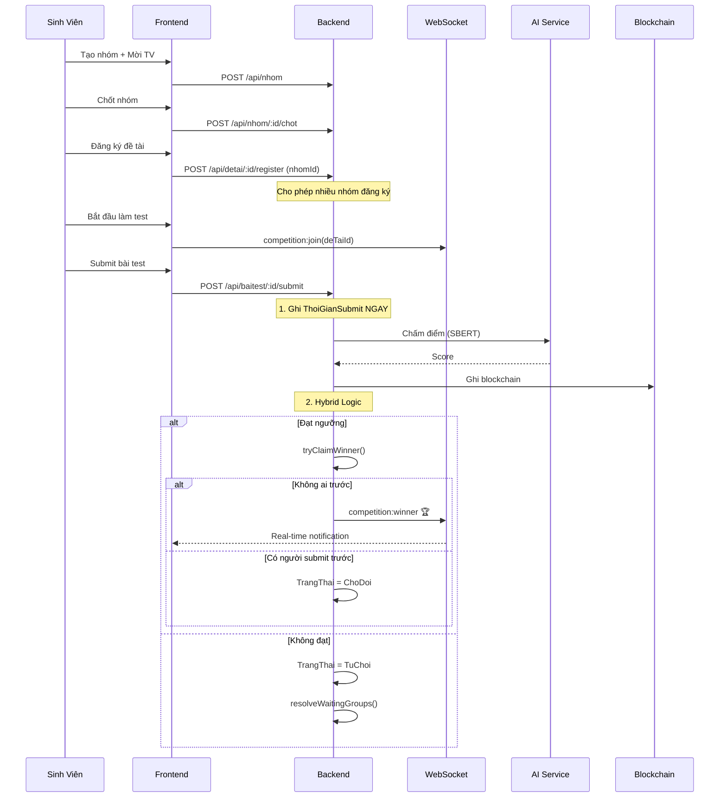

# Walkthrough: Kaggle-style Competition System

## Tổng quan
Chuyển đổi hệ thống đăng ký đề tài từ mô hình "1 SV/nhóm → 1 đề tài" sang **Cạnh Tranh Kaggle-style**: nhiều nhóm đăng ký cùng đề tài → làm bài test → nhóm submit sớm nhất + đạt ngưỡng = **Thắng**.

## Kiến trúc Competition Flow

## Files đã thay đổi

### Backend (7 files)

| File | Thay đổi |
|------|----------|
| [Nhom.js](file:///c:/Users/Lenovo/Downloads/FileTaiLieuHK8/DoAnKySu/Web3-GiangVien/backend/models/Nhom.js) | **[NEW]** Model nhóm |
| [nhomController.js](file:///c:/Users/Lenovo/Downloads/FileTaiLieuHK8/DoAnKySu/Web3-GiangVien/backend/controllers/nhomController.js) | **[NEW]** 10 APIs CRUD nhóm |
| [server.js](file:///c:/Users/Lenovo/Downloads/FileTaiLieuHK8/DoAnKySu/Web3-GiangVien/backend/server.js) | +11 routes nhóm + Socket.IO rooms |
| [DangKyDeTai.js](file:///c:/Users/Lenovo/Downloads/FileTaiLieuHK8/DoAnKySu/Web3-GiangVien/backend/models/DangKyDeTai.js) | +Nhom, +TruongNhom, +ThoiGianSubmit, +6 trạng thái |
| [KetQuaTest.js](file:///c:/Users/Lenovo/Downloads/FileTaiLieuHK8/DoAnKySu/Web3-GiangVien/backend/models/KetQuaTest.js) | +Nhom ref |
| [deTaiController.js](file:///c:/Users/Lenovo/Downloads/FileTaiLieuHK8/DoAnKySu/Web3-GiangVien/backend/controllers/deTaiController.js) | Revert topicTaken, SoDangKy, group-based register |
| [baiTestController.js](file:///c:/Users/Lenovo/Downloads/FileTaiLieuHK8/DoAnKySu/Web3-GiangVien/backend/controllers/baiTestController.js) | Hybrid: tryClaimWinner + resolveWaitingGroups + Socket.IO emit |

### Frontend (7 files)

| File | Thay đổi |
|------|----------|
| [nhomService.js](file:///c:/Users/Lenovo/Downloads/FileTaiLieuHK8/DoAnKySu/Web3-GiangVien/frontend/src/services/nhomService.js) | **[NEW]** API service nhóm |
| [GroupManagement.js](file:///c:/Users/Lenovo/Downloads/FileTaiLieuHK8/DoAnKySu/Web3-GiangVien/frontend/src/components/student/GroupManagement.js) | **[NEW]** UI quản lý nhóm |
| [aiService.js](file:///c:/Users/Lenovo/Downloads/FileTaiLieuHK8/DoAnKySu/Web3-GiangVien/frontend/src/services/aiService.js) | registerTopic gửi nhomId |
| [TopicRegistration.js](file:///c:/Users/Lenovo/Downloads/FileTaiLieuHK8/DoAnKySu/Web3-GiangVien/frontend/src/components/student/TopicRegistration.js) | Badge SoDangKy, check nhóm, alert |
| [EntranceTest.js](file:///c:/Users/Lenovo/Downloads/FileTaiLieuHK8/DoAnKySu/Web3-GiangVien/frontend/src/components/student/EntranceTest.js) | Socket.IO real-time, nhomId submit |
| [TopicManagement.js](file:///c:/Users/Lenovo/Downloads/FileTaiLieuHK8/DoAnKySu/Web3-GiangVien/frontend/src/components/lecturer/TopicManagement.js) | Drawer: Nhom info + competition statuses |
| [EntranceTestManager.js](file:///c:/Users/Lenovo/Downloads/FileTaiLieuHK8/DoAnKySu/Web3-GiangVien/frontend/src/components/lecturer/EntranceTestManager.js) | Results: Nhom + WINNER/Thua |

### Routing & Navigation (2 files)
| File | Thay đổi |
|------|----------|
| [App.js](file:///c:/Users/Lenovo/Downloads/FileTaiLieuHK8/DoAnKySu/Web3-GiangVien/frontend/src/App.js) | +Route `/student/group` |
| [MainLayout.js](file:///c:/Users/Lenovo/Downloads/FileTaiLieuHK8/DoAnKySu/Web3-GiangVien/frontend/src/components/layout/MainLayout.js) | +Menu "Nhóm Của Tôi" |

### Database Migration (1 file)
| File | Mục đích |
|------|----------|
| [fixIndexes.js](file:///c:/Users/Lenovo/Downloads/FileTaiLieuHK8/DoAnKySu/Web3-GiangVien/backend/scripts/fixIndexes.js) | Drop old unique index, create sparse indexes |

## Verification
- ✅ Frontend build compiled successfully (4 lần)
- ✅ Database index migration (fixIndexes.js) chạy thành công
- ✅ `socket.io-client` installed
