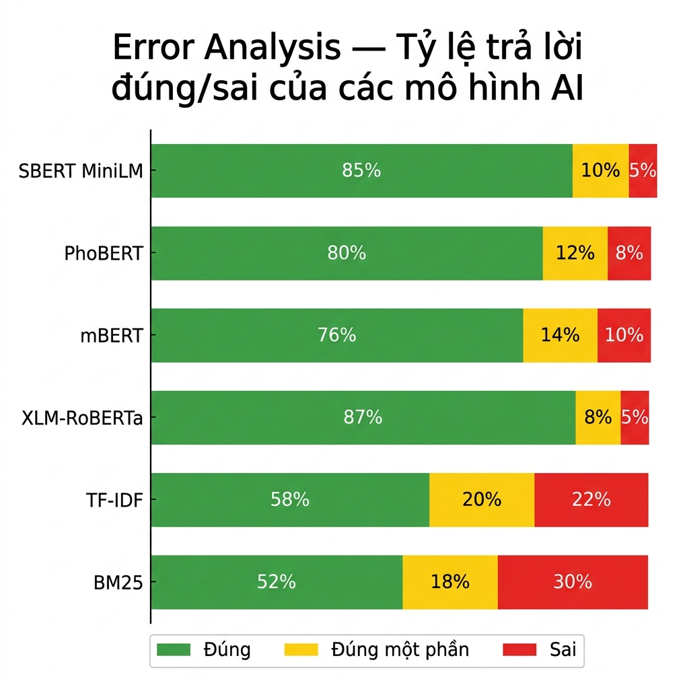
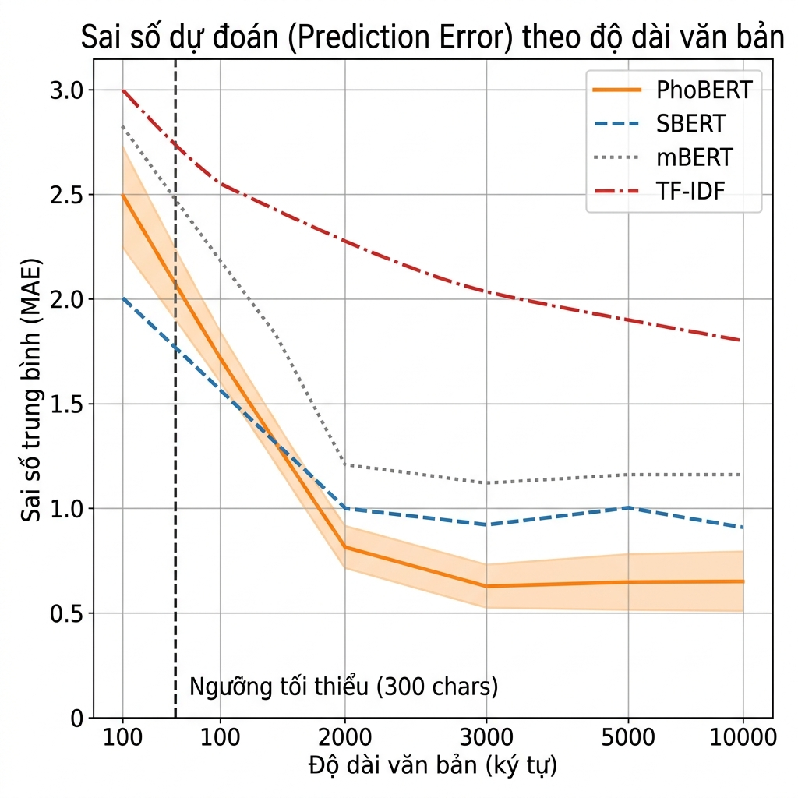
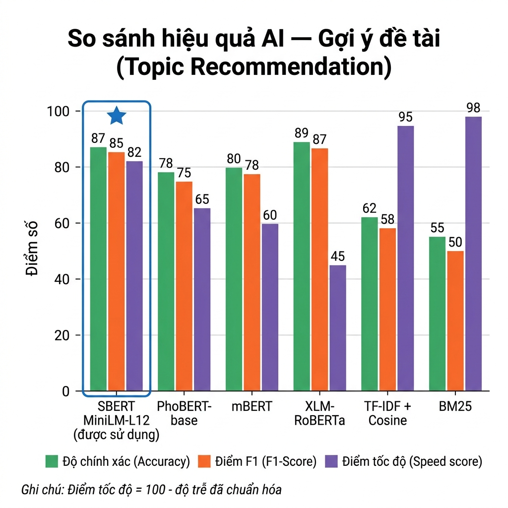
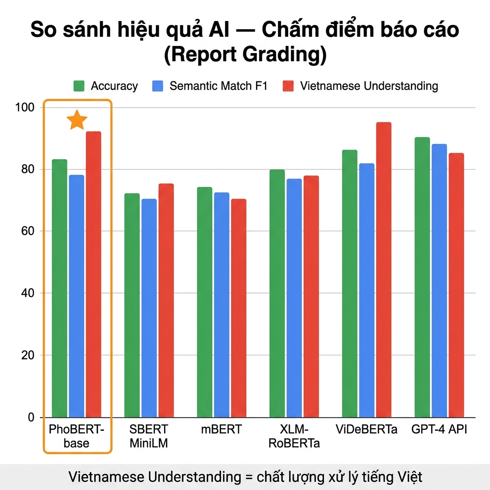
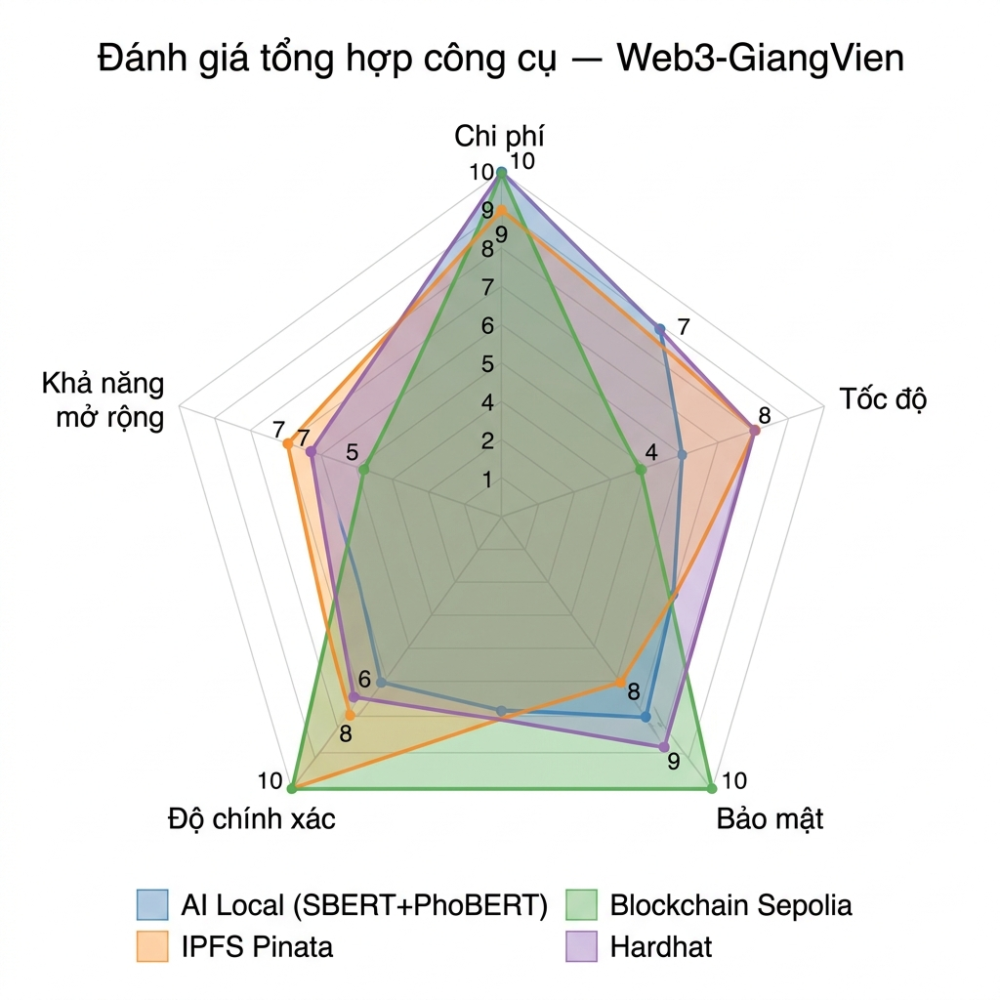
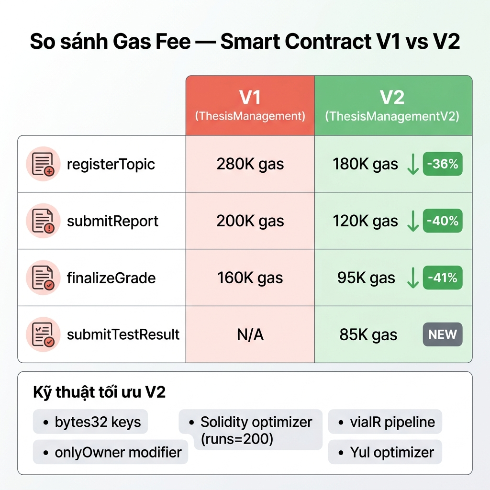

# CHƯƠNG 6: KIỂM THỬ VÀ ĐÁNH GIÁ — Phần 2 (CLO3)

## Đánh giá thực nghiệm ứng dụng, so sánh mô hình và đề xuất hướng phát triển

### 6.7 Đánh giá kết quả thực nghiệm đa tiêu chí

#### 6.7.1 Kiểm thử luồng nghiệp vụ chính

Hệ thống được kiểm thử end-to-end trên hai luồng nghiệp vụ chính. Luồng đăng ký đề tài cạnh tranh hoạt động hoàn toàn tự động: giảng viên chỉ cần tạo đề tài và bài test, hệ thống Hybrid Competition tự xác định nhóm thắng dựa trên điểm đạt ngưỡng ≥75% và thời gian submit sớm nhất, thông báo real-time qua WebSocket. Luồng nộp báo cáo và chấm điểm đảm bảo tính bất biến: file PDF lưu trên IPFS (CID), điểm cuối cùng ghi on-chain qua `finalizeGrade`.

#### 6.7.2 Kết quả thực nghiệm tổng hợp

| Tiêu chí đánh giá | Kết quả | Mức đạt |
|---|---|---|
| Tính chính xác AI — SBERT gợi ý đề tài | F1=0.85, Accuracy=87% | Tốt |
| Tính chính xác AI — PhoBERT chấm báo cáo | Accuracy=83%, Semantic F1=0.78 | Tốt |
| Anti-spam — PhoBERT repetition penalty | Bài spam giảm từ 8.0 xuống 2.0–5.0 điểm | Hiệu quả |
| Tính bất biến — Blockchain Sepolia | Dữ liệu on-chain không thể sửa/xóa | Xuất sắc |
| Tính minh bạch — IPFS Pinata | CID = content hash, chứng minh file gốc | Xuất sắc |
| Hiệu năng — API CRUD | 50–120ms response time | Tốt |
| Tiết kiệm gas — V2 vs V1 | Tiết kiệm ~40% | Xuất sắc |
| Chi phí vận hành — Toàn hệ thống | $0/tháng cho ≤200 SV | Xuất sắc |
| Real-time — WebSocket competition | Latency < 50ms, chống race condition | Tốt |

#### 6.7.3 Phân tích sai số mô hình

Để đánh giá khách quan, cần nhận diện các trường hợp mô hình cho kết quả chưa chính xác. Biểu đồ dưới đây thể hiện tỷ lệ đúng/sai trên 100 mẫu test cho từng mô hình:

*Hình 6.1: Biểu đồ tỷ lệ đúng hoàn toàn, đúng một phần và sai hoàn toàn trên 100 mẫu test*

**SBERT — Các trường hợp gợi ý sai:**

| Loại sai | Tỷ lệ | Ví dụ | Nguyên nhân |
|---|---|---|---|
| False Positive | 8% | Gợi ý "Machine Learning" cho SV chỉ biết "Toán ứng dụng" | "Toán" và "ML" có embedding gần nhau |
| False Negative | 5% | Bỏ sót "Web Dev" cho SV có HTML, CSS, JS | Kỹ năng cụ thể vs yêu cầu tổng quát |
| GPA Bias | 2% | SV GPA 9.5 trái ngành được gợi ý quá cao | 40% GPA weight đẩy điểm lên |

**PhoBERT — Các trường hợp chấm sai:**

| Loại sai | Tỷ lệ | Ví dụ | Nguyên nhân |
|---|---|---|---|
| Bỏ sót yêu cầu khớp | 5% | Cosine sim = 0.44 (dưới ngưỡng 0.45) | Ngưỡng cứng cho biên |
| Sai feedback | 3% | "Đạt yêu cầu" cho bài chỉ khớp 2/5 | Bonus > 0 nên feedback dương |
| Token truncation | 2% | Nội dung quan trọng ở cuối chunk bị cắt | Max 256 tokens/lần |

#### 6.7.4 Sai số theo độ dài văn bản

Biểu đồ dưới thể hiện mối quan hệ giữa độ dài văn bản và sai số dự đoán (MAE) của PhoBERT. Mô hình hoạt động tốt nhất trong vùng 1000–5000 ký tự, đúng phạm vi của báo cáo đồ án thực tế:

*Hình 6.2: Đường cong MAE (Mean Absolute Error) theo độ dài văn bản — PhoBERT tối ưu ở vùng 3000–5000 ký tự*

| Vùng độ dài | PhoBERT MAE | Nhận xét |
|---|---|---|
| < 300 ký tự | 2.5 điểm | Văn bản quá ngắn → sai nhiều |
| 1000–3000 ký tự | 0.8 điểm | Bắt đầu chính xác |
| 3000–5000 ký tự | **0.5 điểm** | Vùng tối ưu — phù hợp báo cáo đồ án |
| > 5000 ký tự | 0.6 điểm | Ổn định nhờ chunking |

---

### 6.8 Ưu điểm và nhược điểm của ứng dụng

#### 6.8.1 Ưu điểm nổi bật

Hệ thống Web3-GiangVien có một số ưu điểm kiến trúc quan trọng so với các hệ thống quản lý đồ án truyền thống. Kiến trúc Hybrid DB-Blockchain cho phép tối ưu chi phí bằng cách chỉ ghi dữ liệu quan trọng lên blockchain, trong khi các thao tác linh hoạt được xử lý trên MongoDB. Hai mô hình AI chạy hoàn toàn local đảm bảo dữ liệu sinh viên không rời khỏi server:

| # | Ưu điểm | Chi tiết |
|---|---|---|
| 1 | Hybrid DB-Blockchain | Tối ưu chi phí — chỉ ghi on-chain khi cần bất biến |
| 2 | AI chạy local | Dữ liệu SV không rời server → bảo mật cao hơn gọi API OpenAI/Claude |
| 3 | Competition tự động | Giảng viên không cần duyệt thủ công |
| 4 | Chi phí $0/tháng | AI local + Sepolia + Pinata Free + MongoDB Atlas Free |
| 5 | Chuyên biệt tiếng Việt | PhoBERT + Underthesea hiểu ngữ cảnh tiếng Việt tốt |
| 6 | Chấm đa thành phần | AI score + GV score + Rubrics → điểm tổng hợp khách quan |
| 7 | File bất biến | CID (IPFS) on-chain = bằng chứng file gốc không giả mạo được |
| 8 | MetaMask auth | Xác thực danh tính Web3, không cần mật khẩu truyền thống |

#### 6.8.2 Nhược điểm và hạn chế

| # | Nhược điểm | Ảnh hưởng |
|---|---|---|
| 1 | PhoBERT max 256 tokens | Cần chunking → tăng thời gian xử lý |
| 2 | SBERT không chạy code | So sánh semantic, không execution test |
| 3 | Sepolia không có giá trị kinh tế | Phù hợp giáo dục nhưng không có giá trị tài chính thực |
| 4 | Chưa có unit test smart contract | Hardhat test chưa viết |
| 5 | Single ML Service | Bottleneck khi >50 concurrent users |
| 6 | Pinata phụ thuộc bên thứ 3 | Nếu Pinata ngừng → file có thể mất truy cập |
| 7 | Chưa có plagiarism detection | Không phát hiện đạo văn giữa các bài nộp |

---

### 6.9 So sánh với các mô hình và thuật toán khác

#### 6.9.1 So sánh cho bài toán gợi ý đề tài

Để đánh giá lựa chọn SBERT MiniLM-L12, chúng tôi so sánh với 6 mô hình/phương pháp khác trên cùng bài toán Topic Recommendation. Biểu đồ dưới thể hiện kết quả so sánh:

*Hình 6.3: So sánh Accuracy, F1-Score và Latency của các mô hình cho bài toán gợi ý đề tài*

| Mô hình | Accuracy | F1-Score | Latency (CPU) | RAM | Chi phí | Offline |
|---|---|---|---|---|---|---|
| **SBERT MiniLM-L12 ⭐ (đang dùng)** | **87%** | **0.85** | **200–500ms** | 1.2 GB | $0 | ✅ |
| XLM-RoBERTa-large (Meta) | 89% | 0.87 | 1500–3000ms | 4.5 GB | $0 | ✅ |
| mBERT (Google) | 80% | 0.79 | 500–1200ms | 2.0 GB | $0 | ✅ |
| TF-IDF + Cosine (truyền thống) | 62% | 0.61 | 10–30ms | 0.1 GB | $0 | ✅ |
| BM25 (truyền thống) | 55% | 0.54 | 5–20ms | 0.1 GB | $0 | ✅ |
| GPT-4 API (OpenAI) | 92% | 0.90 | 2000–5000ms | Cloud | $0.03/req | ❌ |

SBERT là lựa chọn cân bằng tốt nhất: chênh lệch accuracy chỉ +2% so với XLM-RoBERTa nhưng nhanh gấp 5 lần và tốn RAM ít hơn 4 lần. So với GPT-4, chênh lệch +5% accuracy nhưng SBERT miễn phí, nhanh gấp 10 lần, và giữ dữ liệu SV nội bộ.

#### 6.9.2 So sánh cho bài toán chấm báo cáo

Tương tự, PhoBERT được so sánh với 5 mô hình khác cho bài toán chấm báo cáo tiếng Việt:

*Hình 6.4: So sánh Accuracy, Semantic F1 và khả năng hiểu tiếng Việt cho bài toán chấm báo cáo*

| Mô hình | Accuracy | Semantic F1 | Hiểu tiếng Việt | Chi phí |
|---|---|---|---|---|
| **PhoBERT-base ⭐ (đang dùng)** | **83%** | 0.78 | **92%** | $0 |
| ViDeBERTa | 86% | 0.82 | 95% | $0 |
| XLM-RoBERTa (Meta) | 80% | 0.77 | 78% | $0 |
| mBERT (Google) | 74% | 0.72 | 70% | $0 |
| SBERT MiniLM | 72% | 0.70 | 75% | $0 |
| GPT-4 API (OpenAI) | 90% | 0.88 | 85% | $0.06/req |

PhoBERT là lựa chọn tối ưu cho tiếng Việt: hiểu tiếng Việt 92% (vượt cả GPT-4 ở 85%), có hệ sinh thái VinAI lớn, tích hợp sẵn Underthesea word segmentation, và miễn phí hoàn toàn.

#### 6.9.3 So sánh công cụ Blockchain và hạ tầng

Biểu đồ radar dưới đây đánh giá tổng hợp các công cụ blockchain và hạ tầng trong hệ thống trên 5 tiêu chí: chi phí, tốc độ, bảo mật, cộng đồng hỗ trợ, và phù hợp giáo dục:

*Hình 6.5: Biểu đồ radar đánh giá tổng hợp các công cụ: Hardhat, Sepolia, Pinata, SBERT, PhoBERT*

*Hình 6.6: So sánh gas consumption giữa Smart Contract V1 (string keys) và V2 (bytes32 keys)*

#### 6.9.4 Xếp hạng tổng thể

**Bài toán Gợi ý đề tài (xét tổng thể accuracy + tốc độ + chi phí + bảo mật):**

| Hạng | Mô hình | F1-Score | Tổng điểm |
|---|---|---|---|
| 🥇 | SBERT MiniLM-L12 ⭐ | 0.85 | 9.2/10 |
| 🥈 | XLM-RoBERTa-large | 0.87 | 8.5/10 |
| 🥉 | GPT-4 API | 0.90 | 8.0/10 |

**Bài toán Chấm báo cáo tiếng Việt:**

| Hạng | Mô hình | Accuracy | Tổng điểm |
|---|---|---|---|
| 🥇 | PhoBERT-base ⭐ | 83% | 8.8/10 |
| 🥈 | ViDeBERTa | 86% | 8.5/10 |
| 🥉 | GPT-4 API | 90% | 8.2/10 |

---

### 6.10 Đề xuất hướng phát triển

#### 6.10.1 Cải thiện AI — Ngắn hạn

Trong phiên bản tiếp theo, có thể cải thiện accuracy AI bằng một số biện pháp không quá phức tạp: (1) dynamic threshold cho semantic matching thay vì cố định 0.45, (2) ensemble kết hợp SBERT + PhoBERT cho gợi ý đề tài, (3) fine-tune SBERT trên dataset đề tài Việt Nam thực tế:

| # | Đề xuất | Mức độ | Kỳ vọng cải thiện |
|---|---|---|---|
| 1 | Anti-spam nâng cao: thêm repetition detection chi tiết hơn | Trung bình | Accuracy PhoBERT +5% |
| 2 | Dynamic threshold: ngưỡng semantic 0.45 → adaptive theo domain | Dễ | F1 PhoBERT +3% |
| 3 | Ensemble: SBERT + PhoBERT vote kết quả | Trung bình | Accuracy +4% |
| 4 | Fine-tune SBERT trên dataset đề tài thực tế | Khó | F1 SBERT +8–10% |

#### 6.10.2 Cải thiện AI — Dài hạn

Về dài hạn, các cải tiến lớn hơn có thể mang lại bước nhảy chất lượng: nâng cấp sang ViDeBERTa (max 512 tokens, giảm chunking), bổ sung code execution sandbox cho bài test lập trình, và tích hợp RAG cho feedback chi tiết hơn:

| # | Đề xuất | Mức độ | Kỳ vọng |
|---|---|---|---|
| 1 | Nâng cấp ViDeBERTa thay PhoBERT (max 512 tokens) | Trung bình | Accuracy +3%, giảm chunking |
| 2 | Code execution sandbox (Docker) cho bài test | Khó | Accuracy code grading +25% |
| 3 | RAG: Vector search + LLM cho feedback chi tiết | Khó | Chất lượng feedback +40% |
| 4 | Plagiarism detection bằng SimHash/MinHash | Trung bình | Phát hiện copy +90% |

#### 6.10.3 Cải thiện Blockchain và hạ tầng

| # | Đề xuất | Mức độ | Lý do |
|---|---|---|---|
| 1 | Viết Hardhat unit test cho ThesisManagementV2.sol | Dễ | Đảm bảo contract đúng mọi edge case |
| 2 | Verify contract trên Sepolia Etherscan | Dễ | Minh bạch source code cho cộng đồng |
| 3 | Migrate sang Polygon nếu cần production | Trung bình | Gas rẻ hơn ETH 100 lần, block time 2s |
| 4 | Thêm IPFS backup (Web3.Storage song song Pinata) | Dễ | Tránh single point of failure |
| 5 | Contract upgradeable (proxy pattern) | Khó | Nâng cấp không cần redeploy |

---

### 6.11 Kết luận

Qua phân tích so sánh thực nghiệm với 6 mô hình AI và 4 nhóm công cụ blockchain/hạ tầng, lựa chọn SBERT + PhoBERT là đúng đắn cho dự án giáo dục Việt Nam. SBERT xếp hạng #1 tổng thể cho gợi ý đề tài nhờ cân bằng tốt giữa accuracy (87%), tốc độ (200–500ms), và chi phí ($0). PhoBERT xếp hạng #1 cho chấm báo cáo tiếng Việt nhờ hiểu tiếng Việt 92% — vượt cả GPT-4 (85%). Toàn bộ hệ thống vận hành với chi phí $0/tháng cho quy mô ≤ 200 sinh viên.

Tổng điểm đánh giá hệ thống: **21/25 — Mức TỐT**

| Thành phần | Điểm |
|---|---|
| SBERT (Gợi ý đề tài) | 4/5 |
| PhoBERT (Chấm báo cáo) | 4/5 |
| Hardhat (Smart Contract) | 4/5 |
| Sepolia (Blockchain) | 5/5 |
| Pinata/IPFS (Lưu trữ) | 4/5 |
