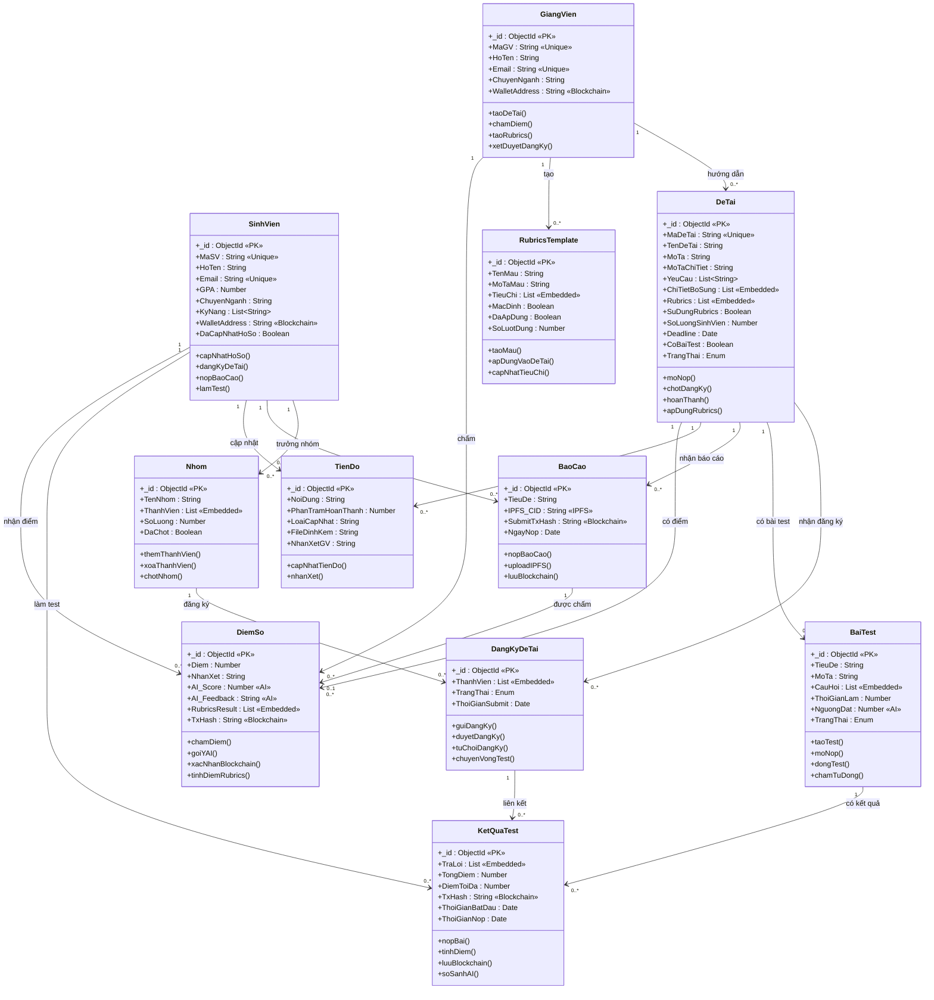

# Sơ Đồ Lớp Mức Phân Tích — Dự Án Web3-GiangVien

## 1. Nguyên tắc vẽ khi dùng MongoDB (NoSQL)

Sơ đồ lớp mức phân tích trong hình mẫu (dự án nhân viên cũ) sử dụng phong cách **UML Analysis Class Diagram** với các đặc điểm:

| Đặc điểm | Dự án cũ (RDBMS) | Dự án Web3 (MongoDB) |
|---|---|---|
| **Khóa chính (PK)** | UUID «PK» | MongoDB tự tạo `_id` (ObjectId) → ta vẫn ghi `_id : ObjectId «PK»` |
| **Khóa ngoại (FK)** | ❌ Không thể hiện FK trực tiếp trên sơ đồ | ❌ MongoDB không có FK, ta dùng `ref` → thể hiện bằng **đường quan hệ** (association) với bội số |
| **Quan hệ** | Dùng đường nối + bội số (1, 0..1, 0..\*, 1..\*) | **Giống hệt** — vẽ đường nối + bội số |
| **Stereotype** | «NFT», «Blockchain», «Unique» | Ta dùng: «Unique», «Blockchain», «IPFS», «AI», «Embedded» |
| **Embedded document** | Không có (do normalize) | MongoDB hay nhúng sub-document → ghi `«Embedded»` hoặc vẽ thành lớp con với quan hệ composition (◆) |
| **Phương thức** | Các business method | Giống hệt — liệt kê các phương thức nghiệp vụ chính |

> [!IMPORTANT]
> **Quy tắc vàng khi vẽ với MongoDB:**
> - Vẫn ghi `_id : ObjectId «PK»` cho mỗi lớp (đây là PK mặc định của MongoDB).
> - **KHÔNG** ghi khóa ngoại (FK) trong thuộc tính — thay vào đó, dùng **đường quan hệ association** với bội số.
> - Sub-document (mảng nhúng) có thể vẽ thành lớp riêng nối bằng **composition** (◆ hình thoi đặc) nếu phức tạp, hoặc ghi trực tiếp dạng `CauHoi : List«Embedded»` nếu đơn giản.
> - Các trường `ref` trong Mongoose chính là cơ sở để vẽ đường quan hệ — nhưng **không** xuất hiện dưới dạng thuộc tính FK.

---

## 2. Danh sách 11 Lớp phân tích

### 2.1 GiangVien (Lecturer)
| Thuộc tính | Kiểu | Ghi chú |
|---|---|---|
| _id | ObjectId «PK» | |
| MaGV | String «Unique» | Mã giảng viên |
| HoTen | String | |
| Email | String «Unique» | |
| ChuyenNganh | String | |
| WalletAddress | String «Unique» «Blockchain» | Ví MetaMask |

**Phương thức:** `+taoDeTai()`, `+chamDiem()`, `+taoRubrics()`, `+xetDuyetDangKy()`

---

### 2.2 SinhVien (Student)
| Thuộc tính | Kiểu | Ghi chú |
|---|---|---|
| _id | ObjectId «PK» | |
| MaSV | String «Unique» | |
| HoTen | String | |
| Email | String «Unique» | |
| GPA | Number | |
| ChuyenNganh | String | |
| KyNang | List\<String\> | |
| WalletAddress | String «Unique» «Blockchain» | |
| DaCapNhatHoSo | Boolean | |

**Phương thức:** `+capNhatHoSo()`, `+dangKyDeTai()`, `+nopBaoCao()`, `+lamTest()`

---

### 2.3 DeTai (Topic)
| Thuộc tính | Kiểu | Ghi chú |
|---|---|---|
| _id | ObjectId «PK» | |
| MaDeTai | String «Unique» | |
| TenDeTai | String | |
| MoTa | String | |
| MoTaChiTiet | String | |
| YeuCau | List\<String\> | |
| ChiTietBoSung | List «Embedded» | Sub-doc {TieuDe, NoiDung} |
| Rubrics | List «Embedded» | Sub-doc {TenTieuChi, MoTa, TrongSo, DiemToiDa, GoiYChoAI} |
| SuDungRubrics | Boolean | |
| HienThiChiTietChoSV | Boolean | |
| SoLuongSinhVien | Number | |
| Deadline | Date | |
| CoBaiTest | Boolean | Có yêu cầu competition test không |
| TrangThai | Enum | {MoDangKy, DaChot, HoanThanh} |

**Phương thức:** `+moNop()`, `+chotDangKy()`, `+hoanThanh()`, `+apDungRubrics()`

---

### 2.4 Nhom (Group)
| Thuộc tính | Kiểu | Ghi chú |
|---|---|---|
| _id | ObjectId «PK» | |
| TenNhom | String | |
| ThanhVien | List «Embedded» | Sub-doc {SinhVien, VaiTro, TrangThai, NgayThamGia} |
| SoLuong | Number | Số thành viên tối đa |
| DaChot | Boolean | |

**Phương thức:** `+themThanhVien()`, `+xoaThanhVien()`, `+chotNhom()`

---

### 2.5 DangKyDeTai (TopicRegistration)
| Thuộc tính | Kiểu | Ghi chú |
|---|---|---|
| _id | ObjectId «PK» | |
| ThanhVien | List «Embedded» | Sub-doc (backward compat) |
| TrangThai | Enum | {ChoDuyet, ChoTest, DangLamTest, DaSubmit, ChoDoi, DaDuyet, TuChoi, Thua} |
| ThoiGianSubmit | Date | Thời điểm submit (Competition) |

**Phương thức:** `+guiDangKy()`, `+duyetDangKy()`, `+tuChoiDangKy()`, `+chuyenVongTest()`

---

### 2.6 BaiTest (EntranceTest)
| Thuộc tính | Kiểu | Ghi chú |
|---|---|---|
| _id | ObjectId «PK» | |
| TieuDe | String | |
| MoTa | String | |
| CauHoi | List «Embedded» | Sub-doc {LoaiCauHoi, NoiDung, LuaChon, DapAnDung, NgonNgu, DapAnMau, Diem} |
| ThoiGianLam | Number | Phút |
| NguongDat | Number | Ngưỡng % đạt «AI» |
| TrangThai | Enum | {MoNop, DaDong} |

**Phương thức:** `+taoTest()`, `+moNop()`, `+dongTest()`, `+chamTuDong()`

---

### 2.7 KetQuaTest (TestResult)
| Thuộc tính | Kiểu | Ghi chú |
|---|---|---|
| _id | ObjectId «PK» | |
| TraLoi | List «Embedded» | Sub-doc {CauHoiIndex, LoaiCauHoi, TraLoiText, Diem, DiemToiDa, DungSai, AI_Similarity} |
| TongDiem | Number | |
| DiemToiDa | Number | |
| TxHash | String «Blockchain» | Hash giao dịch blockchain |
| ThoiGianBatDau | Date | |
| ThoiGianNop | Date | |

**Phương thức:** `+nopBai()`, `+tinhDiem()`, `+luuBlockchain()`, `+soSanhAI()`

---

### 2.8 BaoCao (Report)
| Thuộc tính | Kiểu | Ghi chú |
|---|---|---|
| _id | ObjectId «PK» | |
| TieuDe | String | |
| IPFS_CID | String «IPFS» | Hash lưu trữ phi tập trung |
| SubmitTxHash | String «Blockchain» | |
| NgayNop | Date | |

**Phương thức:** `+nopBaoCao()`, `+uploadIPFS()`, `+luuBlockchain()`

---

### 2.9 DiemSo (Score)
| Thuộc tính | Kiểu | Ghi chú |
|---|---|---|
| _id | ObjectId «PK» | |
| Diem | Number | |
| NhanXet | String | |
| AI_Score | Number «AI» | |
| AI_Feedback | String «AI» | |
| RubricsResult | List «Embedded» | Sub-doc {TenTieuChi, TrongSo, DiemToiDa, AI_Diem, GV_Diem, AI_NhanXet, MatchedChunk} |
| TxHash | String «Blockchain» | |

**Phương thức:** `+chamDiem()`, `+goiYAI()`, `+xacNhanBlockchain()`, `+tinhDiemRubrics()`

---

### 2.10 TienDo (Progress)
| Thuộc tính | Kiểu | Ghi chú |
|---|---|---|
| _id | ObjectId «PK» | |
| NoiDung | String | |
| PhanTramHoanThanh | Number | 0–100% |
| LoaiCapNhat | String | |
| FileDinhKem | String | |
| NhanXetGV | String | |

**Phương thức:** `+capNhatTienDo()`, `+nhanXet()`

---

### 2.11 RubricsTemplate (RubricsTemplate)
| Thuộc tính | Kiểu | Ghi chú |
|---|---|---|
| _id | ObjectId «PK» | |
| TenMau | String | |
| MoTaMau | String | |
| TieuChi | List «Embedded» | Sub-doc {TenTieuChi, MoTa, TrongSo, DiemToiDa, GoiYChoAI} |
| MacDinh | Boolean | Mẫu mặc định |
| DaApDung | Boolean | Đã áp dụng chưa |
| SoLuotDung | Number | |

**Phương thức:** `+taoMau()`, `+apDungVaoDeTai()`, `+capNhatTieuChi()`

---

## 3. Bảng Quan hệ giữa các lớp (Multiplicity)

| Lớp nguồn | Quan hệ | Lớp đích | Bội số nguồn | Bội số đích | Giải thích |
|---|---|---|---|---|---|
| **GiangVien** | hướng dẫn | **DeTai** | 1 | 0..* | 1 GV hướng dẫn nhiều đề tài |
| **GiangVien** | tạo | **RubricsTemplate** | 1 | 0..* | 1 GV tạo nhiều mẫu rubrics |
| **GiangVien** | chấm | **DiemSo** | 1 | 0..* | 1 GV chấm nhiều điểm |
| **DeTai** | có | **DangKyDeTai** | 1 | 0..* | 1 đề tài nhận nhiều đăng ký |
| **DeTai** | có | **BaiTest** | 1 | 0..1 | 1 đề tài có tối đa 1 bài test |
| **DeTai** | có | **BaoCao** | 1 | 0..* | 1 đề tài nhận nhiều báo cáo |
| **DeTai** | có | **TienDo** | 1 | 0..* | 1 đề tài có nhiều cập nhật tiến độ |
| **DeTai** | có | **DiemSo** | 1 | 0..* | 1 đề tài có nhiều điểm số |
| **Nhom** | đăng ký qua | **DangKyDeTai** | 1 | 0..* | 1 nhóm đăng ký nhiều đề tài |
| **SinhVien** | là trưởng nhóm | **Nhom** | 1 | 0..* | 1 SV có thể làm trưởng nhiều nhóm |
| **SinhVien** | tham gia | **Nhom** | 0..* | 0..* | SV tham gia qua ThanhVien «Embedded» |
| **SinhVien** | nộp | **BaoCao** | 1 | 0..* | 1 SV nộp nhiều báo cáo |
| **SinhVien** | cập nhật | **TienDo** | 1 | 0..* | 1 SV cập nhật nhiều tiến độ |
| **SinhVien** | làm | **KetQuaTest** | 1 | 0..* | 1 SV có nhiều kết quả test |
| **SinhVien** | nhận | **DiemSo** | 1 | 0..* | 1 SV có nhiều điểm số |
| **BaiTest** | có | **KetQuaTest** | 1 | 0..* | 1 bài test có nhiều kết quả |
| **BaoCao** | được chấm bởi | **DiemSo** | 1 | 0..1 | 1 báo cáo được chấm 1 lần |
| **DangKyDeTai** | liên kết | **KetQuaTest** | 1 | 0..* | 1 đăng ký có nhiều kết quả test |

---

## 4. Sơ đồ Mermaid (Class Diagram)

> [!TIP]
> Sơ đồ Mermaid bên dưới là **bản tham chiếu** để bạn vẽ lại trên **draw.io**, **StarUML**, hoặc **Visual Paradigm** cho đẹp. Mermaid classDiagram hỗ trợ đủ ký hiệu UML.



---

## 5. Hướng dẫn vẽ trên công cụ (draw.io / StarUML)

### Bước 1: Tạo các lớp
- Mỗi lớp chia 3 phần: **Tên lớp** | **Thuộc tính** | **Phương thức**
- Dùng stereotype `«PK»` cho `_id`, `«Unique»` cho các trường unique
- Dùng stereotype đặc biệt: `«Blockchain»`, `«IPFS»`, `«AI»`, `«Embedded»` để thể hiện đặc thù Web3/AI

### Bước 2: Vẽ quan hệ
- Dùng **Association** (đường thẳng) cho quan hệ tham chiếu (ref trong Mongoose)
- Ghi **bội số (multiplicity)** ở 2 đầu: `1`, `0..1`, `0..*`, `1..*`
- Có thể dùng **Composition** (◆ hình thoi đặc) cho sub-document nếu muốn tách thành lớp riêng

### Bước 3: Bố cục
Gợi ý bố cục giống sơ đồ mẫu:

```
                    GiangVien
                   /    |     \
          RubricsTemplate  DeTai    DiemSo
                         /  |  \  \
              DangKyDeTai BaiTest BaoCao TienDo
               /      \       \
           Nhom    KetQuaTest  DiemSo
            |
        SinhVien
```

> [!NOTE]
> **Khác biệt chính so với sơ đồ nhân viên cũ:**
> 1. **Không có FK** trong thuộc tính — MongoDB dùng `ObjectId ref` → ta chỉ thể hiện qua đường quan hệ
> 2. **Có sub-document** (CauHoi, TraLoi, Rubrics, ThanhVien) → ghi `List «Embedded»` hoặc tách thành lớp con với composition
> 3. **Stereotype mới**: `«Blockchain»` (TxHash, WalletAddress), `«IPFS»` (IPFS_CID), `«AI»` (AI_Score, SBERT)
> 4. Vẫn giữ cấu trúc 3 phần (tên, thuộc tính, phương thức) và bội số giống hệt mẫu cũ
