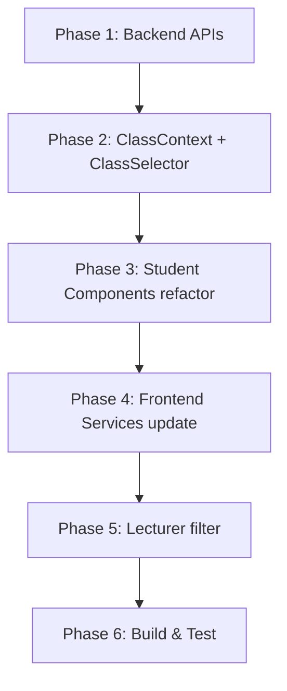

# Multi-Class Context: Hỗ trợ SV có nhiều lớp, nhiều nhóm, nhiều đề tài

## Mô tả vấn đề

Hệ thống hiện tại giả định mỗi SV chỉ có **1 nhóm** và **1 đăng ký đề tài** duy nhất. Tuy nhiên thực tế, 1 SV có thể tham gia **nhiều lớp** (nhiều môn, nhiều GV), mỗi lớp có **nhóm riêng** và **đăng ký đề tài riêng**.

### Các điểm bị sai logic hiện tại:

| API / Component | Lỗi | Hệ quả |
|---|---|---|
| `getMyRegistration` (backend) | `findOne()` → chỉ trả 1 đăng ký | SV có 3 lớp → chỉ thấy 1 đề tài |
| `getNhomBySinhVien` (backend) | `findOne()` → chỉ trả 1 nhóm | Dù có param `lopHocId`, FE không dùng |
| `GroupManagement.js` | Hiển thị 1 nhóm | Không có cách xem nhóm ở lớp khác |
| `TopicRegistration.js` | `registeredTopicId` toàn cục | Đã ĐK lớp A → block hết lớp B, C |
| `ProgressLog.js` | `getMyRegistration()` → 1 đề tài | Không chọn được đề tài khác |
| `ReportUpload.js` | `getMyRegistration()` → 1 đề tài | Không nộp BC cho lớp khác |
| `ProgressTracking.js` | `getMyRegistration()` → 1 đề tài | Chỉ thấy kết quả 1 đề tài |

### Quy tắc nghiệp vụ đã xác nhận:
1. ✅ 1 SV có thể tạo/gia nhập nhóm khác nhau ở mỗi lớp
2. ✅ 1 SV đăng ký đề tài độc lập ở mỗi lớp
3. ✅ Mỗi lớp (môn) chỉ được đăng ký **1 đề tài**
4. ✅ UI dùng **Dropdown chọn lớp ở đầu trang (global)** → toàn bộ nội dung thay đổi theo lớp
5. ✅ GV cũng có **filter theo lớp** khi quản lý

---

## User Review Required

> [!IMPORTANT]
> Thay đổi này ảnh hưởng **cả backend API lẫn frontend** trên nhiều component. Cần review kỹ trước khi thực thi.

> [!WARNING]
> Backend API `getMyRegistration` sẽ đổi từ `findOne` sang `find` (trả mảng). Frontend phải xử lý tương thích. Các dữ liệu cũ trong DB vẫn tương thích vì schema không đổi.

---

## Proposed Changes

### Phase 1: Backend API — Hỗ trợ multi-class

---

#### [MODIFY] [deTaiController.js](file:///d:/HocTap/KLKS_Web3/Web3GiangVien/backend/controllers/deTaiController.js)

**1a. Thêm API `getMyRegistrations` (trả tất cả đăng ký)**

```js
// GET /api/dangky/sinhvien/:svId/all
exports.getMyRegistrations = async (req, res) => {
    const svId = req.params.svId;
    const registrations = await DangKyDeTai.find({
        TrangThai: { $nin: ['TuChoi', 'Thua'] },
        $or: [
            { SinhVien: svId },
            { TruongNhom: svId },
            { 'ThanhVien.SinhVien': svId, 'ThanhVien.TrangThaiTV': 'DaChapNhan' }
        ]
    }).populate('DeTai').populate('Nhom').populate('ThanhVien.SinhVien');
    res.json({ registrations });
};
```

**1b. Sửa `getMyRegistration` — thêm query `?lopHocId=xxx`**

Nếu FE truyền `lopHocId`, lọc theo lớp:
- Tìm tất cả DangKyDeTai của SV
- Lọc theo DeTai có `LopHoc` chứa `lopHocId`
- Trả về đúng 1 registration cho lớp đó (hoặc null)

**1c. Validate đăng ký: 1 SV chỉ ĐK 1 đề tài / lớp**

Trong `registerTopic`: Trước khi tạo DangKyDeTai, kiểm tra SV đã có đăng ký nào cho đề tài cùng LopHoc chưa.

---

#### [MODIFY] [nhomController.js](file:///d:/HocTap/KLKS_Web3/Web3GiangVien/backend/controllers/nhomController.js)

**2a. Thêm API `getAllNhomBySinhVien` (trả tất cả nhóm)**

```js
// GET /api/nhom/sinhvien/:svId/all
exports.getAllNhomBySinhVien = async (req, res) => {
    const nhoms = await Nhom.find({
        'ThanhVien.SinhVien': svId,
        'ThanhVien.TrangThai': { $in: ['DaMoi', 'DaChapNhan'] }
    }).populate('TruongNhom').populate('ThanhVien.SinhVien').populate('LopHoc', 'MaLopHoc TenLopHoc');
    res.json({ nhoms });
};
```

**2b. `getNhomBySinhVien` giữ nguyên** (đã hỗ trợ `?lopHocId`)

---

#### [MODIFY] [server.js](file:///d:/HocTap/KLKS_Web3/Web3GiangVien/backend/server.js)

Thêm 2 route mới:
```
app.get('/api/dangky/sinhvien/:svId/all', ...requireAuth, deTaiController.getMyRegistrations);
app.get('/api/nhom/sinhvien/:svId/all', ...requireAuth, nhomController.getAllNhomBySinhVien);
```

---

### Phase 2: Frontend — ClassContext toàn cục

---

#### [NEW] [ClassContext.js](file:///d:/HocTap/KLKS_Web3/Web3GiangVien/frontend/src/contexts/ClassContext.js)

Tạo React Context quản lý lớp học được chọn, dùng chung cho toàn bộ student pages:

```js
const ClassContext = createContext();

export const ClassProvider = ({ children }) => {
  const [myClasses, setMyClasses] = useState([]);
  const [selectedClassId, setSelectedClassId] = useState(null);
  const [selectedClass, setSelectedClass] = useState(null);
  const [loading, setLoading] = useState(true);
  
  // Fetch lớp học của SV khi mount
  // Auto-select lớp đầu tiên nếu chưa chọn
  // Lưu selectedClassId vào localStorage để persist
  
  return (
    <ClassContext.Provider value={{
      myClasses, selectedClassId, selectedClass, loading,
      setSelectedClassId
    }}>
      {children}
    </ClassContext.Provider>
  );
};
```

**Lý do tạo Context**: Tránh mỗi component tự fetch lớp học và quản lý state riêng → thống nhất 1 nguồn dữ liệu.

---

#### [NEW] [ClassSelector.js](file:///d:/HocTap/KLKS_Web3/Web3GiangVien/frontend/src/components/common/ClassSelector.js)

Component dropdown hiển thị ở **Header** hoặc **đầu Content**, cho phép SV chọn lớp:

```
📚 [Lớp đang chọn: CS101 - Trí tuệ nhân tạo ▼]
```

Hiển thị: `MaLopHoc - TenLopHoc (MonHoc.TenMonHoc) • GV: HoTen`

---

#### [MODIFY] [MainLayout.js](file:///d:/HocTap/KLKS_Web3/Web3GiangVien/frontend/src/components/layout/MainLayout.js)

- Wrap `<Outlet />` trong `<ClassProvider>` cho student routes
- Thêm `<ClassSelector />` vào Header (bên trái Avatar) khi `!isLecturer`
- GV cũng cần **ClassSelector riêng** (dùng `getLopHocByGV` thay vì `getLopHocBySinhVien`)

---

#### [MODIFY] [App.js](file:///d:/HocTap/KLKS_Web3/Web3GiangVien/frontend/src/App.js)

Wrap student route group trong `<ClassProvider>`:
```jsx
<Route path="/student" element={
  <ProtectedRoute allowedRoles={['STUDENT_ROLE']}>
    <ClassProvider>
      <MainLayout />
    </ClassProvider>
  </ProtectedRoute>
}>
```

Tương tự cho lecturer:
```jsx
<Route path="/lecturer" element={
  <ProtectedRoute allowedRoles={['LECTURER_ROLE']}>
    <LecturerClassProvider>
      <MainLayout />
    </LecturerClassProvider>
  </ProtectedRoute>
}>
```

---

### Phase 3: Frontend Student Components — Dùng ClassContext

---

#### [MODIFY] [GroupManagement.js](file:///d:/HocTap/KLKS_Web3/Web3GiangVien/frontend/src/components/student/GroupManagement.js)

**Trước:** Gọi `getNhomBySinhVien(user.id)` → nhận 1 nhóm bất kỳ
**Sau:**
- Dùng `useClassContext()` để lấy `selectedClassId`
- Gọi `getNhomBySinhVien(user.id, { lopHocId: selectedClassId })` → nhận nhóm của lớp đó
- Nếu SV chưa có nhóm ở lớp này → hiển thị "Tạo Nhóm" (cho lớp hiện tại)
- Bỏ Select lớp trong Modal tạo nhóm (vì đã chọn global rồi)
- Khi `selectedClassId` thay đổi → re-fetch data

---

#### [MODIFY] [TopicRegistration.js](file:///d:/HocTap/KLKS_Web3/Web3GiangVien/frontend/src/components/student/TopicRegistration.js)

**Trước:**
- `registeredTopicId` là toàn cục → đã ĐK 1 đề tài = block hết
- Filter lớp riêng lẻ (Select riêng)

**Sau:**
- Dùng `useClassContext()` → `selectedClassId`
- Gọi `getMyRegistration(user.id, { lopHocId: selectedClassId })` → chỉ kiểm tra đăng ký **của lớp hiện tại**
- Nếu lớp này chưa ĐK → cho phép đăng ký đề tài
- Nếu lớp này đã ĐK → hiển thị đề tài đã ĐK
- Lọc đề tài theo `topic.LopHoc` chứa `selectedClassId`
- Bỏ Select "Lọc theo Lớp Học" riêng (vì đã dùng ClassSelector global)
- Chỉ hiển thị đề tài thuộc lớp đang chọn

---

#### [MODIFY] [ProgressLog.js](file:///d:/HocTap/KLKS_Web3/Web3GiangVien/frontend/src/components/student/ProgressLog.js)

**Trước:** `getMyRegistration(user.id)` → 1 đề tài duy nhất
**Sau:**
- Dùng `useClassContext()` → `selectedClassId`
- `getMyRegistration(user.id, { lopHocId: selectedClassId })` → đề tài của lớp hiện tại
- Khi chuyển lớp → re-fetch

---

#### [MODIFY] [ReportUpload.js](file:///d:/HocTap/KLKS_Web3/Web3GiangVien/frontend/src/components/student/ReportUpload.js)

**Trước:** `getMyRegistration(user.id)` → 1 đề tài
**Sau:**
- Dùng `useClassContext()` → `selectedClassId`
- `getMyRegistration(user.id, { lopHocId: selectedClassId })` → đề tài của lớp hiện tại
- Nộp BC gắn với đúng đề tài + nhóm của lớp đang chọn

---

#### [MODIFY] [ProgressTracking.js](file:///d:/HocTap/KLKS_Web3/Web3GiangVien/frontend/src/components/student/ProgressTracking.js)

**Trước:** `getMyRegistration(user.id)` → 1 đề tài
**Sau:**
- Dùng `useClassContext()` → `selectedClassId`
- `getMyRegistration(user.id, { lopHocId: selectedClassId })` → đề tài + điểm của lớp hiện tại

---

#### [MODIFY] [StudentDashboard.js](file:///d:/HocTap/KLKS_Web3/Web3GiangVien/frontend/src/components/student/StudentDashboard.js)

**Trước:** Hiển thị 1 registration toàn cục
**Sau:**
- Dùng `useClassContext()` → `selectedClassId`
- Hiển thị thông tin **theo lớp đang chọn**: nhóm, đề tài, điểm, tiến độ
- Card "Lớp Học Của Tôi" vẫn hiển thị tất cả (không filter)

---

### Phase 4: Frontend Services — Thêm params

---

#### [MODIFY] [aiService.js](file:///d:/HocTap/KLKS_Web3/Web3GiangVien/frontend/src/services/aiService.js)

```js
// Sửa getMyRegistration: thêm optional lopHocId
getMyRegistration: async (svId, lopHocId) => {
    const params = lopHocId ? `?lopHocId=${lopHocId}` : '';
    const res = await apiService.get(`/dangky/sinhvien/${svId}${params}`);
    return res.data;
},

// Thêm getMyRegistrations (tất cả)
getMyRegistrations: async (svId) => {
    const res = await apiService.get(`/dangky/sinhvien/${svId}/all`);
    return res.data;
},
```

---

#### [MODIFY] [nhomService.js](file:///d:/HocTap/KLKS_Web3/Web3GiangVien/frontend/src/services/nhomService.js)

```js
// Sửa getNhomBySinhVien: truyền lopHocId
getNhomBySinhVien: async (svId, lopHocId) => {
    const params = lopHocId ? `?lopHocId=${lopHocId}` : '';
    const res = await axios.get(`${API_URL}/nhom/sinhvien/${svId}${params}`, ...);
    return res.data;
},

// Thêm getAllNhomBySinhVien
getAllNhomBySinhVien: async (svId) => {
    const res = await axios.get(`${API_URL}/nhom/sinhvien/${svId}/all`, ...);
    return res.data;
},
```

---

### Phase 5: Lecturer — Thêm filter lớp

---

#### [NEW] [LecturerClassContext.js](file:///d:/HocTap/KLKS_Web3/Web3GiangVien/frontend/src/contexts/LecturerClassContext.js)

Context riêng cho GV, dùng `getLopHocByGV(user.id)` để lấy danh sách lớp.

---

#### [MODIFY] [TopicManagement.js](file:///d:/HocTap/KLKS_Web3/Web3GiangVien/frontend/src/components/lecturer/TopicManagement.js)

- Dùng `useLecturerClassContext()` → `selectedClassId`
- Filter đề tài theo lớp đang chọn (hoặc "Tất cả")
- Khi tạo đề tài mới, auto-gắn lớp đang chọn

---

#### [MODIFY] [SubmissionReview.js](file:///d:/HocTap/KLKS_Web3/Web3GiangVien/frontend/src/components/lecturer/SubmissionReview.js)

- Dùng `useLecturerClassContext()` → `selectedClassId`
- Filter submissions theo lớp đang chọn
- GV có thể chọn "Tất cả lớp" để xem toàn bộ

---

## Open Questions

> [!NOTE]
> **Không có câu hỏi mở** — tất cả nghiệp vụ đã được xác nhận ở lần hỏi trước.

---

## Thứ tự thực thi



| Phase | Ước lượng | Mô tả |
|-------|-----------|-------|
| 1 | Backend | Thêm `getMyRegistrations`, sửa `getMyRegistration` hỗ trợ `lopHocId`, validate 1 ĐK/lớp |
| 2 | Frontend Core | Tạo `ClassContext`, `ClassSelector`, tích hợp vào `MainLayout` |
| 3 | Frontend SV | Refactor 6 components SV dùng ClassContext |
| 4 | Frontend Services | Cập nhật `aiService`, `nhomService` thêm params |
| 5 | Frontend GV | `LecturerClassContext`, filter ở TopicManagement + SubmissionReview |
| 6 | Verify | `npm run build`, test luồng thủ công |

---

## Verification Plan

### Automated Tests
- `npm run build` → đảm bảo không lỗi compile

### Manual Verification
1. **SV có 2+ lớp**: Đăng nhập → chọn lớp A → thấy nhóm/đề tài/BC/tiến độ của lớp A → chuyển sang lớp B → thấy data riêng
2. **ĐK đề tài 2 lớp**: ĐK đề tài lớp A → chuyển lớp B → vẫn ĐK được đề tài lớp B
3. **Giới hạn 1 ĐK/lớp**: Đã ĐK đề tài lớp A → không cho ĐK đề tài thứ 2 ở lớp A
4. **GV filter**: GV chọn lớp → chỉ thấy đề tài + submission của lớp đó
5. **Dashboard**: Chuyển lớp → card đề tài, điểm, tiến độ cập nhật theo lớp
