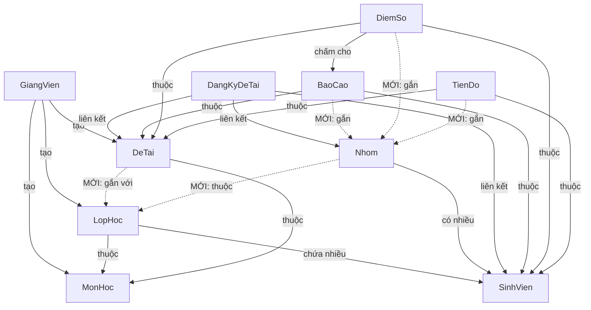

# So Sánh Logic Cũ vs Mới — Refactor Competition Platform

**Ngày:** 2026-05-30  
**Mục đích:** Giải thích bằng lời hệ thống CŨ hoạt động ra sao, và SAU refactor thay đổi gì.

---

## Mục Lục

1. [Tổng quan mối quan hệ các bảng](#1-tổng-quan-mối-quan-hệ-các-bảng)
2. [Logic CŨ — Trước refactor](#2-logic-cũ--trước-refactor)
3. [Logic MỚI — Sau refactor](#3-logic-mới--sau-refactor)
4. [Chi tiết thay đổi từng bảng](#4-chi-tiết-thay-đổi-từng-bảng)
5. [Flow chấm điểm: Cũ vs Mới](#5-flow-chấm-điểm-cũ-vs-mới)
6. [Flow nộp báo cáo: Cũ vs Mới](#6-flow-nộp-báo-cáo-cũ-vs-mới)
7. [Flow tiến độ: Cũ vs Mới](#7-flow-tiến-độ-cũ-vs-mới)
8. [Tóm tắt những gì KHÔNG đổi](#8-tóm-tắt-những-gì-không-đổi)
9. [Phụ lục: Code minh họa](#9-phụ-lục-code-minh-họa)

---

## 1. Tổng Quan Mối Quan Hệ Các Bảng

### Sơ đồ quan hệ (mermaid)



> Đường nét đứt (-.->)  là các quan hệ MỚI được thêm trong lần refactor này.

---

## 2. Logic CŨ — Trước Refactor

### Cấu trúc tổng quát

Trước refactor, hệ thống hoạt động theo luồng **"đề tài gắn với môn học, sinh viên đăng ký trực tiếp"**:

- **Giảng viên** tạo **Môn Học** (`MonHoc`), rồi tạo **Đề Tài** (`DeTai`) gắn với môn học đó.
- **Sinh viên** đăng ký đề tài → tạo bản ghi `DangKyDeTai`.
- Nếu đề tài cho phép làm nhóm (SoLuongSinhVien > 1), sinh viên trưởng nhóm mời thành viên, nhưng **nhóm (`Nhom`) tồn tại độc lập**, không biết mình thuộc lớp nào.
- Đề tài (`DeTai`) chỉ biết mình thuộc **Môn Học** nào, nhưng **không biết mình thuộc Lớp Học nào**.
- Khi sinh viên nộp báo cáo → `BaoCao` chỉ lưu `DeTai` + `SinhVien`, **không lưu nhóm**.
- Khi giảng viên chấm điểm → `DiemSo` lưu `BaoCao` + `SinhVien` + `DeTai`, **không lưu nhóm**.
- Tiến độ (`TienDo`) cũng chỉ lưu `DeTai` + `SinhVien`, **không biết nhóm**.

### Vấn đề với logic cũ

1. **Không ràng buộc theo Lớp Học:** Một sinh viên lớp A có thể đăng ký đề tài của lớp B (vì đề tài chỉ gắn với Môn Học, không gắn với Lớp Học cụ thể).

2. **Không giới hạn 1 đề tài / 1 lớp:** Sinh viên có thể đăng ký nhiều đề tài trong cùng 1 lớp học.

3. **Nhóm "trôi nổi":** Nhóm được tạo nhưng không biết mình thuộc lớp nào → thành viên từ nhiều lớp khác nhau có thể vào cùng 1 nhóm.

4. **Chấm điểm theo cá nhân:** Giảng viên chấm từng sinh viên một, mặc dù cả nhóm nộp chung 1 báo cáo. Không có cơ chế "chấm nhóm rồi điều chỉnh riêng" cho từng thành viên nếu có chênh lệch đóng góp.

5. **Khó truy vết nhóm:** Khi xem báo cáo, tiến độ hay điểm số, không thể nhanh chóng biết sinh viên đó thuộc nhóm nào.

---

## 3. Logic MỚI — Sau Refactor

### Cấu trúc tổng quát

Sau refactor, hệ thống hoạt động theo luồng **"Lớp Học là đơn vị trung tâm"**:

- **Giảng viên** tạo Môn Học → tạo Lớp Học (thuộc Môn Học) → thêm Sinh Viên vào Lớp.
- **Giảng viên** tạo Đề Tài gắn trực tiếp với **1 hoặc nhiều Lớp Học** (trường `LopHoc` mới trên `DeTai`).
- **Nhóm** khi được tạo sẽ **gắn với 1 Lớp Học cụ thể** → chỉ sinh viên trong cùng lớp mới có thể cùng nhóm.
- Khi đăng ký đề tài, backend kiểm tra: **1 sinh viên chỉ được đăng ký tối đa 1 đề tài trong cùng 1 lớp**.
- Khi nộp báo cáo → `BaoCao` **lưu thêm `Nhom`** (nếu có) → biết rõ bài này do nhóm nào nộp.
- Khi giảng viên chấm điểm → `DiemSo` **lưu thêm `Nhom`** + **`DiemGoc`** (điểm gốc ban đầu cho cả nhóm) + **`LaDieuChinh`** (cờ đánh dấu đã điều chỉnh riêng).
- Giảng viên có thể **chấm 1 lần cho cả nhóm**, sau đó **điều chỉnh điểm riêng cho từng thành viên** nếu cần.
- Tiến độ (`TienDo`) cũng **lưu thêm `Nhom`** → giảng viên xem tiến độ theo nhóm dễ hơn.

### Điểm khác biệt cốt lõi

| Khía cạnh | CŨ | MỚI |
|---|---|---|
| Đề tài thuộc về | Môn Học (gián tiếp) | Lớp Học (trực tiếp) |
| Nhóm thuộc về | Không gắn lớp | Gắn với 1 Lớp Học |
| SV đăng ký đề tài | Không giới hạn trong lớp | Tối đa 1 đề tài / lớp |
| Nộp báo cáo | Chỉ lưu SV + Đề tài | Lưu thêm Nhóm |
| Chấm điểm | Chấm từng cá nhân | Chấm nhóm → điều chỉnh riêng nếu cần |
| Điểm gốc | Không lưu | Lưu `DiemGoc` |
| Tiến độ | Chỉ lưu SV + Đề tài | Lưu thêm Nhóm |

---

## 4. Chi Tiết Thay Đổi Từng Bảng

### 4.1 `DeTai` (Đề tài / Challenge)

**CŨ:** Chỉ có trường `MonHoc` — đề tài thuộc về 1 môn học.

**MỚI:** Thêm trường `LopHoc` (mảng ObjectId) — đề tài gắn trực tiếp với 1 hoặc nhiều lớp học cụ thể. Trường `MonHoc` vẫn giữ để tương thích ngược.

**Ý nghĩa:** Giảng viên khi tạo đề tài sẽ chọn "đề tài này dành cho lớp nào" thay vì chỉ chọn môn.

---

### 4.2 `Nhom` (Nhóm sinh viên)

**CŨ:** Nhóm chỉ có TruongNhom, ThanhVien, SoLuong. Không biết thuộc lớp nào.

**MỚI:** Thêm trường `LopHoc` (ObjectId) — nhóm thuộc về 1 lớp cụ thể.

**Ý nghĩa:** Khi tạo nhóm, hệ thống ràng buộc chỉ sinh viên cùng lớp mới được thêm vào nhóm. Tránh trường hợp sinh viên lớp A vào nhóm lớp B.

---

### 4.3 `BaoCao` (Báo cáo / Submission)

**CŨ:** Chỉ lưu `DeTai` + `SinhVien`.

**MỚI:** Thêm trường `Nhom` (ObjectId) — biết bài nộp này thuộc nhóm nào.

**Ý nghĩa:** Khi trưởng nhóm nộp bài, hệ thống tự động gắn `Nhom` ID từ bản ghi đăng ký (`DangKyDeTai.Nhom`). Giảng viên nhìn vào bài nộp là biết ngay đây là nhóm nào, có bao nhiêu thành viên.

---

### 4.4 `TienDo` (Nhật ký tiến độ)

**CŨ:** Chỉ lưu `DeTai` + `SinhVien`.

**MỚI:** Thêm trường `Nhom` (ObjectId) + thêm index `{ DeTai, Nhom, TuanSo }` (sparse).

**Ý nghĩa:** Khi sinh viên cập nhật tiến độ, hệ thống tự động tra cứu nhóm của sinh viên đó và lưu `Nhom` vào bản ghi. Giảng viên có thể xem tiến độ theo nhóm thay vì phải dò từng cá nhân.

---

### 4.5 `DiemSo` (Điểm số / Evaluation Result) — **Thay đổi lớn nhất**

**CŨ:** Mỗi bản ghi `DiemSo` gắn với 1 `BaoCao` + 1 `SinhVien`. Chỉ có trường `Diem` duy nhất.

**MỚI:** Thêm 3 trường quan trọng:
- `Nhom` (ObjectId) — điểm này thuộc nhóm nào.
- `DiemGoc` (Number) — điểm gốc ban đầu mà giảng viên chấm cho cả nhóm.
- `LaDieuChinh` (Boolean) — cờ đánh dấu "điểm này đã bị điều chỉnh riêng cho SV này" hay chưa.

**Ý nghĩa:** Xem phần [Flow chấm điểm](#5-flow-chấm-điểm-cũ-vs-mới) bên dưới.

---

### 4.6 `DangKyDeTai` (Đăng ký đề tài)

**KHÔNG THAY ĐỔI SCHEMA.** Bảng này đã có sẵn trường `Nhom` và `TruongNhom` từ trước. Chỉ thay đổi **logic backend** khi đăng ký:
- Kiểm tra sinh viên có thuộc lớp học mà đề tài yêu cầu không.
- Kiểm tra sinh viên đã đăng ký đề tài khác trong cùng lớp chưa.

---

### 4.7 `LopHoc` (Lớp Học)

**KHÔNG THAY ĐỔI SCHEMA.** Bảng đã có sẵn `MonHoc`, `GiangVien`, `SinhVien[]`. Chỉ thêm **2 API mới** ở backend:
- Import sinh viên hàng loạt bằng Mã SV.
- Truy vấn danh sách lớp học theo sinh viên.

---

### 4.8 `MonHoc` (Môn Học)

**KHÔNG THAY ĐỔI.** Giữ nguyên hoàn toàn.

---

## 5. Flow Chấm Điểm: Cũ vs Mới

### Flow CŨ

```
Bước 1: GV mở danh sách submission
Bước 2: Với mỗi sinh viên, GV nhấn "Chấm điểm"
Bước 3: GV nhập điểm (0-10) + nhận xét
Bước 4: Hệ thống tạo 1 bản ghi DiemSo cho SV đó
Bước 5: Hệ thống ghi lên blockchain
```

**Vấn đề:** Nếu nhóm có 3 người cùng nộp 1 báo cáo, GV phải chấm 3 lần. Điểm như nhau cho cả 3 nhưng phải nhập lại. Nếu 1 người làm ít hơn, không có cách "giảm điểm riêng" một cách có truy vết.

### Flow MỚI

```
Bước 1: GV mở danh sách submission
Bước 2: Hệ thống hiển thị submission theo NHÓM (gom các SV cùng nhóm lại)
Bước 3: GV nhấn "Chấm điểm" → nhập điểm 1 lần
Bước 4: Hệ thống tạo DiemSo cho TẤT CẢ thành viên nhóm:
         - Diem = 7.5
         - DiemGoc = 7.5   ← lưu lại điểm gốc
         - LaDieuChinh = false  ← chưa điều chỉnh
Bước 5: Hệ thống ghi lên blockchain cho từng SV

--- Nếu cần điều chỉnh riêng ---

Bước 6: GV thấy SV Nguyễn Văn A đóng góp ít hơn
Bước 7: GV nhấn "Điều chỉnh điểm" cho SV đó
Bước 8: GV nhập điểm mới: 6.0 + lý do "Đóng góp ít hơn nhóm"
Bước 9: Hệ thống cập nhật DiemSo của SV đó:
         - Diem = 6.0        ← điểm mới
         - DiemGoc = 7.5     ← vẫn giữ điểm nhóm gốc để so sánh
         - LaDieuChinh = true ← đánh dấu đã điều chỉnh
Bước 10: Hệ thống ghi điểm mới lên blockchain (ghi đè)
```

**Lợi ích:**
- GV chỉ cần chấm 1 lần cho cả nhóm → tiết kiệm thời gian.
- Điểm gốc (`DiemGoc`) luôn được lưu → biết điểm nhóm ban đầu là bao nhiêu.
- Cờ `LaDieuChinh` giúp dễ dàng lọc ra "SV nào đã bị điều chỉnh điểm" (để review, audit).
- Blockchain vẫn bất biến — nhưng lần ghi sau sẽ ghi đè lên submission index cũ.

---

## 6. Flow Nộp Báo Cáo: Cũ vs Mới

### Flow CŨ

```
SV nộp file PDF → Hệ thống tạo BaoCao:
  - DeTai: id đề tài
  - SinhVien: id sinh viên
  - IPFS_CID: hash file trên IPFS
  (Nếu đề tài nhóm, tạo BaoCao cho từng thành viên, nhưng không biết nhóm nào)
```

### Flow MỚI

```
SV nộp file PDF → Hệ thống tra cứu DangKyDeTai → lấy Nhom ID → tạo BaoCao:
  - DeTai: id đề tài
  - SinhVien: id sinh viên
  - Nhom: id nhóm   ← MỚI
  - IPFS_CID: hash file trên IPFS
```

**Thay đổi thực tế:** Chỉ thêm 1 dòng `Nhom: dangKy.Nhom || undefined` vào payload khi tạo BaoCao. Không thay đổi luồng upload file, IPFS, hay blockchain.

---

## 7. Flow Tiến Độ: Cũ vs Mới

### Flow CŨ

```
SV cập nhật tiến độ tuần → Hệ thống tạo TienDo:
  - DeTai: id đề tài
  - SinhVien: id sinh viên
  - TuanSo, NoiDung, PhanTramHoanThanh, ...
```

### Flow MỚI

```
SV cập nhật tiến độ → Hệ thống tra cứu DangKyDeTai → lấy Nhom ID → tạo TienDo:
  - DeTai: id đề tài
  - SinhVien: id sinh viên
  - Nhom: id nhóm   ← MỚI
  - TuanSo, NoiDung, PhanTramHoanThanh, ...
```

**Thay đổi thực tế:** Backend tự tra nhóm từ đăng ký, không yêu cầu SV gửi nhomId từ frontend. SV không cần biết sự thay đổi này.

---

## 8. Tóm Tắt Những Gì KHÔNG Đổi

Những thứ sau đây **hoàn toàn giữ nguyên**, không bị ảnh hưởng bởi refactor:

| Thành phần | Trạng thái |
|---|---|
| MetaMask authentication (đăng nhập) | ✅ Không đổi |
| JWT token / session management | ✅ Không đổi |
| IPFS upload (Pinata) | ✅ Không đổi |
| Blockchain ghi điểm / nộp bài | ✅ Không đổi (chỉ thêm ghi đè khi adjustGrade) |
| AI matching đề tài (SBERT) | ✅ Không đổi |
| AI phân tích báo cáo (PhoBERT) | ✅ Không đổi |
| PDF extraction pipeline | ✅ Không đổi |
| Rubrics chấm điểm | ✅ Không đổi |
| Bài test cạnh tranh (BaiTest) | ✅ Không đổi |
| QR Code login | ✅ Không đổi |
| SinhVien schema | ✅ Không đổi |
| GiangVien schema | ✅ Không đổi |
| MonHoc schema | ✅ Không đổi |
| LopHoc schema | ✅ Không đổi |
| DangKyDeTai schema | ✅ Không đổi (chỉ thêm logic kiểm tra ở backend) |

---

## 9. Phụ Lục: Code Minh Họa

### 9.1 Schema DeTai — trường mới

```javascript
// CŨ
MonHoc: { type: mongoose.Schema.Types.ObjectId, ref: 'MonHoc' }

// MỚI: thêm LopHoc (mảng, có thể gắn nhiều lớp)
MonHoc: { type: mongoose.Schema.Types.ObjectId, ref: 'MonHoc' },
LopHoc: [{ type: mongoose.Schema.Types.ObjectId, ref: 'LopHoc' }]
```

### 9.2 Schema DiemSo — 3 trường mới

```javascript
// CŨ
Diem: { type: Number, required: true, min: 0, max: 10 }

// MỚI
Nhom: { type: mongoose.Schema.Types.ObjectId, ref: 'Nhom' },
DiemGoc: { type: Number, min: 0, max: 10 },         // Điểm gốc nhóm
LaDieuChinh: { type: Boolean, default: false },      // Đã điều chỉnh riêng?
Diem: { type: Number, required: true, min: 0, max: 10 }
```

### 9.3 Tạo điểm cho cả nhóm (createGradeForReport)

```javascript
// Khi GV chấm, hệ thống tạo DiemSo với:
const diemSo = new DiemSo({
    BaoCao: baoCao._id,
    SinhVien: sinhVienId,
    DeTai: deTaiId,
    Nhom: nhomId || undefined,      // ← MỚI: gắn nhóm
    Diem: diem,
    DiemGoc: diem,                  // ← MỚI: lưu điểm gốc = điểm nhóm
    LaDieuChinh: false,             // ← MỚI: chưa điều chỉnh
    // ... các trường khác giữ nguyên
});
```

### 9.4 Điều chỉnh điểm riêng (adjustGrade)

```javascript
// Khi GV điều chỉnh điểm cho 1 SV:
if (!grade.LaDieuChinh) {
    grade.DiemGoc = grade.Diem;     // Lần đầu: lưu điểm cũ làm điểm gốc
}
grade.Diem = diemMoi;               // Cập nhật điểm mới
grade.LaDieuChinh = true;           // Đánh dấu đã điều chỉnh

// Ghi lên blockchain với điểm mới
await contractService.finalizeGradeOnChain(
    sinhVienId, deTaiId, diemMoi, nhanXet, submissionIndex
);
```

### 9.5 Nộp báo cáo — lưu Nhom

```javascript
// CŨ: payload chỉ có DeTai + SinhVien
const payload = { DeTai: deTaiId, SinhVien: sv.SinhVien, ... };

// MỚI: thêm Nhom
const payload = {
    DeTai: deTaiId,
    SinhVien: sv.SinhVien,
    Nhom: dangKy.Nhom || undefined,    // ← Lấy từ đăng ký đề tài
    ...
};
```

### 9.6 Tiến độ — tự tra Nhom từ đăng ký

```javascript
// Backend tự lấy nhomId, SV không cần gửi
const registrationCheck = await assertSinhVienBelongsToDangKy(deTaiId, sinhVienId);
const nhomId = registrationCheck.dangKy?.Nhom;

const tienDo = new TienDo({
    DeTai: deTaiId,
    SinhVien: sinhVienId,
    Nhom: nhomId || undefined,   // ← Tự gắn
    // ... các trường khác giữ nguyên
});
```
