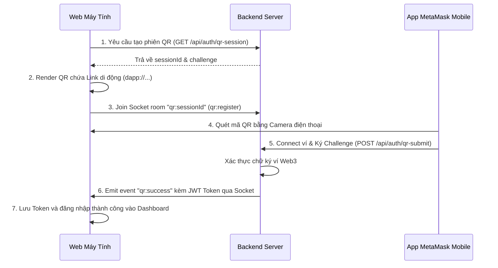

# Hướng Dẫn Tích Hợp Đăng Nhập QR MetaMask & Chuẩn Hóa Domain Đăng Nhập

Tài liệu này ghi nhận tri thức kỹ thuật về tính năng đăng nhập ví MetaMask bằng mã QR và quá trình chuẩn hóa giao diện đăng nhập loại bỏ các nhãn di sản (legacy HR).

## 1. Vấn Đề Ban Đầu
*   Giao diện đăng nhập (`LoginPage.js`) thừa hưởng từ hệ thống quản lý nhân sự cũ: chứa các nhãn như "Nhân viên", "Phòng ban", "Chức vụ", "HR", "Intern", "Quản lý". Các thông tin này hoàn toàn không khớp với domain Quản lý đào tạo/Khóa luận của dự án mới.
*   Tính năng quét mã QR bị vô hiệu hóa (`QrScanner.js` báo lỗi đỏ) và không hỗ trợ thực tế luồng đăng nhập ví di động.

## 2. Nguyên Nhân
*   Hệ thống chuyển đổi từ codebase quản lý nhân viên nhưng chưa được refactor hoàn chỉnh phần giao diện xác thực và luồng QR.
*   Thiếu API xác thực QR MetaMask và cơ chế đồng bộ hóa phiên đăng nhập thời gian thực giữa thiết bị di động (nơi chạy ví) và máy tính (trình duyệt hiển thị).

## 3. Cách Giải Quyết (Flow 2 - Real-Time QR MetaMask Sync)
Hệ thống được thiết kế theo mô hình đồng bộ real-time thông qua WebSockets (Socket.IO):

### Các file và khu vực chỉnh sửa:
1.  **Backend Controller (`backend/controllers/authController.js`)**:
    *   Thêm map `qrSessions` quản lý phiên đăng nhập QR tạm thời.
    *   API `generateQrSession`: Tạo `sessionId` và `challenge` xác thực trong 10 phút.
    *   API `verifyQrSignature`: Kiểm tra tính hợp lệ của chữ ký ví Web3, tra cứu/tạo mới tài khoản Giảng viên hoặc Sinh viên và bắn sự kiện socket `qr:success`.
2.  **Backend Router (`backend/server.js`)**:
    *   Khai báo API endpoints `/api/auth/qr-session` và `/api/auth/qr-submit`.
    *   Bổ sung socket handler lắng nghe sự kiện `qr:register` để thiết bị máy tính join room nhận tín hiệu đăng nhập.
3.  **Frontend API (`frontend/src/services/apiService.js`)**:
    *   Bổ sung phương thức `getQrSession` và `submitQrSignature` kết nối API backend.
4.  **Component Di Động (`frontend/src/components/MobileLogin.js`)**:
    *   Tạo trang trung gian nhận diện URL đăng nhập.
    *   Hỗ trợ chuyển đổi sâu MetaMask (`dapp://`) để tự động mở liên kết bên trong Trình duyệt MetaMask của thiết bị di động nếu người dùng quét bằng camera thường.
    *   Kết nối MetaMask di động và thực hiện ký tin nhắn xác thực an toàn.
5.  **Giao diện Đăng nhập chính (`frontend/src/components/LoginPage.js`)**:
    *   Tích hợp thư viện `qrcode` sinh ảnh QR trực tiếp từ link xác thực.
    *   Thay thế toàn bộ nhãn hiển thị cũ bằng domain Quản lý đào tạo:
        *   "Nhân viên" -> "Sinh viên / Giảng viên"
        *   "Chức vụ" -> "Vai trò"
        *   "Phòng ban" -> "Chuyên ngành"
        *   Hiển thị Mã SV, Mã GV, GPA tương thích động với vai trò tài khoản đăng nhập.

## 4. Kết Quả Sau Khi Fix
*   Giao diện đăng nhập trực quan, hiển thị đúng vai trò và các chỉ số học tập (Mã SV, Mã GV, GPA, Chuyên ngành).
*   Chức năng đăng nhập QR hoạt động trơn tru: người dùng chỉ cần mở app MetaMask trên điện thoại quét QR trên web máy tính, ký xác nhận, máy tính sẽ tự động nhảy vào Dashboard mà không cần tương tác chuột/bàn phím.

## 5. Lưu Ý Để Tránh Lặp Lỗi
*   Địa chỉ ví MetaMask từ QR Code luôn được chuẩn hóa về chữ thường (`toLowerCase()`) để khớp chính xác với database MongoDB.
*   Cần đảm bảo thiết bị di động và máy tính cùng chung một lớp mạng LAN/Wifi để kết nối trực tiếp được tới địa chỉ IP của máy tính làm server.
