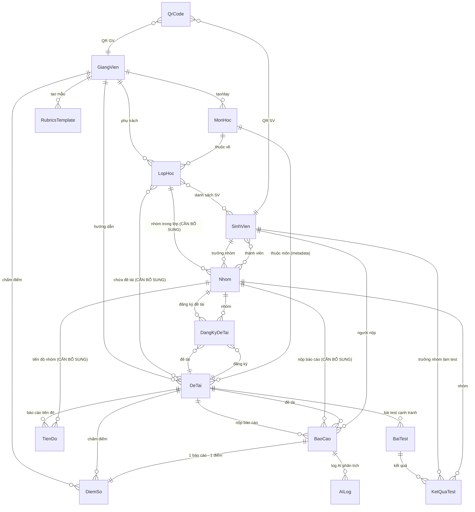
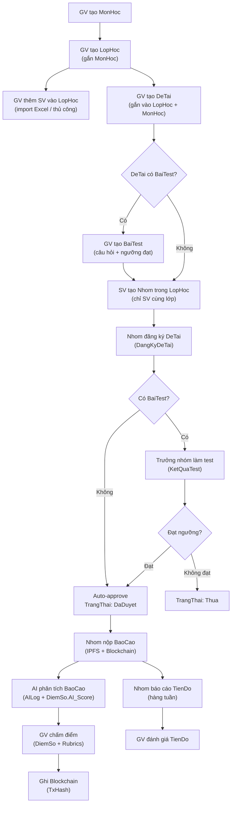

# Phân tích mối quan hệ giữa các Schema/Model trong hệ thống

## Tổng quan

Hệ thống hiện có **15 model** trong MongoDB. Tài liệu này phân tích mối quan hệ giữa chúng dựa trên:
- Schema hiện tại trong source code
- Nghiệp vụ đã xác nhận qua interview

---

## Sơ đồ quan hệ (ER Diagram)

---

## Sơ đồ luồng nghiệp vụ chính

---

## Bảng tổng hợp quan hệ giữa các Model

### Nhóm 1: Quản lý tổ chức (GV → MonHoc → LopHoc → SV)

| Quan hệ | Loại | Mô tả | Trạng thái |
|---------|------|-------|------------|
| GiangVien → MonHoc | 1:N | 1 GV tạo/dạy nhiều môn | ✅ Đã có |
| GiangVien → LopHoc | 1:N | 1 GV phụ trách nhiều lớp | ✅ Đã có |
| MonHoc → LopHoc | 1:N | 1 môn có nhiều lớp | ✅ Đã có |
| LopHoc ↔ SinhVien | N:N | 1 lớp nhiều SV, 1 SV nhiều lớp | ✅ Đã có (mảng SinhVien trong LopHoc) |

### Nhóm 2: Quản lý đề tài (DeTai ↔ LopHoc ↔ MonHoc)

| Quan hệ | Loại | Mô tả | Trạng thái |
|---------|------|-------|------------|
| DeTai → GiangVienHuongDan | N:1 | Nhiều đề tài cùng 1 GV | ✅ Đã có |
| DeTai → MonHoc | N:1 | Metadata, tra cứu nhanh | ✅ Đã có |
| **DeTai ↔ LopHoc** | **N:N** | **1 đề tài nhiều lớp, 1 lớp nhiều đề tài** | ⚠️ **CẦN BỔ SUNG** |

### Nhóm 3: Nhóm & Đăng ký (Nhom → DangKyDeTai)

| Quan hệ | Loại | Mô tả | Trạng thái |
|---------|------|-------|------------|
| Nhom → TruongNhom (SV) | N:1 | Mỗi nhóm có 1 trưởng nhóm | ✅ Đã có |
| Nhom → ThanhVien (SV) | N:N | Nhóm có nhiều SV | ✅ Đã có |
| **Nhom → LopHoc** | **N:1** | **Nhóm thuộc 1 lớp cụ thể** | ⚠️ **CẦN BỔ SUNG** |
| DangKyDeTai → DeTai | N:1 | Đăng ký cho đề tài | ✅ Đã có |
| DangKyDeTai → Nhom | N:1 | Đăng ký qua nhóm | ✅ Đã có |
| DangKyDeTai → SinhVien | N:1 | Legacy (backward compat) | 🔄 Cần dọn dẹp |
| DangKyDeTai.ThanhVien | embedded | Dư thừa với Nhom.ThanhVien | 🔄 Cần dọn dẹp |

### Nhóm 4: Submission & Evaluation

| Quan hệ | Loại | Mô tả | Trạng thái |
|---------|------|-------|------------|
| BaoCao → DeTai | N:1 | Báo cáo cho đề tài | ✅ Đã có |
| BaoCao → SinhVien | N:1 | Người nộp | ✅ Đã có (giữ là NguoiNop) |
| **BaoCao → Nhom** | **N:1** | **Báo cáo thuộc nhóm** | ⚠️ **CẦN BỔ SUNG** |
| DiemSo → BaoCao | 1:1 | 1 báo cáo 1 điểm | ✅ Đã có |
| DiemSo → GiangVienCham | N:1 | GV chấm | ✅ Đã có |
| DiemSo → SinhVien | N:1 | SV nhận điểm | ✅ Đã có |
| DiemSo → DeTai | N:1 | Đề tài | ✅ Đã có |

### Nhóm 5: Tiến độ

| Quan hệ | Loại | Mô tả | Trạng thái |
|---------|------|-------|------------|
| TienDo → DeTai | N:1 | Tiến độ theo đề tài | ✅ Đã có |
| TienDo → SinhVien | N:1 | Hiện gắn SV cá nhân | 🔄 Cần chuyển sang Nhom |
| **TienDo → Nhom** | **N:1** | **Tiến độ theo nhóm** | ⚠️ **CẦN BỔ SUNG** |
| TienDo → GiangVienDanhGia | N:1 | GV đánh giá | ✅ Đã có |

### Nhóm 6: Bài test cạnh tranh

| Quan hệ | Loại | Mô tả | Trạng thái |
|---------|------|-------|------------|
| BaiTest → DeTai | N:1 | Test cho đề tài | ✅ Đã có |
| KetQuaTest → BaiTest | N:1 | Kết quả bài test | ✅ Đã có |
| KetQuaTest → SinhVien | N:1 | Trưởng nhóm làm test | ✅ Đã có |
| KetQuaTest → Nhom | N:1 | Nhóm tham gia | ✅ Đã có |
| KetQuaTest → DangKyDeTai | N:1 | Liên kết đăng ký | ✅ Đã có |

### Nhóm 7: Hỗ trợ

| Quan hệ | Loại | Mô tả | Trạng thái |
|---------|------|-------|------------|
| RubricsTemplate → GiangVien | N:1 | GV tạo mẫu rubrics | ✅ Đã có |
| AILog → BaoCao, DeTai, SV | N:1 | Log AI phân tích | ✅ Đã có |
| QrCode → GV/SV (dynamic ref) | N:1 | QR xác thực | ✅ Đã có |

---

## Chi tiết từng Model và mối liên kết

### 1. GiangVien
> [Xem schema](file:///d:/HocTap/KLKS_Web3/Web3GiangVien/backend/models/GiangVien.js)

**Vai trò:** Trung tâm quản lý — tạo môn, lớp, đề tài, rubrics, chấm điểm.

| Field | Mô tả |
|-------|-------|
| MaGV | Mã giảng viên (unique) |
| HoTen | Họ tên |
| Email | Email (unique) |
| ChuyenNganh | Chuyên ngành |
| WalletAddress | MetaMask wallet (unique, dùng đăng nhập) |

**Được tham chiếu bởi:** MonHoc, LopHoc, DeTai, DiemSo, RubricsTemplate, TienDo, QrCode

---

### 2. SinhVien
> [Xem schema](file:///d:/HocTap/KLKS_Web3/Web3GiangVien/backend/models/SinhVien.js)

**Vai trò:** Người tham gia — đăng ký đề tài qua nhóm, nộp bài, nhận điểm.

| Field | Mô tả |
|-------|-------|
| MaSV | Mã sinh viên (unique) |
| HoTen | Họ tên |
| Email | Email (unique) |
| GPA | Điểm trung bình |
| ChuyenNganh | Chuyên ngành |
| KyNang | Mảng kỹ năng |
| WalletAddress | MetaMask wallet (unique) |
| DaCapNhatHoSo | Đã hoàn tất hồ sơ chưa |

**Được tham chiếu bởi:** LopHoc, Nhom, DangKyDeTai, BaoCao, DiemSo, TienDo, KetQuaTest, QrCode, AILog

---

### 3. MonHoc
> [Xem schema](file:///d:/HocTap/KLKS_Web3/Web3GiangVien/backend/models/MonHoc.js)

**Vai trò:** Đại diện môn học — do GV tạo, liên kết với LopHoc.

| Field | Ref | Quan hệ |
|-------|-----|---------|
| MaMonHoc | - | Mã môn (unique) |
| TenMonHoc | - | Tên môn |
| MoTa | - | Mô tả |
| GiangVien | GiangVien | 1 môn → 1 GV (GV có thể dạy nhiều môn) |

---

### 4. LopHoc
> [Xem schema](file:///d:/HocTap/KLKS_Web3/Web3GiangVien/backend/models/LopHoc.js)

**Vai trò:** Đơn vị tổ chức trung tâm — kết nối GV, MonHoc, SV và DeTai.

| Field | Ref | Quan hệ |
|-------|-----|---------|
| MaLopHoc | - | Mã lớp (unique) |
| TenLopHoc | - | Tên lớp |
| MonHoc | MonHoc | 1 lớp → 1 môn |
| GiangVien | GiangVien | 1 lớp → 1 GV |
| SinhVien | [SinhVien] | N:N — danh sách SV trong lớp |

**Cần bổ sung quan hệ:**
- DeTai cần ref ngược lại LopHoc (hoặc LopHoc cần mảng DeTai)
- Nhom cần ref đến LopHoc

---

### 5. DeTai
> [Xem schema](file:///d:/HocTap/KLKS_Web3/Web3GiangVien/backend/models/DeTai.js)

**Vai trò:** Competition/Challenge — đề tài nghiên cứu/đồ án cho SV đăng ký.

| Field | Ref | Quan hệ |
|-------|-----|---------|
| GiangVienHuongDan | GiangVien | N:1 — GV hướng dẫn |
| MonHoc | MonHoc | N:1 — metadata môn học |
| Rubrics | embedded | Rubrics chấm điểm (copy từ RubricsTemplate) |
| SoLuongSinhVien | - | Số SV tối đa nhóm |
| Deadline, HanDangKy, HanNopBaoCao | - | Các mốc thời gian |
| CoBaiTest | - | Có yêu cầu test cạnh tranh không |
| TrangThai | - | MoDangKy / DaChot / HoanThanh |

> ⚠️ **CẦN BỔ SUNG:** `LopHoc: [{ type: ObjectId, ref: 'LopHoc' }]` — mảng lớp học (N:N)

---

### 6. Nhom
> [Xem schema](file:///d:/HocTap/KLKS_Web3/Web3GiangVien/backend/models/Nhom.js)

**Vai trò:** Đơn vị đăng ký & nộp bài — mọi hoạt động đều qua nhóm.

| Field | Ref | Quan hệ |
|-------|-----|---------|
| TruongNhom | SinhVien | 1 nhóm → 1 trưởng nhóm |
| ThanhVien | [SinhVien] | N:N (kèm VaiTro, TrangThai) |
| SoLuong | - | Số thành viên tối đa |
| DaChot | - | Đã chốt nhóm chưa |

> ⚠️ **CẦN BỔ SUNG:** `LopHoc: { type: ObjectId, ref: 'LopHoc', required: true }` — nhóm thuộc lớp

---

### 7. DangKyDeTai
> [Xem schema](file:///d:/HocTap/KLKS_Web3/Web3GiangVien/backend/models/DangKyDeTai.js)

**Vai trò:** Bản ghi đăng ký đề tài — kết nối Nhom ↔ DeTai.

| Field | Ref | Trạng thái |
|-------|-----|------------|
| DeTai | DeTai | ✅ |
| Nhom | Nhom | ✅ |
| TruongNhom | SinhVien | ✅ |
| SinhVien | SinhVien | 🔄 Legacy — cần loại bỏ |
| ThanhVien | embedded | 🔄 Dư thừa — đã có trong Nhom |
| TrangThai | - | ChoDuyet / ChoTest / DaDuyet / TuChoi / Thua... |

> 🔄 **CẦN DỌN DẸP:** Bỏ field `SinhVien` và `ThanhVien` (backward compat), thống nhất chỉ dùng `Nhom`.

---

### 8. BaoCao (Submission)
> [Xem schema](file:///d:/HocTap/KLKS_Web3/Web3GiangVien/backend/models/BaoCao.js)

**Vai trò:** Bản nộp bài — file PDF qua IPFS, ghi blockchain.

| Field | Ref | Quan hệ |
|-------|-----|---------|
| DeTai | DeTai | N:1 |
| SinhVien | SinhVien | N:1 (NguoiNop — người upload) |
| IPFS_CID | - | Hash file trên IPFS |
| SubmitTxHash | - | Blockchain transaction |

> ⚠️ **CẦN BỔ SUNG:** `Nhom: { type: ObjectId, ref: 'Nhom', required: true }` — báo cáo thuộc nhóm

---

### 9. DiemSo (Evaluation)
> [Xem schema](file:///d:/HocTap/KLKS_Web3/Web3GiangVien/backend/models/DiemSo.js)

**Vai trò:** Kết quả đánh giá — kết hợp AI + GV + Rubrics.

| Field | Ref | Mô tả |
|-------|-----|-------|
| BaoCao | BaoCao | 1:1 (unique index) |
| GiangVienCam/Cham | GiangVien | GV phụ trách/chấm |
| SinhVien | SinhVien | SV nhận điểm |
| DeTai | DeTai | Đề tài |
| Diem | - | Điểm tổng (0-10) |
| AI_Score | - | Điểm AI gợi ý |
| AI_Feedback | - | Feedback AI |
| RubricsResult | embedded | Điểm theo từng tiêu chí |
| TxHash | - | Blockchain hash |

> [!NOTE]
> Điểm tính theo Nhom (chung cho cả nhóm từ 1 BaoCao), nhưng GV có thể điều chỉnh riêng cho từng SV nếu cần. Schema hiện tại cho phép tạo nhiều DiemSo cho cùng 1 BaoCao nếu cần (bỏ unique index hoặc tạo DiemSo riêng cho từng SV trong nhóm khi GV điều chỉnh).

---

### 10. TienDo (Báo cáo tiến độ hàng tuần)
> [Xem schema](file:///d:/HocTap/KLKS_Web3/Web3GiangVien/backend/models/TienDo.js)

**Vai trò:** Nhóm báo cáo tiến độ hàng tuần cho GV.

| Field | Ref | Trạng thái |
|-------|-----|------------|
| DeTai | DeTai | ✅ |
| SinhVien | SinhVien | 🔄 Cần chuyển sang Nhom |
| GiangVienDanhGia | GiangVien | ✅ |
| TuanSo, MucTieuTuan... | - | ✅ |
| RubricsTuan | embedded | ✅ |
| TxHash | - | ✅ Blockchain |

> ⚠️ **CẦN BỔ SUNG:** `Nhom: { type: ObjectId, ref: 'Nhom', required: true }` — tiến độ theo nhóm

---

### 11. BaiTest (Bài test cạnh tranh)
> [Xem schema](file:///d:/HocTap/KLKS_Web3/Web3GiangVien/backend/models/BaiTest.js)

**Vai trò:** Bài test sàng lọc — SV phải đạt ngưỡng mới được đăng ký đề tài.

| Field | Ref | Quan hệ |
|-------|-----|---------|
| DeTai | DeTai | N:1 — test cho đề tài cụ thể |
| CauHoi | embedded | Trắc nghiệm + Code |
| NguongDat | - | Ngưỡng đạt (%) |

**Không cần thay đổi.**

---

### 12. KetQuaTest
> [Xem schema](file:///d:/HocTap/KLKS_Web3/Web3GiangVien/backend/models/KetQuaTest.js)

**Vai trò:** Kết quả bài test — Trưởng nhóm làm đại diện.

| Field | Ref | Quan hệ |
|-------|-----|---------|
| BaiTest | BaiTest | N:1 |
| DeTai | DeTai | N:1 |
| SinhVien | SinhVien | N:1 — Trưởng nhóm |
| Nhom | Nhom | N:1 |
| DangKyDeTai | DangKyDeTai | N:1 |

**Không cần thay đổi.** Unique index `{ BaiTest, SinhVien }` vẫn phù hợp vì chỉ Trưởng nhóm làm.

---

### 13. RubricsTemplate
> [Xem schema](file:///d:/HocTap/KLKS_Web3/Web3GiangVien/backend/models/RubricsTemplate.js)

**Vai trò:** Mẫu rubrics — GV tạo trước, áp dụng khi tạo đề tài.

| Field | Ref | Quan hệ |
|-------|-----|---------|
| GiangVien | GiangVien | N:1 — template của GV |

**Không cần thay đổi.**

---

### 14. AILog
> [Xem schema](file:///d:/HocTap/KLKS_Web3/Web3GiangVien/backend/models/AILog.js)

**Vai trò:** Log nội bộ — ghi lại lịch sử AI phân tích báo cáo.

**Không cần thay đổi.**

---

### 15. QrCode
> [Xem schema](file:///d:/HocTap/KLKS_Web3/Web3GiangVien/backend/models/QrCode.js)

**Vai trò:** QR xác thực — độc lập, không liên quan luồng đề tài.

**Không cần thay đổi.**

---

## Tóm tắt các thay đổi Schema cần thực hiện

| # | Model | Thay đổi | Lý do |
|---|-------|----------|-------|
| 1 | **DeTai** | Thêm `LopHoc: [ObjectId ref LopHoc]` | Đề tài gắn vào lớp (N:N) |
| 2 | **Nhom** | Thêm `LopHoc: ObjectId ref LopHoc` (required) | Nhóm thuộc lớp, chỉ SV cùng lớp mới vào nhóm |
| 3 | **BaoCao** | Thêm `Nhom: ObjectId ref Nhom` (required) | Báo cáo thuộc nhóm, không phải cá nhân |
| 4 | **TienDo** | Thêm `Nhom: ObjectId ref Nhom` (required) | Tiến độ theo nhóm |
| 5 | **DangKyDeTai** | Loại bỏ field `SinhVien` và `ThanhVien` (legacy) | Thống nhất chỉ dùng Nhom |

---

## Ràng buộc nghiệp vụ đã xác nhận

| # | Ràng buộc | Kiểm tra ở |
|---|-----------|------------|
| 1 | SV phải thuộc LopHoc mới thấy DeTai của lớp đó | Backend |
| 2 | SV chỉ đăng ký 1 đề tài trong mỗi lớp | Backend |
| 3 | Chỉ SV cùng lớp mới được mời vào nhóm | Backend |
| 4 | GV thêm SV vào lớp (import Excel hoặc thủ công) | Backend |
| 5 | 1 đề tài có thể thuộc nhiều lớp | Schema (mảng) |
| 6 | Mọi đăng ký đều qua Nhom (kể cả 1 người) | Backend + Frontend |
| 7 | Trưởng nhóm làm test đại diện | Backend |
| 8 | BaoCao & TienDo thuộc Nhom | Schema |
| 9 | Điểm tính theo Nhom, GV có thể điều chỉnh cá nhân | Backend |
