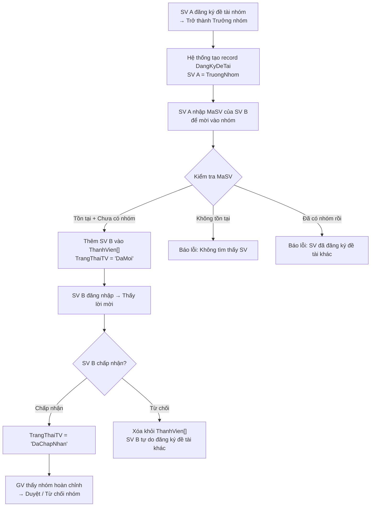
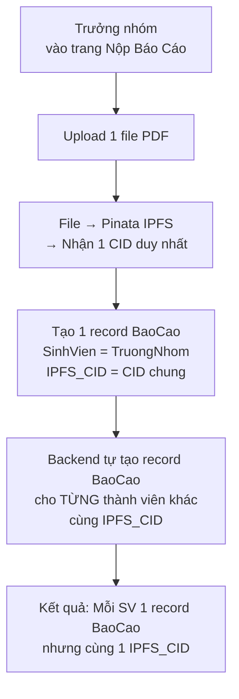
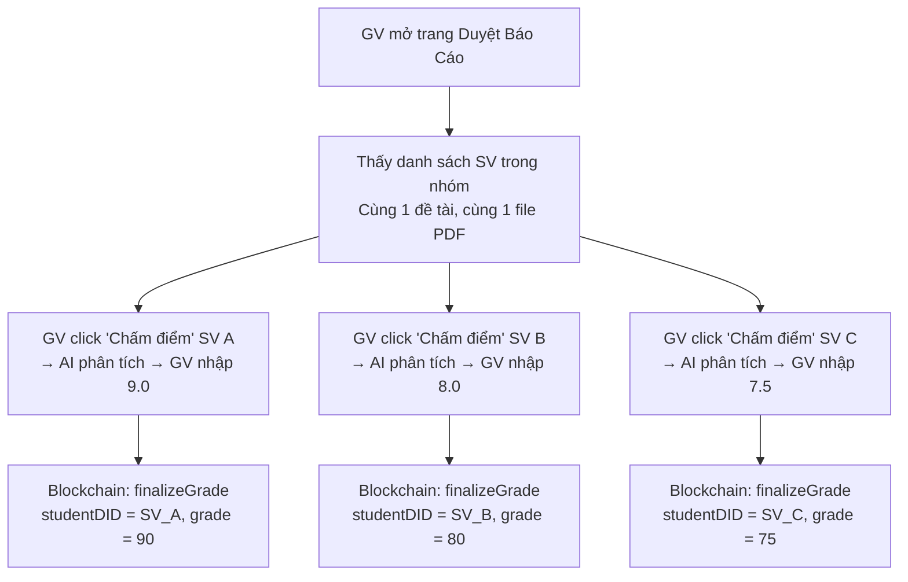

# 📋 Kế Hoạch Triển Khai Cuối Cùng – Hệ Thống Web3 Quản Lý Đồ Án

> [!IMPORTANT]
> Đây là plan cuối cùng tổng hợp toàn bộ, đã bao gồm phản hồi của bạn.
> Sẵn sàng để triển khai ngay sau khi bạn xác nhận.

---

## Mục Lục

- [PHẦN A: Tổng hợp quyết định đã chốt](#-phần-a-tổng-hợp-quyết-định-đã-chốt)
- [PHẦN B: Thiết kế nhóm sinh viên](#-phần-b-thiết-kế-nhóm-sinh-viên--nộp-chung---chấm-riêng)
- [PHẦN C: Thay đổi cụ thể theo từng file](#-phần-c-thay-đổi-cụ-thể-theo-từng-file)
- [PHẦN D: Danh sách công việc & Sprint](#-phần-d-danh-sách-công-việc--sprint)

---

# 🔒 PHẦN A: Tổng Hợp Quyết Định Đã Chốt

| # | Vấn đề | Quyết định cuối cùng |
|---|--------|---------------------|
| 1 | AI trong điểm số | ✅ Giữ nguyên: GV toàn quyền, AI chỉ gợi ý |
| 2 | TransactionLog/AuthLog/ActionLog | ❌ KHÔNG TẠO – đi ngược triết lý Web3 |
| 3 | Admin | ❌ KHÔNG CẦN ADMIN – Web3 không có admin |
| 4 | Tài khoản SV | ✅ Giữ auto-register + bắt buộc cập nhật hồ sơ |
| 5 | Tiến độ | ✅ Tab mới "Nhật Ký Tiến Độ" + Model `TienDo` |
| 6 | Chi tiết đề tài | ✅ `MoTaChiTiet` + `ChiTietBoSung[]` (key-value linh hoạt) |
| 7 | Nhóm SV | ✅ Trưởng nhóm mời bằng MaSV |
| 8 | Nộp bài nhóm | ✅ **Nộp chung 1 file – Chấm riêng từng SV** |
| 9 | Số lượng SV | ✅ GV nhập khi tạo đề tài, **không cứng max trong code** |
| 10 | Khóa hủy nộp sau chấm điểm | ✅ Fix ngay |

---

# 🆕 PHẦN B: Thiết Kế Nhóm Sinh Viên + Nộp Chung - Chấm Riêng

## B.1 Giải quyết vấn đề "SV D lạ tham gia nhóm"

### Cơ chế trước (LOẠI BỎ ❌):
```
Ai cũng có thể tự đăng ký vào nhóm → SV D lạ vào nhóm SV A
```

### Cơ chế mới (CHỌN ✅): **Trưởng nhóm mời bằng MaSV**



### Tại sao cơ chế "Mời bằng MaSV" tốt hơn:

| Tiêu chí | Tự do tham gia ❌ | Mời bằng MaSV ✅ |
|----------|:-----------------:|:-----------------:|
| SV lạ tham gia | ⚠️ Không kiểm soát | ✅ Chỉ người được mời |
| Quyền trưởng nhóm | ❌ Không có | ✅ TN kiểm soát thành viên |
| Phù hợp thực tế | ❌ | ✅ Giống hệ thống trường |
| SV biết nhóm mình | ⚠️ Không chắc | ✅ Phải chấp nhận lời mời |

---

## B.2 Model `DangKyDeTai` mở rộng (Final)

```javascript
const dangKyDeTaiSchema = new mongoose.Schema({
  DeTai: { type: mongoose.Schema.Types.ObjectId, ref: 'DeTai', required: true },
  
  // Trưởng nhóm (người đăng ký đầu tiên)
  SinhVien: { type: mongoose.Schema.Types.ObjectId, ref: 'SinhVien', required: true },
  
  // Danh sách thành viên nhóm (bao gồm cả trưởng nhóm)
  ThanhVien: [{
    SinhVien: { type: mongoose.Schema.Types.ObjectId, ref: 'SinhVien' },
    VaiTro: { type: String, enum: ['TruongNhom', 'ThanhVien'], default: 'ThanhVien' },
    TrangThaiTV: { 
      type: String, 
      enum: ['DaMoi', 'DaChapNhan', 'TuChoi'], 
      default: 'DaChapNhan'  // Trưởng nhóm tự động 'DaChapNhan'
    },
    NgayThamGia: { type: Date, default: Date.now }
  }],
  
  TrangThai: { type: String, enum: ['ChoDuyet', 'DaDuyet', 'TuChoi'], default: 'ChoDuyet' }
}, { timestamps: true });

// Một sinh viên chỉ đăng ký 1 đề tài 1 lần (trưởng nhóm)
dangKyDeTaiSchema.index({ DeTai: 1, SinhVien: 1 }, { unique: true });
```

---

## B.3 Model `DeTai` mở rộng (Final)

```javascript
const deTaiSchema = new mongoose.Schema({
  MaDeTai: { type: String, required: true, unique: true },
  TenDeTai: { type: String, required: true },
  MoTa: { type: String },                      // Giữ nguyên (ngắn, cho SBERT)
  MoTaChiTiet: { type: String },               // MỚI: mô tả dài (textarea)
  YeuCau: [{ type: String }],                  // Giữ nguyên (tags kỹ năng)
  ChiTietBoSung: [{                            // MỚI: linh hoạt key-value
    TieuDe: { type: String },                  // VD: "Mục tiêu", "Bộ môn"
    NoiDung: { type: String }
  }],
  SoLuongSinhVien: { type: Number, default: 1, min: 1 }, // MỚI: GV nhập, KHÔNG có max cứng
  Deadline: { type: Date, required: true },
  GiangVienHuongDan: { type: mongoose.Schema.Types.ObjectId, ref: 'GiangVien', required: true },
  TrangThai: { type: String, enum: ['MoDangKy', 'DaChot', 'HoanThanh'], default: 'MoDangKy' }
}, { timestamps: true });
```

> [!TIP]
> **Về `SoLuongSinhVien`**: Chỉ có `min: 1`, **KHÔNG có `max`** cứng trong model. 
> GV nhập bao nhiêu cũng được. Frontend chỉ gợi ý mặc định 1, nhưng không giới hạn trên.
> Nếu sau này trường quy định max = 5, chỉ cần thêm validation ở frontend, không cần sửa model.

---

## B.4 Luồng "Nộp Chung – Chấm Riêng" chi tiết

### LUỒNG NỘP BÀI (Trưởng nhóm nộp 1 file):



**Chi tiết kỹ thuật:**

Khi trưởng nhóm nộp file:
1. Upload 1 file PDF → Pinata IPFS → Nhận **1 CID**
2. Backend tạo record `BaoCao` cho **trưởng nhóm** với CID đó
3. Backend tự động tạo thêm record `BaoCao` cho **mỗi thành viên** cùng CID
4. → Kết quả: **N records BaoCao** (N = số SV trong nhóm), **cùng 1 IPFS_CID**

```javascript
// baoCaoController.js - uploadBaoCao (mở rộng)
exports.uploadBaoCao = async (req, res) => {
  const { deTaiId, sinhVienId, tieuDe } = req.body;
  
  // Upload file → IPFS → nhận CID
  const ipfsResult = await ipfsService.uploadFile(req.file.path, req.file.originalname);
  const ipfsCid = ipfsResult.IpfsHash;
  
  // Tạo BaoCao cho trưởng nhóm
  const baoCaoTruongNhom = new BaoCao({
    DeTai: deTaiId, SinhVien: sinhVienId,
    TieuDe: tieuDe, IPFS_CID: ipfsCid
  });
  await baoCaoTruongNhom.save();
  
  // Tìm nhóm đăng ký của SV này
  const dangKy = await DangKyDeTai.findOne({
    DeTai: deTaiId,
    TrangThai: 'DaDuyet',
    $or: [
      { SinhVien: sinhVienId },
      { 'ThanhVien.SinhVien': sinhVienId }
    ]
  });
  
  if (dangKy && dangKy.ThanhVien.length > 1) {
    // Tạo BaoCao cho từng thành viên khác
    for (const tv of dangKy.ThanhVien) {
      if (tv.SinhVien.toString() !== sinhVienId && tv.TrangThaiTV === 'DaChapNhan') {
        const existing = await BaoCao.findOne({ DeTai: deTaiId, SinhVien: tv.SinhVien });
        if (!existing) {
          await new BaoCao({
            DeTai: deTaiId, SinhVien: tv.SinhVien,
            TieuDe: tieuDe, IPFS_CID: ipfsCid  // CÙNG CID
          }).save();
        }
      }
    }
  }
  
  res.status(201).json({ message: 'Nộp báo cáo thành công cho cả nhóm!', data: baoCaoTruongNhom });
};
```

### LUỒNG CHẤM ĐIỂM (GV chấm riêng từng SV):



**Tại sao KHÔNG cần sửa Smart Contract:**

Smart Contract hiện tại đã thiết kế **chấm theo từng SV** rồi:

```solidity
// ThesisManagement.sol - đã có sẵn:
mapping(string => mapping(string => Submission[])) private submissions;
// topicId => studentDID => Submissions[]

function finalizeGrade(
    string memory studentDID,  // ← Từng SV riêng
    string memory topicId,
    uint8 grade,               // ← Điểm riêng cho SV đó
    string memory feedback,
    uint256 submissionIndex
) public { ... }
```

→ Contract đã mapping `(topicId, studentDID) → Submission[]`. Mỗi SV có **Submission riêng** dù cùng 1 `ipfsCID`.

**Kịch bản on-chain:**
```
Tất cả SV trong nhóm đều có submitReport() riêng:
- submitReport("SV_A_id", "topic_1", "QmXyz...abc", timestamp)  ← cùng CID
- submitReport("SV_B_id", "topic_1", "QmXyz...abc", timestamp)  ← cùng CID
- submitReport("SV_C_id", "topic_1", "QmXyz...abc", timestamp)  ← cùng CID

Mỗi SV có finalizeGrade() riêng:
- finalizeGrade("SV_A_id", "topic_1", 90, "Trưởng nhóm tốt", 0)  ← 9.0 điểm
- finalizeGrade("SV_B_id", "topic_1", 80, "Đóng góp khá", 0)     ← 8.0 điểm
- finalizeGrade("SV_C_id", "topic_1", 75, "Cần cải thiện", 0)     ← 7.5 điểm
```

> [!NOTE]
> **Kết quả**: Dù nộp chung 1 file (chung bằng chứng nội dung CID trên IPFS), mỗi SV vẫn có "dòng trạng thái" điểm số **riêng biệt** trên Blockchain. Smart Contract **KHÔNG cần sửa**.

---

## B.5 UI cho SV – Trang Đăng ký + Quản lý nhóm

### Khi SV đăng ký đề tài nhóm:

```
┌────────────────────────────────────────────────────────┐
│ Đề tài: "Xây dựng hệ thống Web3..."                   │
│ Số lượng SV: 3                    Deadline: 15/05/2026 │
│ ────────────────────────────────────────────────────── │
│                                                        │
│ Bạn đã đăng ký đề tài này (👑 Trưởng nhóm)            │
│                                                        │
│ Thành viên nhóm (1/3):                                 │
│ ┌──────────────────────────────────────────────┐       │
│ │ 👑 Nguyễn Văn A (20110001) - Trưởng nhóm    │       │
│ │    Đã chấp nhận ✅                            │       │
│ └──────────────────────────────────────────────┘       │
│                                                        │
│ ┌─ Mời thành viên ─────────────────────────────┐       │
│ │ Nhập Mã SV: [____________] [🔍 Tìm & Mời]   │       │
│ └───────────────────────────────────────────────┘       │
│                                                        │
│ [❌ Hủy Đăng Ký]                                       │
└────────────────────────────────────────────────────────┘
```

### Khi SV B nhận lời mời:

```
┌────────────────────────────────────────────────────────┐
│ 📩 Bạn có 1 lời mời vào nhóm!                         │
│                                                        │
│ Đề tài: "Xây dựng hệ thống Web3..."                   │
│ Trưởng nhóm: Nguyễn Văn A (20110001)                  │
│ Thành viên hiện tại: 1/3                               │
│                                                        │
│ [✅ Chấp nhận]   [❌ Từ chối]                           │
└────────────────────────────────────────────────────────┘
```

### UI cho GV – Duyệt nhóm:

```
┌────────────────────────────────────────────────────────┐
│ Đề tài: "Xây dựng hệ thống Web3..."                   │
│ Quy mô: 3 SV         Trạng thái nhóm: Đủ thành viên  │
│ ────────────────────────────────────────────────────── │
│                                                        │
│ 👑 Trưởng nhóm: Nguyễn Văn A (20110001)               │
│    GPA: 3.2 | KyNang: React, Node.js                  │
│    Trạng thái: ✅ Đã chấp nhận                         │
│                                                        │
│ 👤 Thành viên: Trần Thị B (20110002)                   │
│    GPA: 3.5 | KyNang: Python, ML                      │
│    Trạng thái: ✅ Đã chấp nhận                         │
│                                                        │
│ 👤 Thành viên: Lê Văn C (20110003)                     │
│    GPA: 3.0 | KyNang: Solidity, React                 │
│    Trạng thái: ✅ Đã chấp nhận                         │
│                                                        │
│ [✅ Duyệt nhóm]  [❌ Từ chối nhóm]                     │
└────────────────────────────────────────────────────────┘
```

### UI cho GV – Chấm điểm nhóm:

```
┌────────────────────────────────────────────────────────┐
│ Đề tài: "Xây dựng hệ thống Web3..."                   │
│ File báo cáo chung: 📄 QmXyz...abc  [📥 Tải xuống]    │
│ ────────────────────────────────────────────────────── │
│                                                        │
│ Danh sách chấm điểm riêng từng SV:                    │
│                                                        │
│ ┌──────────────────────────────────────────────┐       │
│ │ 👑 Nguyễn Văn A (20110001) - Trưởng nhóm    │       │
│ │ AI Score: 8.2  │  GV Score: [9.0▾]           │       │
│ │ [🔐 Ký MetaMask & Ghi Blockchain]            │       │
│ └──────────────────────────────────────────────┘       │
│                                                        │
│ ┌──────────────────────────────────────────────┐       │
│ │ 👤 Trần Thị B (20110002) - Thành viên        │       │
│ │ AI Score: 8.2  │  GV Score: [8.0▾]           │       │
│ │ [🔐 Ký MetaMask & Ghi Blockchain]            │       │
│ └──────────────────────────────────────────────┘       │
│                                                        │
│ ┌──────────────────────────────────────────────┐       │
│ │ 👤 Lê Văn C (20110003) - Thành viên          │       │
│ │ AI Score: 8.2  │  GV Score: [7.5▾]           │       │
│ │ [🔐 Ký MetaMask & Ghi Blockchain]            │       │
│ └──────────────────────────────────────────────┘       │
└────────────────────────────────────────────────────────┘
```

> [!IMPORTANT]
> GV chấm **từng SV riêng**. Mỗi SV = 1 lần ký MetaMask = 1 giao dịch blockchain riêng.
> AI Score giống nhau vì cùng 1 file, nhưng GV có thể cho điểm khác nhau tùy đánh giá đóng góp.

---

# 📁 PHẦN C: Thay Đổi Cụ Thể Theo Từng File

## Nhóm Backend - Models

---

### [MODIFY] [DeTai.js](file:///c:/Users/Lenovo/Downloads/FileTaiLieuHK8/DoAnKySu/Web3-GiangVien/backend/models/DeTai.js)

Thêm 3 field mới: `MoTaChiTiet`, `ChiTietBoSung[]`, `SoLuongSinhVien`

```diff
 const deTaiSchema = new mongoose.Schema({
   MaDeTai: { type: String, required: true, unique: true },
   TenDeTai: { type: String, required: true },
   MoTa: { type: String },
+  MoTaChiTiet: { type: String },
   YeuCau: [{ type: String }],
+  ChiTietBoSung: [{
+    TieuDe: { type: String },
+    NoiDung: { type: String }
+  }],
+  SoLuongSinhVien: { type: Number, default: 1, min: 1 },
   Deadline: { type: Date, required: true },
   GiangVienHuongDan: { type: mongoose.Schema.Types.ObjectId, ref: 'GiangVien', required: true },
   TrangThai: { type: String, enum: ['MoDangKy', 'DaChot', 'HoanThanh'], default: 'MoDangKy' }
 }, { timestamps: true });
```

---

### [MODIFY] [DangKyDeTai.js](file:///c:/Users/Lenovo/Downloads/FileTaiLieuHK8/DoAnKySu/Web3-GiangVien/backend/models/DangKyDeTai.js)

Thêm field `ThanhVien[]` với cơ chế mời:

```diff
 const dangKyDeTaiSchema = new mongoose.Schema({
   DeTai: { type: mongoose.Schema.Types.ObjectId, ref: 'DeTai', required: true },
   SinhVien: { type: mongoose.Schema.Types.ObjectId, ref: 'SinhVien', required: true },
+  ThanhVien: [{
+    SinhVien: { type: mongoose.Schema.Types.ObjectId, ref: 'SinhVien' },
+    VaiTro: { type: String, enum: ['TruongNhom', 'ThanhVien'], default: 'ThanhVien' },
+    TrangThaiTV: { type: String, enum: ['DaMoi', 'DaChapNhan', 'TuChoi'], default: 'DaChapNhan' },
+    NgayThamGia: { type: Date, default: Date.now }
+  }],
   TrangThai: { type: String, enum: ['ChoDuyet', 'DaDuyet', 'TuChoi'], default: 'ChoDuyet' }
 }, { timestamps: true });
```

---

### [MODIFY] [SinhVien.js](file:///c:/Users/Lenovo/Downloads/FileTaiLieuHK8/DoAnKySu/Web3-GiangVien/backend/models/SinhVien.js)

Thêm field `DaCapNhatHoSo` để bắt buộc cập nhật hồ sơ lần đầu (**Bắt buộc nhập đủ GPA và ít nhất 1 Kỹ năng** để thuật toán SBERT gợi ý đề tài hoạt động chính xác):

```diff
 const sinhVienSchema = new mongoose.Schema({
   MaSV: { type: String, required: true, unique: true },
   HoTen: { type: String, required: true },
   Email: { type: String, required: true, unique: true },
   GPA: { type: Number, default: 0 },
   ChuyenNganh: { type: String, default: '' },
   KyNang: [{ type: String }],
-  WalletAddress: { type: String, required: true, unique: true }
+  WalletAddress: { type: String, required: true, unique: true },
+  DaCapNhatHoSo: { type: Boolean, default: false }
 }, { timestamps: true });
```

---

### [MODIFY] [BaoCao.js](file:///c:/Users/Lenovo/Downloads/FileTaiLieuHK8/DoAnKySu/Web3-GiangVien/backend/models/BaoCao.js)

Thêm field `TxHash` để track giao dịch submitReport:

```diff
 const baoCaoSchema = new mongoose.Schema({
   DeTai: { type: mongoose.Schema.Types.ObjectId, ref: 'DeTai', required: true },
   SinhVien: { type: mongoose.Schema.Types.ObjectId, ref: 'SinhVien', required: true },
   TieuDe: { type: String, required: true },
   IPFS_CID: { type: String, required: true },
-  NgayNop: { type: Date, default: Date.now }
+  NgayNop: { type: Date, default: Date.now },
+  TxHash: { type: String }
 }, { timestamps: true });
```

---

### [NEW] [TienDo.js](file:///c:/Users/Lenovo/Downloads/FileTaiLieuHK8/DoAnKySu/Web3-GiangVien/backend/models/TienDo.js)

Model mới cho Nhật ký tiến độ:

```javascript
const mongoose = require('mongoose');

const tienDoSchema = new mongoose.Schema({
  DeTai: { type: mongoose.Schema.Types.ObjectId, ref: 'DeTai', required: true },
  SinhVien: { type: mongoose.Schema.Types.ObjectId, ref: 'SinhVien', required: true },
  NoiDung: { type: String, required: true },
  PhanTramHoanThanh: { type: Number, default: 0, min: 0, max: 100 },
  LoaiCapNhat: { 
    type: String, 
    enum: ['NghienCuu', 'ThietKe', 'LapTrinh', 'KiemThu', 'VietBaoCao', 'Khac'],
    default: 'Khac'
  },
  FileDinhKem: { type: String },
  NhanXetGV: { type: String },
}, { timestamps: true });

module.exports = mongoose.model('TienDo', tienDoSchema);
```

---

## Nhóm Backend - Controllers

---

### [MODIFY] [deTaiController.js](file:///c:/Users/Lenovo/Downloads/FileTaiLieuHK8/DoAnKySu/Web3-GiangVien/backend/controllers/deTaiController.js)

**Thay đổi lớn nhất**. Cần viết lại:
- `registerTopic` → Logic mới cho đề tài cá nhân / nhóm
- `approveRegistration` → Duyệt/từ chối nhóm + từ chối nhóm khác
- Thêm API mời thành viên: `inviteMember`
- Thêm API xử lý lời mời: `respondToInvitation`
- Thêm API lấy lời mời: `getMyInvitations`
- `getMyRegistration` → Kiểm tra cả ThanhVien[]

---

### [MODIFY] [baoCaoController.js](file:///c:/Users/Lenovo/Downloads/FileTaiLieuHK8/DoAnKySu/Web3-GiangVien/backend/controllers/baoCaoController.js)

- `uploadBaoCao` → Nộp chung: Tạo BaoCao cho tất cả thành viên cùng CID
- `deleteBaoCao` → Kiểm tra đã chấm điểm chưa trước khi cho hủy

---

### [MODIFY] [diemSoController.js](file:///c:/Users/Lenovo/Downloads/FileTaiLieuHK8/DoAnKySu/Web3-GiangVien/backend/controllers/diemSoController.js)

- `chamDiem` → Không thay đổi logic (vẫn chấm từng SV), chỉ thêm validation

---

### [NEW] [tienDoController.js](file:///c:/Users/Lenovo/Downloads/FileTaiLieuHK8/DoAnKySu/Web3-GiangVien/backend/controllers/tienDoController.js)

CRUD mới cho Nhật ký tiến độ.

---

### [NEW] [sinhVienController.js](file:///c:/Users/Lenovo/Downloads/FileTaiLieuHK8/DoAnKySu/Web3-GiangVien/backend/controllers/sinhVienController.js)

API cập nhật hồ sơ SV: `PUT /api/sinhvien/:id/profile`

---

## Nhóm Backend - Routes

---

### [MODIFY] Routes files

Thêm các endpoints mới:
```
POST   /api/detai/:id/invite          → Mời SV vào nhóm (body: { maSV })
POST   /api/detai/invitation/:id/respond → SV trả lời lời mời (body: { accept: true/false })
GET    /api/detai/invitations/:svId   → Lấy lời mời đang chờ của SV
PUT    /api/sinhvien/:id/profile      → Cập nhật hồ sơ SV
GET    /api/tiendo/:svId              → Lấy tiến độ SV
POST   /api/tiendo                    → Tạo entry tiến độ mới
GET    /api/tiendo/detai/:deTaiId     → GV xem tiến độ theo đề tài
PUT    /api/tiendo/:id/nhanxet        → GV comment tiến độ
```

---

## Nhóm Frontend - Student Components

---

### [MODIFY] [TopicRegistration.js](file:///c:/Users/Lenovo/Downloads/FileTaiLieuHK8/DoAnKySu/Web3-GiangVien/frontend/src/components/student/TopicRegistration.js)

- Hiển thị `SoLuongSinhVien` trên card
- Nếu đề tài nhóm: Hiển thị form mời thành viên (input MaSV)
- Hiển thị danh sách thành viên nhóm
- Hiển thị badge "Đề tài nhóm (3 SV)" trên card

---

### [MODIFY] [StudentDashboard.js](file:///c:/Users/Lenovo/Downloads/FileTaiLieuHK8/DoAnKySu/Web3-GiangVien/frontend/src/components/student/StudentDashboard.js)

- Thêm form chỉnh sửa hồ sơ (HoTen, MaSV, Email, GPA, ChuyenNganh, KyNang)
- Hiển thị thêm thông tin nhóm (nếu có)
- Hiển thị lời mời vào nhóm (nếu có)
- Nút "Xem file IPFS" nếu đã nộp

---

### [MODIFY] [ReportUpload.js](file:///c:/Users/Lenovo/Downloads/FileTaiLieuHK8/DoAnKySu/Web3-GiangVien/frontend/src/components/student/ReportUpload.js)

- **Fix bug**: Kiểm tra đã chấm điểm chưa → Ẩn nút "Hủy Nộp"
- Nếu đề tài nhóm: Hiển thị "Trưởng nhóm nộp cho cả nhóm"
- Nếu không phải trưởng nhóm: Hiển thị "Đợi trưởng nhóm nộp bài"

---

### [NEW] [ProgressLog.js](file:///c:/Users/Lenovo/Downloads/FileTaiLieuHK8/DoAnKySu/Web3-GiangVien/frontend/src/components/student/ProgressLog.js)

Tab mới "Nhật Ký Tiến Độ" cho SV.

---

## Nhóm Frontend - Lecturer Components

---

### [MODIFY] [SubmissionReview.js](file:///c:/Users/Lenovo/Downloads/FileTaiLieuHK8/DoAnKySu/Web3-GiangVien/frontend/src/components/lecturer/SubmissionReview.js)

- Hiển thị danh sách SV theo nhóm (group by đề tài)
- Mỗi SV trong nhóm: Chấm điểm riêng
- Thêm nút "Tải xuống báo cáo" (link IPFS gateway)
- Thêm nút "Verify on Etherscan" (link Etherscan)
- Hiển thị badge so sánh AI Score vs GV Score

---

### [MODIFY] Trang quản lý đề tài GV (TopicManagement / form tạo đề tài)

- Thêm field `MoTaChiTiet` (textarea)
- Thêm field `SoLuongSinhVien` (InputNumber, default 1, min 1)
- Thêm phần "Thông tin bổ sung" với nút "+ Thêm mục" → `ChiTietBoSung[]`
- Trang duyệt đăng ký: Hiển thị nhóm + thành viên + nút Duyệt/Từ chối nhóm

---

## Nhóm Frontend - Services

---

### [MODIFY] [aiService.js](file:///c:/Users/Lenovo/Downloads/FileTaiLieuHK8/DoAnKySu/Web3-GiangVien/frontend/src/services/aiService.js)

Thêm các hàm API mới:
```javascript
inviteMember(deTaiId, maSV)
respondToInvitation(invitationId, accept)
getMyInvitations(svId)
updateStudentProfile(svId, profileData)
createProgressEntry(data)
getProgressBySV(svId)
getProgressByTopic(deTaiId)
commentProgress(tienDoId, nhanXet)
```

---

# 📋 PHẦN D: Danh Sách Công Việc & Sprint

## Sprint 1: Bug Fix + Nền tảng (Ưu tiên 🔴 CAO)

| # | Công việc | Files | Phức tạp |
|---|----------|-------|---------|
| 1.1 | Khóa hủy nộp sau chấm điểm | `ReportUpload.js`, `baoCaoController.js` | THẤP |
| 1.2 | Thêm TxHash vào model BaoCao | `BaoCao.js` | THẤP |
| 1.3 | Nút "Tải xuống" + "Verify Etherscan" + "Xem IPFS" cho GV | `SubmissionReview.js` | THẤP |
| 1.4 | Form cập nhật hồ sơ SV + bắt buộc lần đầu (Kèm logic ép buộc GPA, KyNang cho AI) | `SinhVien.js`, `StudentDashboard.js`, `sinhVienController.js` | THẤP-TB |
| 1.5 | Mở rộng model DeTai + form tạo đề tài GV | `DeTai.js`, form GV | TRUNG BÌNH |
| 1.6 | Hiển thị tên GVHD + chi tiết đề tài cho SV | `TopicRegistration.js` | THẤP |

---

## Sprint 2: Nhóm Sinh Viên (Ưu tiên 🟡 CAO)

| # | Công việc | Files | Phức tạp |
|---|----------|-------|---------|
| 2.1 | Mở rộng model DangKyDeTai + DeTai (SoLuongSinhVien) | `DangKyDeTai.js`, `DeTai.js` | THẤP |
| 2.2 | Backend: API đăng ký nhóm, mời, phản hồi lời mời | `deTaiController.js`, routes | CAO |
| 2.3 | Backend: Nộp chung (tạo BaoCao cho cả nhóm) | `baoCaoController.js` | TRUNG BÌNH |
| 2.4 | Backend: Duyệt + từ chối nhóm | `deTaiController.js` | TRUNG BÌNH |
| 2.5 | Frontend SV: Giao diện mời thành viên + lời mời | `TopicRegistration.js`, `StudentDashboard.js` | CAO |
| 2.6 | Frontend SV: Nộp bài nhóm (trưởng nhóm nộp) | `ReportUpload.js` | TRUNG BÌNH |
| 2.7 | Frontend GV: Duyệt nhóm + Chấm riêng từng SV | `SubmissionReview.js`, trang duyệt đăng ký | CAO |

---

## Sprint 3: Bổ sung (Ưu tiên 🟢 TRUNG BÌNH)

| # | Công việc | Files | Phức tạp |
|---|----------|-------|---------|
| 3.1 | Model + API nhật ký tiến độ | `TienDo.js`, `tienDoController.js`, routes | TRUNG BÌNH |
| 3.2 | Tab "Nhật Ký Tiến Độ" cho SV | `ProgressLog.js` (mới) | TRUNG BÌNH |
| 3.3 | GV xem tiến độ SV | `SubmissionReview.js` hoặc tab mới | TRUNG BÌNH |
| 3.4 | Convention đặt tên file IPFS | `ipfsService.js`, `baoCaoController.js` | THẤP |

---

## Sprint 4: Polish (Ưu tiên 🔵 TÙY CHỌN)

| # | Công việc | Files | Phức tạp |
|---|----------|-------|---------|
| 4.1 | Badge so sánh AI Score vs GV Score | `SubmissionReview.js` | THẤP |
| 4.2 | Verify contract trên Etherscan | CLI command | THẤP |
| 4.3 | Responsive + UX polish | Toàn bộ FE | TRUNG BÌNH |

---

## Tổng kết

| Metric | Giá trị |
|--------|---------|
| Tổng số công việc | 18 |
| Models sửa | 4 (DeTai, DangKyDeTai, SinhVien, BaoCao) |
| Models mới | 1 (TienDo) |
| Controllers sửa | 3 (deTai, baoCao, diemSo) |
| Controllers mới | 2 (tienDo, sinhVien) |
| Components FE sửa | 4 (TopicRegistration, StudentDashboard, ReportUpload, SubmissionReview) |
| Components FE mới | 1 (ProgressLog) |
| Smart Contract sửa | ❌ KHÔNG CẦN |
| API endpoints mới | 8 |
| Ước tính thời gian | 7-10 ngày |

> [!CAUTION]
> **Bạn xác nhận plan này để mình bắt đầu triển khai Sprint 1?**
